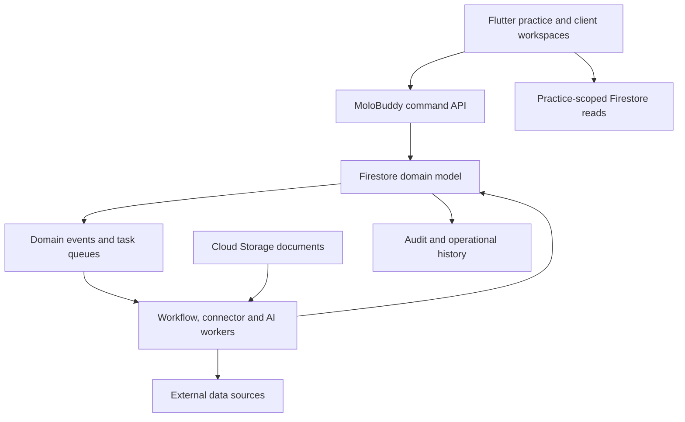
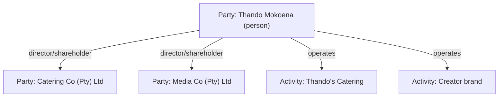
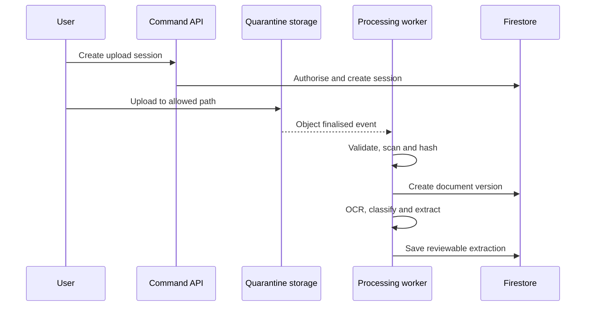

# MoloBuddy Firebase Architecture

- **Status:** Proposed architecture
- **Audience:** Product, engineering, security and design
- **Primary market:** South African accounting and tax practices
- **Application stack:** Flutter authenticated client; TypeScript backend and workers
- **Platform facts checked:** 2026-08-19; re-check before provisioning production resources
**Architecture principle:** Firebase is the operational backend. Cloud Firestore is the system of record; no PostgreSQL database is introduced.

---

## 1. Executive decision

MoloBuddy should be built as a **multi-tenant practice operating system** with a **connector and automation harness** around a stable tax-work core.

The core is intentionally small:

1. Practices and people
2. Parties, client accounts, relationships and tax registrations
3. Tax matters
4. Tasks and deadlines
5. Document requests and documents
6. Communications and notifications
7. Audit history

Everything external—Google Drive, OneDrive, Xero, Sage, QuickBooks, email, WhatsApp, bank feeds, calendars and future providers—connects through a governed **Connector Platform**. A connector never writes uncontrolled provider data directly into a tax matter. It ingests, normalises, matches and then proposes or executes an approved domain action.

The most important tenancy decision is:

> Every firm is a `Practice`, including a one-person practice. A solo operator is a practice with one active membership whose role is `owner`.

There is no separate solo data model and no migration when the owner hires a team member. The interface can hide team features until they are needed, while the backend remains identical.

### Recommended deployment shape

- Separate Firebase/Google Cloud projects for `development`, `staging` and `production`.
- One production Firebase project and one shared Firestore database for MoloBuddy practices initially.
- Logical tenant isolation through practice-scoped document paths and Security Rules.
- One global Firebase Authentication identity per human.
- Practice roles and client access held in Firestore membership records, not encoded as a growing list of custom claims.
- Cloud Storage for original and derived files.
- Cloud Functions for Firebase 2nd gen for commands, triggers and scheduled coordinators.
- Cloud Tasks for retryable units of work and rate-limited provider calls.
- Pub/Sub/Eventarc for domain events and fan-out.
- Cloud Run workers for OCR, malware scanning, connector jobs or AI work that exceeds normal function constraints.
- Secret Manager for OAuth refresh tokens, API credentials and webhook secrets.
- Document AI or a replaceable OCR provider behind the Intelligence Gateway.

Firestore supports a Johannesburg regional location (`africa-south1`), and its location cannot be changed after provisioning. The production location therefore needs to be decided before creating the database. [Firebase: Cloud Firestore locations](https://firebase.google.com/docs/firestore/locations)

---

## 2. What “a powerful harness” means

MoloBuddy should not be a collection of tightly coupled screens. It should be a harness with six planes:

| Plane | Responsibility | Examples |
|---|---|---|
| Experience | Interfaces for each audience | Flutter practice and client workspaces, public website, admin workspace |
| Domain | Stable business truth | Practices, clients, matters, tasks, requests, documents, deadlines |
| Workflow | Coordinates repeatable work | Templates, status transitions, assignments, reminders, approvals |
| Connector | Exchanges data with external systems | Drive, email, WhatsApp, accounting tools, calendars |
| Intelligence | Reads and assists | OCR, classification, extraction, matching, summaries, anomaly flags |
| Trust | Controls and proves activity | Authentication, authorisation, consent, audit, retention, monitoring |

The domain plane must remain useful even if every connector and AI provider is switched off. Connectors and AI enrich the core; they do not own it.



### Architectural style

Start as a **modular monolith** in one monorepo, with a Dart/Flutter authenticated client and independently deployable TypeScript functions/workers:

- `identity-access`
- `practice`
- `client`
- `tax-work`
- `documents`
- `workflow`
- `notifications`
- `connectors`
- `intelligence`
- `audit`

This provides clean domain boundaries without the deployment, tracing and consistency cost of premature microservices. A module may later become a separate Cloud Run service without changing the public domain contracts.

---

## 3. Firebase and Google Cloud component map

| Component | Use in MoloBuddy | Source-of-truth status |
|---|---|---|
| Firebase Authentication | Google and email/password login, email verification, session identity | Identity only |
| Cloud Firestore | All operational metadata and application state | Primary system of record |
| Cloud Storage for Firebase | Original documents, versions, previews and derived OCR artifacts | Source of truth for file bytes |
| Firebase App Check | Reduce abuse from unauthorised clients | Trust control |
| Cloud Functions 2nd gen | Callable commands, HTTP webhooks, Firestore/Storage triggers, schedulers | Compute only |
| Cloud Tasks | Retry, backoff, rate limiting and delayed execution | Work queue |
| Pub/Sub + Eventarc | Domain-event distribution and loose coupling | Transport only |
| Cloud Run | Long-running or dependency-heavy workers | Compute only |
| Secret Manager | Connector credentials and signing secrets | Secret source of truth |
| Document AI / OCR adapter | OCR and layout extraction | Replaceable processor |
| Firebase Cloud Messaging | Browser/mobile push notifications | Delivery channel |
| Cloud Logging/Monitoring/Error Reporting | Logs, traces, alerts and service health | Operational telemetry |

Cloud Functions can run from HTTPS calls, Firebase/Google Cloud events and Cloud Scheduler jobs. Task queue functions use Cloud Tasks for resource-intensive or rate-limited asynchronous work. [Firebase: Cloud Functions](https://firebase.google.com/docs/functions) · [Firebase: task queue functions](https://firebase.google.com/docs/functions/task-functions)

### Region strategy

Recommended default:

- Firestore: `africa-south1` (Johannesburg)
- Storage: `africa-south1` (Johannesburg)
- Cloud Functions 2nd gen and Cloud Run: `africa-south1` (Johannesburg)
- Scheduler: invoke a coordinator in the application region
- External AI/OCR: select and document the actual processing region per provider

The Johannesburg service-location statements were checked on 2026-08-19 against [Cloud Firestore locations](https://firebase.google.com/docs/firestore/locations), [Cloud Functions locations](https://firebase.google.com/docs/functions/locations), [Cloud Run locations](https://cloud.google.com/run/docs/locations) and [Cloud Storage bucket locations](https://cloud.google.com/storage/docs/locations).

Important constraint: Document AI currently lists `us`, `eu` and a limited set of single regions for OCR; Johannesburg is not listed as a Document AI processing location. MoloBuddy must therefore either:

1. obtain the required contractual/privacy approval for processing in a supported region such as `eu`, or
2. run an alternative OCR engine in a Johannesburg Cloud Run worker.

The processor choice must be configuration, not hard-coded application logic. [Google Cloud: Document AI regions](https://cloud.google.com/document-ai/docs/regions)

---

## 4. Multi-tenancy model

### 4.1 Tenant boundary

The tenant is `practiceId`.

All tenant-owned operational documents live below:

```text
/practices/{practiceId}/...
```

This gives every Security Rule a practice identifier from the path and makes accidental unscoped queries visibly wrong during review.

Do not create one Firebase project per small practice. It multiplies deployments, migrations, observability, connector callback configuration and support work. Dedicated projects or databases may be introduced later only for contracted enterprise isolation.

### 4.2 Global user, contextual access

A human has one global Firebase Auth `uid`. That user can be:

- owner of Practice A;
- invited practitioner in Practice B;
- portal user for their own individual tax record in Practice C;
- portal user for one or more companies represented in Practice C.

Use a global identity because the same person may cross practice boundaries. Firebase Authentication with Identity Platform can create separate identity-provider/user silos, but that is better reserved for enterprise tenants needing their own SAML/OIDC configuration or identity policies. It is not the default practice-isolation mechanism. [Firebase Authentication](https://firebase.google.com/docs/auth) · [Firebase Admin Auth multi-tenancy](https://firebase.google.com/docs/reference/admin/node/firebase-admin.auth)

### 4.3 Membership model

```text
/users/{uid}
/users/{uid}/practiceRefs/{practiceId}
/practices/{practiceId}
/practices/{practiceId}/members/{uid}
/practices/{practiceId}/parties/{partyId}/portalUsers/{uid}
```

`users/{uid}/practiceRefs` is a navigation projection. It allows “choose a workspace” after login but does not grant access. The authoritative grant is the practice `members/{uid}` document or client `portalUsers/{uid}` document.

Practice roles:

| Role | Typical authority |
|---|---|
| `owner` | Billing, deletion, all settings, members, connectors and work |
| `admin` | Members, clients, templates, connectors and all work except ownership/billing |
| `manager` | Clients, assignment, due dates, review and reporting |
| `practitioner` | Assigned/shared client work, documents and internal comments |
| `reviewer` | Review queues, approvals and quality control |
| `assistant` | Collection, data capture and explicitly granted work |
| `client` | Not a practice member; access comes through `portalUsers` |

Permissions should be expressed as capabilities in server code, for example:

```text
parties.read
parties.manage
matters.create
matters.transition
documents.review
members.manage
connectors.manage
audit.read
```

Roles map to capabilities. This avoids scattering role-name comparisons throughout the codebase and permits custom enterprise roles later.

### 4.4 Solo practice behaviour

On first signup, a single transaction creates:

1. the user profile;
2. a practice;
3. an `owner` membership;
4. default statuses;
5. default tax-work templates;
6. default reminder policy;
7. the user's practice navigation reference.

For a solo practice:

- `assignedToUid` defaults to the owner;
- the Team navigation is hidden or presented as “Invite someone”;
- workload charts collapse to “My work”;
- approval steps may be self-review or disabled by template policy;
- all records retain the same assignment and audit fields used by larger teams.

Adding the first employee is therefore an invitation, not a tenancy conversion.

### 4.5 Taxpayer, business and trading-activity model

MoloBuddy must not use one `Client` record to mean all of the following at once:

- the human who logs in;
- the taxpayer legally responsible for an obligation;
- a registered company owned or represented by that human;
- an unregistered business name or side hustle;
- the practice's commercial relationship;
- a group of related people and businesses.

Those are different concepts and need separate records.

| Concept | Meaning | Example |
|---|---|---|
| `User` | A login identity | The person using the MoloBuddy portal |
| `Party` | A real-world person or independently registered entity | Thando Mokoena; Mokoena Media (Pty) Ltd |
| `ClientAccount` | The practice's service relationship with one party | Active client, relationship manager, billing reference |
| `PartyRelationship` | A dated relationship between two parties | Director, shareholder, trustee, member, representative |
| `BusinessActivity` | A trade, side hustle or brand operated by a party but not necessarily a separate entity | “Thando’s Catering”; creator brand |
| `TaxRegistration` | A tax obligation/registration belonging to a party | Income tax, VAT, PAYE, provisional tax profile |
| `ClientGroup` | An operational portfolio used to view related parties together | “Mokoena Portfolio” |
| `TaxMatter` | Work for one responsible tax subject, optionally in the context of one or more activities | Company VAT return; individual provisional tax |

The deciding question when work is created is:

> **Which person or independently registered entity is responsible for this tax obligation?**

That party becomes `subjectPartyId` on the tax matter.

#### Example: one person with multiple companies and informal brands



- The person has a personal tax profile and personal tax matters.
- Each registered company is a separate party with its own client account, identifiers, registrations, matters, deadlines, documents and risk status.
- The catering and creator brands are business activities under the person when they are not independently registered entities.
- A personal/provisional-tax matter can link to one or both activities as context while remaining a matter of the person.
- If an activity has a VAT or other registration attached to the person, the `TaxRegistration` links both to the responsible person and, optionally, to the activity.
- If the catering operation is later incorporated, MoloBuddy creates a new organisation party and a successor relationship. It does not rewrite the old activity into a company or lose its historical documents.

MoloBuddy must not infer whether something is an independent taxpayer from its trading name, logo, bank account or connector. The practice confirms the classification and can record verification evidence.

#### Client groups are navigation, not legal boundaries

A `ClientGroup` lets the practice open one portfolio and see the person, companies, trust and activities together. It may drive a consolidated dashboard or combined communication, but it must not:

- merge tax registrations;
- merge document ownership;
- make one entity's deadline satisfy another's;
- grant portal access to every group member;
- imply legal ownership without a `PartyRelationship` record.

Every board row, deadline and matter must still name its responsible party. Group totals are derived projections.

#### Portal access is granted per party

A portal user may be allowed to see:

- their personal profile;
- Company A, where they are an authorised representative;
- Company B, where they are also authorised;
- neither company's internal practice notes.

Access to one connected party never automatically grants access to all parties in the same group. The practice explicitly issues a `portalUsers/{uid}` grant under each party, with role, scope, start/end dates and evidence of authority.

#### Practice-side workflow

The practice onboarding flow should support:

1. Add or import the person.
2. Ask whether the person needs only personal tax work, operates under a trading/brand name, or represents an independently registered entity.
3. Create one party for every independently registered person, company, close corporation, trust or other supported entity.
4. Create activities for unincorporated trades, side hustles and creator/catering brands.
5. Record ownership, directorship, trusteeship, membership and representation as relationships.
6. Add the relevant tax registrations to each responsible party.
7. Optionally group related parties into one portfolio.
8. Create matters against the responsible party and registration, with activity context where applicable.

The client directory should therefore offer two complementary views:

- **Tax subjects:** separate operational rows for every person/entity with work and deadlines.
- **Portfolios:** related parties and activities grouped for relationship management.

On the matter board, the primary label is the responsible party and the secondary label is the portfolio/activity, for example `Mokoena Media (Pty) Ltd · VAT` or `Thando Mokoena · Creator activity · Provisional tax`. The practice can filter by portfolio, but bulk status changes still operate on selected subject-scoped matters.

After login, the client portal shows a profile switcher only for parties covered by active grants. A combined portfolio landing page may summarise outstanding requests across those parties, but every card and upload destination visibly states whether it belongs to the person, Company A or Company B.

---

## 5. Firestore data architecture

### 5.1 Rules for modelling

1. Store binary files and large OCR payloads in Cloud Storage, never Firestore.
2. Store growing lists as subcollections, not arrays on parent documents.
3. Denormalise the small display fields needed by a screen.
4. Make every business record carry `practiceId`, even if the path already contains it; this aids events, exports and validation.
5. Use server timestamps for authoritative times.
6. Store money as integer minor units plus currency, never floating point.
7. Version templates, rules, extracted data and connector schemas.
8. Never depend on deleting a parent document to delete its subcollections.

Firestore documents have a 1 MiB maximum, and growing nested lists do not scale as well as subcollections. [Firebase: Firestore limits](https://firebase.google.com/docs/firestore/quotas) · [Firebase: choose a data structure](https://firebase.google.com/docs/firestore/manage-data/structure-data)

### 5.2 Recommended collection tree

```text
/users/{uid}
  /practiceRefs/{practiceId}

/connectorDefinitions/{connectorKey}
/systemTaxTypes/{taxTypeKey}
/systemDeadlineRules/{ruleId}

/practices/{practiceId}
  /members/{uid}
  /invitations/{invitationId}
  /consentTemplates/{templateId}
  /workflowTemplates/{templateId}
    /versions/{versionId}
  /parties/{partyId}
    /portalUsers/{uid}
    /contacts/{contactId}
    /identifiers/{identifierId}
  /clientAccounts/{clientAccountId}
  /partyRelationships/{relationshipId}
  /businessActivities/{activityId}
  /taxRegistrations/{registrationId}
  /clientGroups/{groupId}
    /members/{partyId}
  /requestBundles/{bundleId}
  /matters/{matterId}
  /tasks/{taskId}
  /deadlines/{deadlineId}
  /documentRequests/{requestId}
    /items/{requestItemId}
  /documents/{documentId}
    /versions/{versionId}
    /extractions/{extractionId}
  /documentLinks/{linkId}
  /uploadSessions/{uploadId}
  /comments/{commentId}
  /notifications/{notificationId}
  /notificationDeliveries/{deliveryId}
  /connectorInstallations/{installationId}
    /syncRuns/{syncRunId}
    /externalObjects/{externalObjectId}
  /imports/{importId}
    /rows/{rowId}
  /domainEvents/{eventId}
  /processedEvents/{consumerEventId}
  /idempotencyKeys/{keyHash}
  /auditEvents/{auditId}
  /dashboardProjections/{projectionId}
```

### 5.3 Core documents

#### Practice

```ts
type Practice = {
  practiceId: string;
  name: string;
  slug: string;
  status: 'trial' | 'active' | 'suspended' | 'closing' | 'closed';
  timezone: 'Africa/Johannesburg' | string;
  locale: 'en-ZA' | string;
  defaultCurrency: 'ZAR' | string;
  ownerUid: string;
  branding: { logoPath?: string; primaryColour?: string };
  plan: { code: string; limitsVersion: number };
  featureFlags: Record<string, boolean>;
  dataRegion: string;
  createdAt: Timestamp;
  updatedAt: Timestamp;
};
```

#### Member

```ts
type PracticeMember = {
  practiceId: string;
  uid: string;
  role: 'owner' | 'admin' | 'manager' | 'practitioner' | 'reviewer' | 'assistant';
  capabilityOverrides?: Record<string, boolean>;
  status: 'invited' | 'active' | 'suspended' | 'removed';
  displayName: string;
  emailLower: string;
  workloadCapacity?: number;
  joinedAt?: Timestamp;
  updatedAt: Timestamp;
};
```

#### Party and client portfolio

```ts
type Party = {
  practiceId: string;
  partyId: string;
  kind: 'natural_person' | 'registered_organisation' | 'trust' | 'other';
  displayName: string;
  searchName: string;
  legalName?: string;
  tradingNames: string[];
  status: 'lead' | 'onboarding' | 'active' | 'inactive' | 'archived';
  primaryContactId?: string;
  source: { type: 'manual' | 'csv' | 'connector'; ref?: string };
  verificationStatus: 'unverified' | 'partially_verified' | 'verified';
  createdAt: Timestamp;
  updatedAt: Timestamp;
};

type ClientAccount = {
  practiceId: string;
  clientAccountId: string;
  partyId: string;
  serviceStatus: 'prospect' | 'onboarding' | 'active' | 'paused' | 'terminated' | 'archived';
  relationshipOwnerUid?: string;
  billingReference?: string;
  serviceTags: string[];
  riskFlags: string[];                // practice-internal
  openMatterCount: number;
  overdueCount: number;
  nextDueAt?: Timestamp;
  createdAt: Timestamp;
  updatedAt: Timestamp;
};

type PartyRelationship = {
  practiceId: string;
  relationshipId: string;
  fromPartyId: string;
  toPartyId: string;
  role: 'director' | 'shareholder' | 'member' | 'trustee' | 'beneficiary' | 'representative' | 'owner' | 'other';
  ownershipPercentageBps?: number;    // 10000 = 100%; optional, never inferred
  status: 'pending_verification' | 'active' | 'ended';
  validFrom?: Timestamp;
  validTo?: Timestamp;
  evidenceDocumentIds?: string[];
  createdAt: Timestamp;
  updatedAt: Timestamp;
};

type BusinessActivity = {
  practiceId: string;
  activityId: string;
  liablePartyId: string;
  name: string;
  kind: 'sole_trade' | 'freelance' | 'creator' | 'catering' | 'rental' | 'other';
  registrationStatus: 'unincorporated' | 'pending_registration' | 'unknown';
  startedAt?: Timestamp;
  endedAt?: Timestamp;
  successorPartyId?: string;
  status: 'active' | 'inactive' | 'ceased' | 'incorporated';
  createdAt: Timestamp;
  updatedAt: Timestamp;
};

type TaxRegistration = {
  practiceId: string;
  registrationId: string;
  subjectPartyId: string;
  businessActivityId?: string;
  taxType: string;
  maskedReference?: string;
  status: 'unconfirmed' | 'active' | 'inactive' | 'deregistered';
  effectiveFrom?: Timestamp;
  effectiveTo?: Timestamp;
  filingFrequency?: string;
  createdAt: Timestamp;
  updatedAt: Timestamp;
};

type ClientGroup = {
  practiceId: string;
  groupId: string;
  name: string;
  primaryPartyId?: string;
  status: 'active' | 'inactive' | 'archived';
  memberCount: number;
  openMatterCount: number;            // derived projection only
  overdueCount: number;               // derived projection only
  createdAt: Timestamp;
  updatedAt: Timestamp;
};

type PartyPortalGrant = {
  practiceId: string;
  partyId: string;
  uid: string;
  role: 'self' | 'director' | 'trustee' | 'representative' | 'viewer' | 'uploader';
  scopes: Array<'profile.read' | 'matters.read' | 'documents.read' | 'documents.upload' | 'requests.respond'>;
  status: 'invited' | 'active' | 'suspended' | 'expired' | 'revoked';
  validFrom?: Timestamp;
  validTo?: Timestamp;
  authorityEvidenceDocumentIds?: string[];
  grantedByUid: string;
  createdAt: Timestamp;
  updatedAt: Timestamp;
};
```

Sensitive identifiers should be separate records so normal party-list queries do not fetch tax numbers and registration identifiers. Store a masked display value, a deterministic keyed hash where exact matching is required, and a protected/encrypted value for authorised retrieval.

#### Tax matter

```ts
type TaxMatter = {
  practiceId: string;
  matterId: string;
  subjectPartyId: string;
  clientAccountId: string;
  subjectName: string;                // denormalised display field
  clientGroupIds?: string[];
  taxRegistrationId?: string;
  businessActivityIds?: string[];
  taxType: 'PIT' | 'CIT' | 'VAT' | 'PROVISIONAL' | 'PAYE' | 'DISPUTE' | string;
  title: string;
  period: { label: string; startAt?: Timestamp; endAt?: Timestamp };
  internalStatus: string;
  clientStatus: string;
  priority: 'low' | 'normal' | 'high' | 'urgent';
  assignedToUid?: string;
  assignedToName?: string;
  reviewerUid?: string;
  statutoryDueAt?: Timestamp;
  internalDueAt?: Timestamp;
  clientDocumentDueAt?: Timestamp;
  effectiveDueAt?: Timestamp;         // projection for lists
  blockingReason?: string;
  outstandingDocumentCount: number;
  incompleteTaskCount: number;
  workflowTemplateVersionRef?: string;
  createdByUid: string;
  createdAt: Timestamp;
  updatedAt: Timestamp;
  completedAt?: Timestamp;
};
```

Internal and client status must remain separate. The client does not see internal quality problems, staffing notes or risk flags.

#### Document request

```ts
type DocumentRequest = {
  practiceId: string;
  requestId: string;
  requestBundleId?: string;
  subjectPartyId: string;
  clientAccountId: string;
  businessActivityIds?: string[];
  matterId?: string;
  title: string;
  status: 'draft' | 'sent' | 'opened' | 'partial' | 'submitted' | 'reviewing' | 'more_info' | 'complete' | 'cancelled';
  recipientUserIds: string[];
  dueAt?: Timestamp;
  reminderPolicySnapshot: object;
  totalItems: number;
  acceptedItems: number;
  outstandingItems: number;
  sentAt?: Timestamp;
  completedAt?: Timestamp;
  createdByUid: string;
  createdAt: Timestamp;
  updatedAt: Timestamp;
};
```

Request items are subcollection documents. Each item references zero or more uploaded documents and has its own state.

A practice may send one `RequestBundle` to a person covering personal work and several represented businesses. The bundle controls one communication/link, but contains separate subject-scoped requests and headings. This reduces message chasing without mixing document ownership or completion states.

#### Document and version

`documents/{documentId}` is the stable logical document. `versions/{versionId}` is immutable evidence for every replacement.

```ts
type Document = {
  practiceId: string;
  documentId: string;
  subjectPartyId: string;
  businessActivityId?: string;
  matterId?: string;
  requestId?: string;
  requestItemId?: string;
  kind: string;
  displayName: string;
  currentVersionId: string;
  status: 'processing' | 'needs_review' | 'accepted' | 'rejected' | 'superseded';
  uploadedByUid: string;
  createdAt: Timestamp;
  updatedAt: Timestamp;
};

type DocumentVersion = {
  versionId: string;
  storagePath: string;
  sha256: string;
  byteSize: number;
  contentType: string;
  malwareScan: 'pending' | 'clean' | 'blocked' | 'failed';
  ocrStatus: 'not_requested' | 'queued' | 'processing' | 'complete' | 'failed';
  pageCount?: number;
  source: 'portal' | 'staff' | 'connector' | 'email';
  sourceRef?: string;
  uploadedAt: Timestamp;
};

type DocumentLink = {
  practiceId: string;
  linkId: string;
  documentId: string;
  subjectPartyId: string;
  targetType: 'matter' | 'business_activity' | 'tax_registration' | 'request_item';
  targetId: string;
  createdByUid: string;
  createdAt: Timestamp;
};
```

`DocumentLink` allows one document belonging to a party—for example a personal bank statement—to support more than one activity or matter without copying the file. Cross-party links require an explicit privileged action and must never be inferred merely because parties share a client group.

#### Task and deadline

Tasks represent work; deadlines represent time obligations. A task can be due without being a statutory deadline, and a deadline can create many tasks/reminders.

```ts
type Deadline = {
  practiceId: string;
  deadlineId: string;
  subjectPartyId: string;
  clientAccountId: string;
  taxRegistrationId?: string;
  businessActivityId?: string;
  matterId?: string;
  taxType: string;
  kind: 'statutory' | 'internal' | 'client_documents' | 'custom';
  dueAt: Timestamp;
  timezone: string;
  source: 'rule' | 'template' | 'manual' | 'connector';
  ruleVersionRef?: string;
  status: 'scheduled' | 'satisfied' | 'missed' | 'cancelled';
  nextReminderAt?: Timestamp;
  assignedToUid?: string;
  createdAt: Timestamp;
  updatedAt: Timestamp;
};
```

### 5.4 Query projections and indexes

Firestore is not a relational join engine. Each important list screen should query one collection and receive the fields it needs.

Required projections:

- `matters` carries subject name, assignee name, effective due date and counts.
- `clientAccounts` carries open/overdue counts and next due date.
- `clientGroups` contains derived portfolio totals but never replaces subject-level queries.
- `dashboardProjections/{uid}` carries counts for “mine”, “unassigned”, “overdue” and “waiting on client”.
- daily practice snapshots support historical operational reporting.

Initial composite indexes should be designed from screens, not guessed. Likely examples:

```text
matters: internalStatus + effectiveDueAt
matters: assignedToUid + internalStatus + effectiveDueAt
matters: taxType + internalStatus + effectiveDueAt
matters: subjectPartyId + updatedAt
matters: taxRegistrationId + effectiveDueAt
tasks: assignedToUid + status + dueAt
deadlines: status + nextReminderAt
deadlines: subjectPartyId + status + dueAt
documentRequests: subjectPartyId + status + updatedAt
notifications: recipientUid + readAt + createdAt
```

Firestore uses indexes for queries, and compound query combinations generally require manual/composite indexes. Disable automatic indexing for large unqueried maps, OCR text, AI payloads and raw connector metadata. [Firebase: Firestore index overview](https://firebase.google.com/docs/firestore/query-data/index-overview)

For party and portfolio search in the MVP, maintain normalised prefix/search fields for legal name, trading names, email and masked identifier. Do not place full extracted document text into a search array. If full-text or semantic document search becomes necessary, add a derived search index through the connector/event layer; Firestore remains the source of truth.

---

## 6. Command, read and event model

### 6.1 Client reads

Allow direct Firestore reads only for deliberately client-readable, practice-scoped projections:

- practice and membership summary;
- parties, client accounts and matters the caller may access;
- client-visible request, document and status projections;
- notification inbox;
- limited comments marked `visibility = client`.

Realtime listeners are useful for a matter board, request progress and notifications, but only subscribe to the visible page/query—not an entire practice. Firestore listeners send an initial snapshot and subsequent changes, so listener scope directly affects reads and cost. [Firebase: realtime updates](https://firebase.google.com/docs/firestore/query-data/listen)

### 6.2 Server commands

All consequential writes go through callable or HTTPS functions:

```text
createPractice
invitePracticeMember
acceptPracticeInvitation
importClients
createParty
createClientAccount
createPartyRelationship
createBusinessActivity
createTaxRegistration
createClientGroup
createTaxMatter
transitionTaxMatter
assignTaxMatter
createDocumentRequest
sendDocumentRequest
createUploadSession
submitDocumentRequest
reviewDocument
createTask
completeTask
installConnector
requestConnectorSync
disconnectConnector
```

Each command handler performs:

1. authentication and App Check verification;
2. practice membership/client-grant resolution;
3. capability check;
4. input/schema validation;
5. idempotency check;
6. invariant and state-transition validation;
7. one Firestore transaction/batch for state plus a domain event;
8. an audit entry;
9. a response containing authoritative IDs and version.

Firestore transactions and batched writes are atomic. Use transactions when validation depends on current data; use batched writes when it does not. [Firebase: transactions and batched writes](https://firebase.google.com/docs/firestore/manage-data/transactions)

### 6.3 Domain event envelope

```ts
type DomainEvent<T = unknown> = {
  eventId: string;
  eventType: string;                  // document.uploaded.v1
  schemaVersion: 1;
  practiceId: string;
  aggregate: { type: string; id: string; version: number };
  actor: { type: 'user' | 'system' | 'connector'; id: string };
  occurredAt: Timestamp;
  correlationId: string;
  causationId?: string;
  data: T;                            // IDs and safe summary, not raw file content
  publishStatus: 'pending' | 'published' | 'failed';
};
```

The transaction that changes a matter also creates the event document. A publisher forwards pending events to Pub/Sub and marks them published. Consumers create a `processedEvents/{consumer}:{eventId}` record in the same transaction as their business effect.

Pub/Sub is at-least-once by default and messages can be redelivered, so every consumer must be idempotent. [Google Cloud: Pub/Sub subscription delivery](https://cloud.google.com/pubsub/docs/subscription-overview)

Suggested events:

```text
practice.created.v1
member.invited.v1
party.created.v1
client_account.created.v1
party_relationship.created.v1
business_activity.created.v1
tax_registration.created.v1
matter.created.v1
matter.status_changed.v1
request.sent.v1
request.opened.v1
document.uploaded.v1
document.scan_completed.v1
document.ocr_completed.v1
document.reviewed.v1
deadline.approaching.v1
connector.sync_requested.v1
connector.sync_completed.v1
connector.sync_failed.v1
```

This event surface is the spine of the harness. Notifications, connectors, AI and reporting subscribe without being built into the matter command itself.

---

## 7. Document ingestion, OCR and AI

### 7.1 Secure upload pipeline



Detailed flow:

1. A user requests an upload session for one request item/subject party/matter.
2. The server checks access and creates an expiring `uploadSessions` document.
3. Storage Rules permit that user to upload only to the assigned quarantine path, with allowed size and MIME constraints.
4. A Storage finalise trigger queues scanning and validation.
5. The worker verifies file signature, size, checksum, page constraints and malware status.
6. A duplicate check compares SHA-256 within the practice/subject-party scope.
7. Clean bytes are copied to an immutable version path.
8. OCR and extraction jobs are queued.
9. The request item becomes `uploaded`/`processing` and later `needs_review`.
10. Rejected or infected quarantine objects are isolated and removed under a retention policy.

Recommended storage paths:

```text
quarantine/{practiceId}/{subjectPartyId}/{uploadId}/original
documents/{practiceId}/{subjectPartyId}/{documentId}/{versionId}/original
derived/{practiceId}/{subjectPartyId}/{documentId}/{versionId}/preview/page-{n}.webp
derived/{practiceId}/{subjectPartyId}/{documentId}/{versionId}/ocr/result.json
derived/{practiceId}/{subjectPartyId}/{documentId}/{versionId}/extraction/result.json
connector-raw/{practiceId}/{installationId}/{objectType}/{externalId}/{version}.json
```

Cloud Storage Rules can check authentication, validate upload size/content type and consult Firestore access documents. Keep the rule lookup to the practice membership and client portal grant for the current path. [Firebase: Storage Rules conditions](https://firebase.google.com/docs/storage/security/rules-conditions)

### 7.2 Intelligence Gateway

All AI/OCR providers implement internal interfaces:

```ts
interface OcrProvider {
  process(input: OcrInput): Promise<OcrResult>;
}

interface DocumentClassifier {
  classify(input: ClassifiedText): Promise<ClassificationResult>;
}

interface Extractor<TSchema> {
  extract(input: ExtractionInput, schema: TSchema): Promise<ExtractionResult>;
}
```

The gateway owns:

- provider selection by environment/practice/data region;
- redaction and minimisation;
- timeout and retry policy;
- prompt/model/schema versions;
- cost and token accounting;
- provider request IDs;
- confidence normalisation;
- traceability back to page and bounding box;
- audit-safe failure reporting.

Document AI OCR can return text/layout and quality information, while specialised extraction should remain a separate step. [Google Cloud: Enterprise Document OCR](https://cloud.google.com/document-ai/docs/enterprise-document-ocr)

### 7.3 AI run and extraction model

Every run is recorded:

```ts
type IntelligenceRun = {
  runId: string;
  practiceId: string;
  documentVersionRef: string;
  task: 'ocr' | 'classify' | 'extract' | 'summarise' | 'match' | 'flag';
  provider: string;
  model: string;
  modelVersion?: string;
  schemaVersion: string;
  promptVersion?: string;
  inputFingerprint: string;
  status: 'queued' | 'running' | 'complete' | 'failed';
  confidence?: number;
  outputStorageRef?: string;
  cost?: { amountMinor: number; currency: string };
  startedAt?: Timestamp;
  completedAt?: Timestamp;
};
```

Extraction fields include:

- field key and typed value;
- confidence;
- page number;
- source text/bounding box;
- extraction method;
- reviewer decision;
- corrected value;
- reviewer UID and timestamp.

AI may create a proposal or flag. It may not autonomously:

- mark a tax matter submitted;
- approve its own extraction;
- calculate a final tax liability without an explicit product workflow and professional review;
- send sensitive documents to a new connector;
- alter a statutory deadline rule;
- delete evidence.

---

## 8. Connector Platform

### 8.1 Connector concepts

| Concept | Meaning |
|---|---|
| Connector definition | MoloBuddy-owned manifest describing a provider and supported capabilities |
| Connector installation | One practice's authorised connection to a provider account |
| Data source | A provider/resource inside an installation, such as one Drive folder or Xero organisation |
| Sync run | A bounded attempt to import/reconcile data |
| External object | Provider record tracked by external ID/version/checksum |
| Mapping | Link between an external object and a MoloBuddy client/document/matter |
| Action | An outbound operation, such as sending a message or creating a calendar event |

### 8.2 Capability manifest

```ts
type ConnectorManifest = {
  key: string;                         // google-drive
  version: string;
  name: string;
  auth: 'oauth2' | 'api_key' | 'service_account' | 'none';
  capabilities: Array<
    | 'clients.read'
    | 'documents.read'
    | 'documents.write'
    | 'transactions.read'
    | 'messages.send'
    | 'calendar.read'
    | 'calendar.write'
    | 'webhooks.receive'
  >;
  scopes: Array<{ key: string; description: string; required: boolean }>;
  objectTypes: Array<{ key: string; schemaVersion: string }>;
  supportsDeltaSync: boolean;
  supportsWebhooks: boolean;
  rateLimitProfile: string;
  status: 'private' | 'beta' | 'public' | 'deprecated';
};
```

### 8.3 Installation record

```ts
type ConnectorInstallation = {
  practiceId: string;
  installationId: string;
  connectorKey: string;
  connectorVersion: string;
  status: 'authorising' | 'active' | 'attention_required' | 'paused' | 'revoked';
  externalAccountId?: string;
  externalAccountName?: string;
  grantedCapabilities: string[];
  grantedScopes: string[];
  secretRef: string;                   // reference only; no token value
  webhookKeyId?: string;
  syncCursor?: string;
  lastSuccessfulSyncAt?: Timestamp;
  nextScheduledSyncAt?: Timestamp;
  errorSummary?: { code: string; occurredAt: Timestamp };
  installedByUid: string;
  createdAt: Timestamp;
  updatedAt: Timestamp;
};
```

OAuth access/refresh tokens and API keys belong in Secret Manager, with least-privilege IAM for only the connector runtime. Firestore stores the opaque secret reference and non-secret connection metadata. [Google Cloud: Secret Manager best practices](https://cloud.google.com/secret-manager/docs/best-practices)

### 8.4 Connector runtime contract

```ts
interface ConnectorAdapter {
  getAuthorizationUrl(ctx: InstallContext): Promise<string>;
  exchangeAuthorizationCode(ctx: CallbackContext): Promise<CredentialResult>;
  testConnection(ctx: ConnectorContext): Promise<ConnectionHealth>;
  listDataSources(ctx: ConnectorContext): Promise<DataSource[]>;
  sync(ctx: SyncContext): AsyncIterable<ExternalObjectEnvelope>;
  handleWebhook(ctx: WebhookContext): Promise<WebhookResult>;
  executeAction?(ctx: ActionContext): Promise<ActionResult>;
  revoke(ctx: ConnectorContext): Promise<void>;
}
```

MoloBuddy-built connectors can live as modules in the connector runtime. Third-party or untrusted connector code must not execute inside the main command API. Later, partner connectors can run in isolated Cloud Run services and communicate through signed, versioned envelopes.

### 8.5 Inbound sync pipeline

```mermaid
flowchart LR
    SOURCE["External source"] --> EDGE["Webhook or sync request"]
    EDGE --> QUEUE["Per-installation queue"]
    QUEUE --> FETCH["Fetch and checkpoint"]
    FETCH --> RAW["Immutable raw object"]
    RAW --> NORMAL["Normalise and validate"]
    NORMAL --> MATCH["Match or request review"]
    MATCH --> COMMAND["MoloBuddy domain command"]
    COMMAND --> AUDIT["Event and audit trail"]
```



Rules:

1. Verify webhook signatures before acknowledging useful work.
2. Acknowledge quickly, then queue processing.
3. Serialise or bound concurrency by installation to protect cursors and provider rate limits.
4. Persist the raw provider payload in Cloud Storage with a checksum and schema/version metadata.
5. Normalise into a connector-neutral envelope.
6. Match using deterministic identifiers first; use AI only as a confidence-scored suggestion.
7. Quarantine ambiguous records for human review.
8. Invoke domain commands; never write directly to arbitrary core documents.
9. Advance the sync cursor only after the corresponding batch is durably recorded.
10. Make every operation idempotent using provider event ID, external object version or a generated idempotency key.

### 8.6 Canonical external object envelope

```ts
type ExternalObjectEnvelope<T = unknown> = {
  schemaVersion: 1;
  practiceId: string;
  installationId: string;
  connectorKey: string;
  objectType: string;
  externalId: string;
  externalVersion?: string;
  occurredAt?: string;
  receivedAt: string;
  operation: 'upsert' | 'delete';
  checksum: string;
  rawObjectRef: string;
  data: T;
};
```

### 8.7 Matching states

Every imported object moves through:

```text
received → normalised → matched → applied
                    ↘ needs_review
                    ↘ ignored
                    ↘ failed
```

Store the reason and confidence for a match. Once a user confirms a match—for example a Drive folder to a client—save a deterministic mapping rule so future objects do not require repeated AI matching.

### 8.8 Connector permissions and consent

Installing a connector is a privileged practice action. The install screen must explain:

- which account is being connected;
- requested scopes;
- data types MoloBuddy will read/write;
- whether historical backfill will occur;
- sync frequency;
- retention behaviour after disconnect;
- who installed it;
- how to revoke access.

Client-granted connectors need an additional client-level grant. A practice owner connecting a firm Drive must not automatically authorise MoloBuddy to connect to a client's private Drive.

---

## 9. Workflow, deadlines and reminders

### 9.1 Versioned workflow templates

A workflow template contains:

- applicable tax type and client type;
- initial internal/client status;
- required document request template;
- task definitions and dependencies;
- default assignee strategy;
- review gates;
- deadline offsets;
- reminder policy;
- completion criteria.

Publishing creates an immutable template version. Creating a matter materialises tasks, deadlines and request items from that version. Editing the template affects future matters only unless a manager explicitly applies a migration.

### 9.2 Deadline rules

Do not hard-code tax dates in UI code. Store versioned rule definitions with:

- authority/source reference;
- applicable tax type/entity class/period;
- calculation inputs;
- calculation function version;
- effective date range;
- exception notes;
- reviewed-by and reviewed-at;
- active/deprecated status.

The rule engine calculates a proposed statutory deadline. The practice may set an earlier internal deadline and client-document deadline. The UI displays the source and whether the date was manually overridden.

### 9.3 Scheduling architecture

Do not create a Cloud Scheduler job for every deadline.

Use:

1. one scheduled coordinator every 15–60 minutes;
2. query `deadlines` where `nextReminderAt <= now` and status is active;
3. partition results into Cloud Tasks;
4. create notification intents idempotently;
5. calculate and store the next reminder time.

Scheduled Firebase functions use Cloud Scheduler. [Firebase: schedule functions](https://firebase.google.com/docs/functions/schedule-functions)

### 9.4 Notification pipeline

```text
domain event / deadline
  → notification policy evaluator
  → notification intent
  → one delivery record per channel
  → provider adapter
  → delivery status/webhook
```

Channels:

- in-app notification;
- email;
- browser/mobile push through FCM;
- WhatsApp connector;
- optional calendar connector.

Never place tax numbers, balances or document contents in push payloads or lock-screen text. Use a safe message such as “A document needs your review” and deep-link into the authenticated app. FCM is designed for reliable cross-platform notification delivery, but notification data should be treated as a delivery hint rather than the record itself. [Firebase Cloud Messaging](https://firebase.google.com/docs/cloud-messaging)

---

## 10. Security and privacy architecture

### 10.1 Defence layers

1. **Authentication:** Firebase Auth, verified email, optional MFA for practice staff.
2. **App authenticity:** Firebase App Check, with reCAPTCHA Enterprise for web.
3. **Authorisation:** practice membership/party portal grant plus capability checks.
4. **Data isolation:** every tenant object under a practice path.
5. **Command validation:** server-side invariants and state machines.
6. **File isolation:** practice/subject-party/version storage paths and quarantine.
7. **Secret isolation:** Secret Manager and least-privilege service accounts.
8. **Auditability:** immutable append-only audit events.
9. **Recovery:** backups, exports, retention and tested restore procedures.
10. **Operational security:** alerts, dependency scanning, incident runbooks and access reviews.

App Check complements Authentication by attesting that requests come from an authorised app/client environment. It should be enforced for Firestore, Storage and callable functions after observing metrics in staging. [Firebase App Check](https://firebase.google.com/docs/app-check)

### 10.2 Firestore authorisation pattern

Pseudocode:

```text
isPracticeMember(practiceId) =
  signedIn && exists(/practices/{practiceId}/members/{uid})
  && member.status == active

hasPartyPortalAccess(practiceId, partyId) =
  signedIn && exists(/practices/{practiceId}/parties/{partyId}/portalUsers/{uid})
  && grant.status == active
```

Key policy:

- client apps can read only explicitly exposed projections;
- clients cannot read internal comments, risk flags, audit records or connector configuration;
- direct client writes are limited to safe profile fields and allocated upload paths;
- matters, tasks, assignments, statuses, reviews, connector installs and consents are server commands;
- deny by default.

Server/Admin SDKs bypass Firestore Security Rules, so each function must perform explicit authorisation and run under a least-privilege service account. Firebase documents this server-client behaviour. [Firebase: structuring Firestore Security Rules](https://firebase.google.com/docs/firestore/security/rules-structure)

Every Security Rule branch needs emulator tests for owner, each staff role, client, unrelated authenticated user and unauthenticated user. [Firebase: test Security Rules](https://firebase.google.com/docs/firestore/security/test-rules-emulator)

### 10.3 Consent evidence

Store immutable consent records:

```ts
type ConsentRecord = {
  consentId: string;
  practiceId: string;
  subjectPartyId: string;
  uid: string;
  purpose: string;
  termsVersion: string;
  privacyNoticeVersion: string;
  documentSharingScope: string[];
  acceptedAt: Timestamp;
  channel: 'web' | 'mobile' | 'email_link';
  evidence: { userAgentHash?: string; ipEvidenceRef?: string };
  withdrawnAt?: Timestamp;
};
```

Consent is not a boolean field on a client. It is versioned evidence of who accepted which wording, for which purpose, at which time. Legal wording and retention periods require South African legal review.

### 10.4 Audit events

Audit events are append-only and contain:

- practice ID;
- actor and acting context;
- action;
- target type/ID;
- timestamp;
- correlation ID;
- before/after field names or safe diff;
- source IP evidence reference where appropriate;
- connector/provider request reference;
- reason for privileged actions.

Do not duplicate full documents or OCR text into the audit log. Restrict reads to owner/admin/auditor capabilities. Corrections create a new event; they do not mutate the old event.

### 10.5 Retention and deletion

Define retention by class:

- upload sessions and temporary files;
- rejected/quarantined files;
- provider raw payloads;
- OCR and AI intermediates;
- operational documents;
- audit records;
- connector tokens after revocation;
- closed-practice export and deletion window.

Firestore TTL is appropriate for ephemeral records such as upload sessions, idempotency keys and temporary webhook receipts. TTL deletion is not immediate and does not delete subcollections, so it must not be the only mechanism for a contractual deletion workflow. [Firebase: Firestore TTL](https://firebase.google.com/docs/firestore/ttl)

---

## 11. Reliability and consistency

### 11.1 Consistency rules

- A command owns the authoritative state transition.
- A Firestore transaction updates the aggregate and writes its domain event.
- Projections and notifications are eventually consistent.
- Users see `processing` states for asynchronous work.
- External provider success is recorded only after receiving a successful provider response.
- Webhook delivery does not equal business completion.

### 11.2 Idempotency

Every callable mutation accepts an `idempotencyKey`. The server stores:

```text
/practices/{practiceId}/idempotencyKeys/{sha256(uid + command + key)}
```

The record includes request hash, result reference, status and expiry. Reusing the same key with a different payload is rejected.

Connector idempotency uses, in order:

1. provider event ID;
2. provider object ID + version;
3. object checksum + installation ID;
4. MoloBuddy-generated action key for outbound calls.

### 11.3 Retries and dead letters

- exponential backoff with jitter;
- connector-specific concurrency/rate limits;
- maximum retry count by error class;
- no retry for validation, permission or revoked-authorisation errors;
- dead-letter state with safe error summary;
- admin retry/replay command requiring capability and audit reason;
- circuit breaker for provider-wide incidents.

### 11.4 Backup and recovery

Enable and test:

- scheduled Firestore backups/PITR where available for the selected edition/plan;
- managed exports to a protected Storage bucket;
- Storage object versioning/retention appropriate to document policy;
- infrastructure/configuration in source control;
- quarterly restore drills into a non-production project;
- tenant export tooling for practice closure or migration.

Firestore's managed export/import service can recover from accidental deletion and export selected collection groups. [Firebase: export and import Firestore data](https://firebase.google.com/docs/firestore/manage-data/export-import)

---

## 12. Observability and operations

Every request/job log should include structured fields:

```text
environment
service
operation
practiceId
actorId (hashed or internal ID)
correlationId
causationId
eventId
jobId
connectorKey
installationId
durationMs
result
errorCode
```

Never log access tokens, tax numbers, document text, passwords, signed URLs or raw provider payloads.

Dashboards and alerts:

- command error rate and p95 latency;
- Firestore read/write volume and denied requests;
- upload processing age;
- malware/validation failures;
- OCR queue age and failure rate;
- AI cost and low-confidence rate;
- connector sync freshness and failure rate;
- deadline coordinator lag;
- notification delivery/bounce rate;
- event publish backlog;
- dead-letter count;
- per-practice quota usage and abnormal spikes.

Use correlation IDs end-to-end so one uploaded document can be traced through storage, scanning, OCR, extraction, review and notification without exposing its contents.

---

## 13. Repository and deployment structure

```text
apps/
  client-app/                 # Flutter; authenticated practice and client workspaces
    packages/                 # Dart feature and foundation packages
  public-web/                 # TypeScript; optional public/SEO surface
packages/
  contracts/                  # Language-neutral OpenAPI and JSON schemas
  domain/
  authz/
  firebase-server/
  observability/
services/
  command-api/
  event-publisher/
  workflow-worker/
  document-worker/
  intelligence-worker/
  notification-worker/
  connector-runtime/
connectors/
  google-drive/
  microsoft-onedrive/
  xero/
  email/
  whatsapp/
firebase/
  firestore.rules
  firestore.indexes.json
  storage.rules
  firebase.json
infra/
  environments/
  monitoring/
```

Recommended engineering rules:

- Dart and Flutter for the authenticated client; TypeScript for functions, workers, connector runtimes and any public web surface.
- Runtime schema validation at every boundary, not TypeScript or Dart types alone.
- Language-neutral OpenAPI and JSON Schema definitions are the contract source of truth; generated TypeScript and Dart clients must not drift from them.
- Shared TypeScript server packages own IDs, timestamps, money and event envelopes; Flutter consumes generated wire contracts and keeps UI models client-specific.
- No UI imports from server modules.
- No connector imports from the domain model.
- Connector adapters call public application commands.
- Firestore indexes, rules and infrastructure are reviewed and deployed from source control.
- Emulator Suite tests run in CI for Auth/Firestore/Storage/Functions paths.
- Production deploys require rules tests, migration checks and connector contract tests.

---

## 14. Recommended API boundary

Use callable functions for authenticated app commands that benefit from Firebase Auth/App Check integration. Use HTTPS endpoints for OAuth callbacks and external webhooks.

### Public app commands

```text
POST callable:createPractice
POST callable:createParty
POST callable:createClientAccount
POST callable:createPartyRelationship
POST callable:createBusinessActivity
POST callable:createTaxRegistration
POST callable:createClientGroup
POST callable:createMatter
POST callable:transitionMatter
POST callable:createDocumentRequest
POST callable:sendDocumentRequest
POST callable:createUploadSession
POST callable:reviewDocument
POST callable:inviteMember
POST callable:installConnector
POST callable:syncConnector
```

### External endpoints

```text
GET  /oauth/{connectorKey}/start
GET  /oauth/{connectorKey}/callback
POST /webhooks/{connectorKey}/{publicInstallationKey}
POST /email/inbound/{routingKey}
GET  /health
```

Webhook endpoints derive the installation from an opaque public key, validate the provider signature and then enqueue a canonical receipt. They must not trust a caller-supplied `practiceId`.

### Internal task handlers

```text
processUpload
runOcr
classifyDocument
extractDocument
publishDomainEvent
syncConnectorPage
applyExternalObject
evaluateNotificationPolicy
deliverEmail
deliverPush
deliverWhatsApp
rebuildProjection
```

---

## 15. Scale and cost controls

### Avoid hotspots

- Use random IDs, not sequential IDs, for high-write collections.
- Do not update one “practice counters” document for every event at scale.
- Shard counters or write time-bucketed projections when update frequency grows.
- Exempt large/unqueried fields from indexing.
- Page all list screens with cursors.
- Do not attach listeners to unbounded collections.

### Bound expensive work

- plan-based upload size/page limits;
- OCR before LLM extraction, with document-type routing;
- skip OCR for duplicate file hashes when policy allows reuse;
- cache extraction by input fingerprint + model/schema version;
- queue provider work with per-practice and global concurrency limits;
- daily AI/connector budget alerts;
- manual approval for large connector backfills;
- store raw and derived payloads in Storage rather than Firestore.

### Practice quotas

Track, at minimum:

- active client accounts and parties;
- active members;
- storage bytes;
- pages OCR'd;
- AI runs/tokens/cost;
- connector calls and installed connectors;
- outbound email/WhatsApp volume;
- historical retention tier.

Quota enforcement belongs in server commands and workers, not only in the UI.

---

## 16. Delivery plan

### Foundation: tenancy and trust

- Firebase environments and Johannesburg region decision
- Auth: Google + email/password + verification
- Practice, solo onboarding and membership model
- Capability authorisation library
- Firestore/Storage Rules with emulator tests
- App Check rollout
- audit event foundation
- logging and correlation IDs

### Release 1: collection and visibility

- parties, client accounts, relationships, activities and CSV import
- tax matters
- document request templates
- secure upload pipeline and document versions
- client portal and consent evidence
- basic deadlines
- email and in-app notifications
- firm dashboard projections

### Release 2: practice workspace

- tasks, assignments and Kanban/list views
- workflow templates and versions
- internal versus client status
- reminder policies
- team invitations
- review gates and workload views

### Release 3: intelligence

- OCR gateway
- classification and duplicate detection
- typed extraction with page-level evidence
- confidence/review interface
- AI summaries and flags
- cost and model-version telemetry

### Release 4: connector harness

- connector manifest/SDK
- installation and secret lifecycle
- webhook edge and sync workers
- raw/normalised/matched data pipeline
- first connectors: cloud drive and communication
- sync-health dashboard and dead-letter tooling

### Release 5: ecosystem

- accounting-package connectors
- calendar integration
- client-owned connector grants
- partner connector isolation/runtime
- connector certification and schema compatibility tests
- workflow actions triggered by connector events

---

## 17. Decisions to lock before implementation

| Decision | Recommendation |
|---|---|
| Tenant unit | Practice |
| Solo operator | Practice with one owner membership |
| Taxpayer unit | Party: one natural person or independently registered entity |
| Informal brand/side hustle | Business activity under its liable party, not a fictional company |
| Related businesses | Explicit party relationships plus an optional client group for navigation |
| Matter ownership | One responsible subject party and optional activity/registration context |
| Auth tenancy | Global Firebase Auth identity + Firestore memberships |
| Database | Cloud Firestore Standard, no PostgreSQL |
| Production region | Johannesburg, subject to confirming all required service availability |
| Core write path | Server commands for consequential state changes |
| Integration pattern | Connector adapters + canonical envelopes + domain commands |
| Async backbone | Domain-event outbox, Pub/Sub and Cloud Tasks |
| File model | Immutable Storage versions + Firestore metadata |
| OCR | Replaceable provider behind Intelligence Gateway |
| AI authority | Proposals and extraction only; human approval for professional outcomes |
| Status model | Separate internal and client-facing status |
| Templates | Versioned and materialised per matter |
| Secrets | Secret Manager, never plaintext Firestore tokens |
| Security | Deny-by-default Rules plus explicit server authorisation |
| Search | Firestore prefix search first; derived external index only when needed |

---

## 18. Architecture acceptance criteria

The architecture is ready for implementation when the team can demonstrate:

1. A solo owner can create a practice and complete work without seeing unnecessary team complexity.
2. Adding a staff member requires no data migration.
3. A user belonging to two practices cannot read data across the practice path boundary.
4. A client portal user can access only explicitly granted party records; access to one related company does not grant access to another.
5. A direct client call cannot transition a tax matter or approve an extraction.
6. Every meaningful write produces an audit event and correlation ID.
7. Replaying a webhook or queue message causes no duplicate business effect.
8. Disconnecting a connector revokes credentials and stops sync without deleting core MoloBuddy records.
9. Replacing an OCR/AI provider does not alter the tax-work model.
10. A failed OCR, notification or connector job is visible, retryable and does not leave a false “complete” status.
11. A document version can be traced from upload through scan, OCR, extraction and human review.
12. Deadline reminders are generated by one scalable coordinator rather than one scheduler job per deadline.
13. Firestore rules and server capability checks have automated tests for every actor type.
14. A practice can export its parties, client accounts, relationships, activities, matters, metadata and documents in a coherent package.
15. Recovery from an accidental deletion has been tested from backup/export.
16. One person can have personal tax work, multiple independent companies and multiple informal activities without their registrations, deadlines or documents being merged.
17. Incorporating an informal activity creates a successor organisation party while preserving the activity's historical matters and documents.

---

## 19. Final product framing

MoloBuddy's architectural promise should be:

> MoloBuddy is the operational harness around a tax practice: it turns client data, documents, deadlines, external systems and professional review into controlled, traceable work.

The core should be conservative and auditable. The edges should be extensible. This balance is what allows MoloBuddy to serve the CEO-and-two-accountant pilot today, a solo practitioner tomorrow, and a connector-rich multi-team practice later without rebuilding the foundation.
