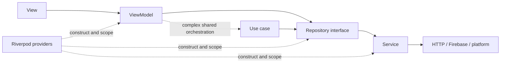

# Flutter Application Architecture

- **Status:** Accepted foundation
- **Pattern:** Feature-first MVVM
- **State and composition:** Riverpod 3
- **Last updated:** 19 August 2026

## 1. Decision

The Flutter application will not use domain-driven design. It follows Flutter's recommended separation into UI and data layers:

- **Views** render immutable UI state and forward user intent.
- **View models** transform repository data into UI state and expose commands.
- **Repositories** are the source of truth for application data and session-scoped caches.
- **Services** are stateless adapters for HTTP, Firebase and platform APIs.
- **Use cases** are optional and exist only when complex orchestration is reused by multiple view models.

This is a feature-first MVVM architecture, adapted for Riverpod. It follows Flutter's current architecture guidance while keeping the codebase practical for a product team. [Flutter architecture guide](https://docs.flutter.dev/app-architecture/guide) · [Flutter architecture recommendations](https://docs.flutter.dev/app-architecture/recommendations)

## 2. Dependency flow



Rules:

1. A view knows its view model and presentation models, not services or DTOs.
2. A view model may use multiple repository interfaces but no vendor SDK.
3. A repository may use multiple services; repositories never depend on other repositories.
4. A service loads or sends data and owns no application state.
5. Cross-repository orchestration belongs in a view model or a focused use case.
6. Riverpod is the composition and reactive-lifecycle mechanism, not a replacement for these boundaries.

## 3. Canonical source shape

```text
lib/
  bootstrap/
    app_bootstrap.dart
    app_environment.dart
    bootstrap_failure.dart
    provider_observer.dart
  app/
    molo_app.dart
    router/
      app_router.dart
      routes/
      route_guards.dart
    design_system/
      colour/
      typography/
      spacing/
      components/
    adaptive/
      window_class.dart
      adaptive_shell.dart
      capabilities.dart
      policies.dart
    localisation/
      l10n/
      locale_controller.dart
  core/
    auth/
      data/
        models/
        repositories/
        services/
        federation/
      ui/
        view_models/
        views/
        widgets/
      auth_providers.dart
      auth.dart
    networking/
      molo_api_transport.dart
      interceptors/
      problem_details_mapper.dart
    result/
    storage/
    observability/
    platform/
    contracts/
      generated/
  features/
    {feature}/
      data/
        models/
        repositories/
        services/
      logic/
        use_cases/             # optional
      ui/
        view_models/
        views/
        widgets/
      {feature}_providers.dart
      {feature}.dart           # public surface
```

Omit directories that a feature does not need. Do not manufacture empty layers for symmetry.

The initial feature names follow user journeys, not server internals: `practice_home`, `clients`, `tax_work`, `document_requests`, `documents`, `notifications`, `settings` and `account_security`. A screen may combine data from several server domains without becoming a server bounded context.

## 4. State model

Molo distinguishes four types of state:

| State | Owner | Examples | Lifetime |
|---|---|---|---|
| Widget-ephemeral | Flutter widget | Focus, animation, text controller, hover, expansion | Widget instance |
| View state | ViewModel through Riverpod | Loading, filters, selected row, validation, command progress | Route/view |
| Application/session | Repository through Riverpod | Auth session, selected practice, region route, locale | Signed-in/app session |
| Durable business data | Molo backend | Work items, documents, members, deadlines | Server-controlled |

Riverpod owns the middle two categories. Flutter widgets own the first. The backend owns the fourth.

### Riverpod conventions

- Use generated providers through `riverpod_annotation` and `riverpod_generator`.
- Use `AsyncNotifier` for asynchronous view models with commands and `Notifier` for synchronous view state.
- Use `Provider`, `FutureProvider` or `StreamProvider` for read-only dependencies or projections.
- Use `autoDispose` for route/view state by default. Use `keepAlive` only for deliberate app/session sources of truth.
- Parameterised providers take stable identifiers, never large mutable objects.
- Use `select` for narrow rebuilds after profiling or when state is demonstrably broad.
- Use provider overrides with fakes in tests; do not add a second DI system.
- Observe provider failures through a redacting `ProviderObserver`; never log state values indiscriminately.
- Do not use Riverpod's legacy `StateProvider`, `StateNotifierProvider` or `ChangeNotifierProvider` APIs.
- Do not build production architecture on experimental mutations or offline persistence.

Riverpod 3 provides automatic disposal, error/loading representation, provider overrides and modern `Notifier`/`AsyncNotifier` APIs. Version 3 moved older state APIs into a legacy library, which is why new Molo code starts on the modern API. [Riverpod providers](https://riverpod.dev/docs/concepts2/providers) · [Riverpod 3 changes](https://riverpod.dev/docs/whats_new)

## 5. Views and view models

A view:

- watches one primary view-model provider;
- renders state using Molo design-system components;
- contains layout, animation and simple visibility logic only;
- invokes named view-model commands for user intent;
- owns presentation-only actions such as focus and local dialogs.

A view model:

- exposes one immutable state type;
- loads and combines repository data;
- validates presentation input without pretending to enforce server invariants;
- exposes intention-revealing commands such as `submitRequest`, not setters such as `setStatus`;
- cancels or ignores stale work on disposal/practice change;
- maps typed failures into localisable presentation outcomes;
- never accepts `BuildContext` and never navigates directly.

Commands return a typed result when the view must perform a one-off presentation effect. Durable success is confirmed from the repository/server response, not optimistic UI alone for consequential actions.

## 6. Repositories and services

Repositories are the client-side source of truth. They own:

- mapping wire DTOs into stable application models;
- session-scoped memory caching and invalidation;
- request cancellation and safe idempotent retry policy;
- merging approved realtime streams with command responses;
- hiding whether data came from HTTP, Firebase or a platform service;
- clearing practice-scoped data on sign-out or practice switch.

Services are narrow, stateless and vendor-specific. Examples include `MoloApiService`, `FirebaseAuthService`, `AppCheckService`, `FileSelectionService` and `BrowserLocationService`.

Generated API clients and DTOs live below services. They are never used as view state and never edited manually.

## 7. Failures and results

- Expected failures cross layers as typed result/failure values.
- Services translate vendor exceptions into infrastructure failures.
- Repositories translate infrastructure failures and API Problem Details into application failures.
- View models translate application failures into localisable UI states/actions.
- Unexpected programmer errors still fail loudly in development and are recorded through redacted observability.
- Never display raw provider, Firebase, HTTP or stack-trace text to a user.

This follows Flutter's current Result-object guidance rather than using exceptions as ordinary UI control flow. [Flutter Result pattern](https://docs.flutter.dev/app-architecture/design-patterns/result)

## 8. Feature boundaries

- A feature exposes only its `{feature}.dart` surface.
- A feature cannot import another feature's `data/` or `ui/` internals.
- Shared visual primitives move to `app/design_system` only after real reuse.
- Shared technical adapters move to `core` only when they contain no feature policy.
- Cross-feature navigation uses typed routes, not widget imports.
- Cross-feature data composition belongs at the consuming view model or app shell.

## 9. Authentication integration

Authentication uses the same architecture:

```text
AuthView → AuthViewModel → AuthRepository → FirebaseAuthService
                                      ↘ federation adapters
```

Firebase user types never leave the data layer. `AuthRepository` exposes Molo-owned session models and is the source of truth for client authentication state. The API transport can obtain tokens only through the dedicated token broker. Full trust-boundary rules remain in the [authentication design](../backend_design/authentication.md).

## 10. Testing and enforcement

| Component | Primary test |
|---|---|
| Service | Contract/adapter test with fake server or platform boundary |
| Repository | Unit test for mapping, cache, cancellation and failure policy |
| ViewModel | Provider-container unit test with repository fakes |
| View | Widget test over state variants and user commands |
| Route | Deep-link, redirect, browser back/forward and restoration test |
| Feature journey | Integration test on Web, Android and iOS |
| Architecture | Static import/dependency test |

Acceptance criteria:

1. No view imports a service, Firebase SDK or generated DTO.
2. No view model imports Flutter widgets, `BuildContext` or vendor SDKs.
3. Riverpod is the only application state/DI mechanism.
4. Repository interfaces can be replaced by fakes without starting Flutter plugins.
5. Every route-level view has loading, empty, content, recoverable error and unauthorised behaviour where applicable.
6. A practice switch disposes or invalidates all practice-scoped providers before new data appears.
7. Static checks reject feature-internal cross-imports and forbidden vendor imports.
