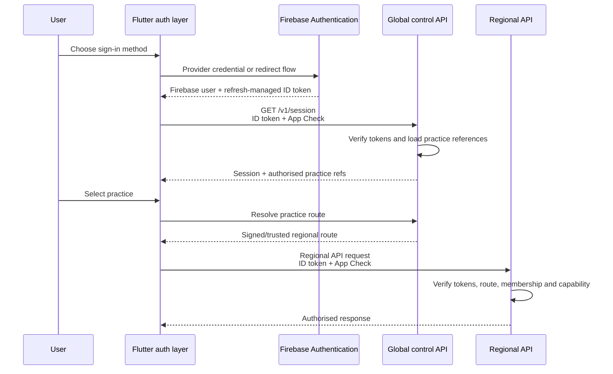

# Client-First Authentication Design

- **Status:** Draft v0.2, first slice implemented (see section 17)
- **Identity service:** Firebase Authentication with Identity Platform
- **Development project:** `molobuddy-development`
- **Client:** Flutter
- **Last updated:** 19 August 2026

## 1. Decision

Yes: Molo should have a **full client-first authentication layer** in the Flutter app.

Client-first means the app owns the user experience, state machine, provider adapters, deep links, account linking, reauthentication and recovery journeys. It does **not** mean the client decides whether a token is valid or what the user may access.

The trust split is:

| Responsibility | Owner |
|---|---|
| Sign-in, sign-up and provider-selection UI | Flutter app |
| Provider SDK/redirect/popup interaction | Flutter auth provider adapter |
| Credential verification and identity issuance | Firebase Authentication / Identity Platform |
| ID-token refresh and native persistence | Firebase client SDK |
| App attestation token | Firebase App Check client SDK |
| ID-token and App Check verification | Molo backend |
| Practice membership, taxpayer grants and capabilities | Regional Molo backend |
| Region route | Global control API from server-owned directory |
| Forced session revocation | Firebase Admin SDK plus Molo membership state |

Firebase's Flutter SDK supports federated sign-in and linking multiple providers to one Firebase user, preserving a stable UID. Identity Platform supports configurable SAML and OIDC providers for later enterprise federation. [Flutter federated sign-in](https://firebase.google.com/docs/auth/flutter/federated-auth) · [Flutter provider linking](https://firebase.google.com/docs/auth/flutter/account-linking) · [Identity Platform SAML/OIDC providers](https://cloud.google.com/identity-platform/docs/managing-providers-programmatically)

## 2. Trust-boundary flow



The Flutter app never sends a trusted role, capability, `homeRegionKey` or acting user ID. It may send a selected `practiceId`; the server derives all authority.

## 3. Flutter auth module

Authentication follows the accepted Flutter MVVM architecture rather than DDD:

```text
AuthView → AuthViewModel → AuthRepository → FirebaseAuthService
                                      ↘ federation adapters
```

`AuthRepository` is the client source of truth for identity/session state. Riverpod constructs and scopes the repository, view models, services and provider/federation adapters. The complete client rules live in the [Flutter application architecture](../app_design/architecture.md).

All direct Firebase Authentication usage is contained within:

```text
src/molobuddy_app/lib/core/auth/
  data/
    models/
      auth_session.dart
      auth_user.dart
      auth_failure.dart
      auth_method_descriptor.dart
    repositories/
      auth_repository.dart
      firebase_auth_repository.dart
    services/
      firebase_auth_service.dart
      firebase_app_check_service.dart
      auth_token_broker.dart
      auth_deep_link_service.dart
    federation/
      auth_method_adapter.dart
      email_password_adapter.dart
      email_link_adapter.dart
      google_adapter.dart
      apple_adapter.dart
      microsoft_adapter.dart
      oidc_adapter.dart
      saml_adapter.dart
      auth_method_registry.dart
  ui/
    view_models/
      auth_view_model.dart
      account_linking_view_model.dart
      reauthentication_view_model.dart
    views/
      sign_in/
      recovery/
      account_security/
      provider_linking/
    widgets/
  auth_providers.dart
  auth.dart
```

Features outside `core/auth` consume Molo-owned session providers/repository interfaces through `auth.dart`. They never import `firebase_auth`, provider SDKs or raw token types.

## 4. Federated identity adapter contract

Authentication-method-specific code implements a Molo-owned interface:

```dart
abstract interface class AuthMethodAdapter {
  String get providerId;
  Set<AuthPlatform> get supportedPlatforms;

  Future<AuthAttempt> signIn(AuthMethodContext context);
  Future<AuthAttempt> link(AuthMethodContext context);
  Future<AuthAttempt> reauthenticate(AuthMethodContext context);
  Future<void> cancel();
}
```

The interface returns Molo-owned outcomes, not Firebase `UserCredential` objects. The repository/service layer converts the identity-provider result into stable `AuthUser`/`AuthSession` models.

Federation adapters own only identity-provider interaction. They do not load Molo membership, choose a region or call business APIs.

## 5. Provider registry and gradual federation

The app has a compiled registry of adapters. The public `GET /v1/auth/providers` endpoint returns safe rollout configuration:

```json
{
  "providers": [
    {
      "providerId": "google.com",
      "kind": "federated",
      "displayNameKey": "auth.provider.google",
      "availability": "coming_soon",
      "enabledPlatforms": ["android", "ios", "web"],
      "supportsLinking": true,
      "sortOrder": 10
    }
  ]
}
```

No client ID, secret, certificate or provider endpoint is returned unless it is explicitly public configuration required by the SDK.

There are three federation rollout levels:

1. **Configuration-only:** enable an adapter already shipped in the app.
2. **App release:** add a provider requiring a new native SDK, entitlement or callback configuration.
3. **Enterprise configuration:** add an approved SAML/OIDC provider through Identity Platform and expose it to the relevant invited users.

Provider enablement is platform-aware and can be rolled out gradually. A provider button is active only when both the compiled adapter and trusted server configuration mark it `available`. A `coming_soon` adapter may be rendered as a disabled product preview, but it never starts provider code.

## 6. Authentication state machine

The Riverpod `AuthViewModel` and `AuthRepository` together expose one explicit state machine:

```text
initialising
  → signed_out
  → authenticating
  → mfa_challenge
  → authenticated_unrouted
  → loading_session
  → selecting_practice
  → resolving_region
  → ready

Any authenticated state may move to:
  → reauthentication_required
  → session_revoked
  → access_suspended
  → recoverable_error
  → signed_out
```

`FirebaseAuth.instance.idTokenChanges()` is a data-service signal for token/user changes; the repository maps it into Molo session models consumed by the Riverpod view model. It is not exposed directly to features. Firebase documents that client SDKs persist sessions and refresh ID tokens; ID tokens are short-lived while refresh tokens maintain the session. [Flutter auth-state streams](https://firebase.google.com/docs/auth/flutter/start) · [Firebase session management](https://firebase.google.com/docs/auth/admin/manage-sessions)

The state machine prevents common UI bugs:

- authenticated does not imply authorised for a practice;
- a restored Firebase session still reloads `/v1/session`;
- a stale route is re-resolved after `421 region_route_mismatch`;
- an invitation can be accepted before a practice is selected;
- token refresh does not reset the current feature navigation unnecessarily;
- sign-out clears in-memory practice data before returning to the sign-in screen.

## 7. Token broker and API client

Raw ID and App Check tokens are available only to the API transport interceptor:

```text
feature → generated API client → authenticated transport
                                ↘ AuthTokenBroker.getIdToken()
                                ↘ AppCheckGateway.getToken()
```

Rules:

- never put tokens in feature state, logs, analytics, crash reports or URLs;
- never manually persist a raw ID token in general-purpose preferences;
- allow the Firebase SDK to own refresh-token persistence;
- coalesce simultaneous refresh requests;
- retry one request after a forced token refresh on a token-expiry response;
- do not retry authorisation failures as authentication failures;
- cancel or isolate in-flight practice requests during sign-out/practice switch;
- clear all regional caches on user change.

Flutter web uses Firebase ID tokens for the API in v1 so mobile and web share one model. A future server-rendered public web product may use Firebase session cookies behind a separate web boundary; it must not silently change the Flutter contract.

## 8. Backend authentication pipeline

Every authenticated request passes these stages in order:

1. enforce TLS/ingress and request limits;
2. verify App Check token and expected Firebase app/project;
3. verify Firebase ID token signature, audience, issuer and expiry;
4. construct an immutable `ActorContext` from verified claims;
5. resolve `practiceId → homeRegionKey` from trusted server data;
6. reject a wrong regional route;
7. load active membership or taxpayer access grant from regional Firestore;
8. evaluate the required capability and resource scope;
9. enforce verified-email, recent-authentication or revocation checks for sensitive actions;
10. execute the application command with actor/correlation context.

The `ActorContext` may contain verified `uid`, Firebase project, provider IDs, email-verification flag, authentication time and App Check app ID. It never contains trusted practice roles from client-supplied or long-lived custom claims.

## 9. Verification tiers

| Tier | Examples | Additional checks |
|---|---|---|
| Standard | Lists, ordinary work updates | Valid ID token, App Check, current membership/capability |
| Sensitive | Connector authorisation, member role change, document export | Token revocation check, verified email, policy-defined maximum `auth_time` age |
| Privileged | Identifier reveal, owner change, closure, regional migration | Explicit reauthentication/step-up, fresh token, reason, dedicated audit event |

Firebase ID tokens normally last about one hour and refresh tokens can be revoked through the Admin SDK. Molo membership suspension is checked regionally and takes effect independently of token expiry. [Firebase session revocation](https://firebase.google.com/docs/auth/admin/manage-sessions)

## 10. Provider linking and collision handling

Account linking is explicit:

1. user must already be signed in;
2. sensitive linking begins with reauthentication when policy requires it;
3. the adapter obtains the new provider credential;
4. Firebase links it to the current UID;
5. Molo reloads identity state and records a safe security event;
6. the app shows recovery implications and remaining sign-in methods.

Never merge Molo users merely because two providers return the same email address. Never move practice memberships between Firebase UIDs automatically. Provider collision recovery requires proof of control of the existing account and the new provider.

Do not allow unlinking the final usable sign-in method. Provider tokens received during linking are not sent to the Molo backend unless a documented Identity Platform flow specifically requires it.

## 11. Email and enumeration protection

Keep email-enumeration protection enabled. The UI uses neutral outcomes such as “If an account can use this method, we have sent the next step.” It does not call email discovery APIs to reveal registered methods.

Email verification is required before:

- joining a practice as staff;
- enrolling MFA;
- linking a new provider;
- accessing privileged tax information where policy requires it.

Email-link sign-in is a strong low-friction option because it verifies email ownership and avoids password reuse. The initial provider set remains a product decision; the architecture supports email/password, email link and federated adapters without coupling screens to one method. [Firebase email-link authentication](https://firebase.google.com/docs/auth/flutter/email-link-auth)

## 12. MFA and step-up authentication

Identity Platform exposes MFA, but current Flutter documentation focuses on SMS and explicitly warns that SMS is insecure. Molo should not treat SMS as its highest-assurance factor. [Firebase Flutter MFA](https://firebase.google.com/docs/auth/flutter/multi-factor)

Policy:

- design the UI/state machine for multi-factor challenges now;
- do not make SMS the default privileged-control factor;
- use fresh provider reauthentication plus verified email for initial step-up where appropriate;
- evaluate cross-platform TOTP/passkey support before locking the production MFA method;
- require stronger authentication for owners/admins when an approved method is available;
- provide recovery codes or a reviewed support recovery procedure before mandatory MFA.

## 13. App Check

Activate App Check after Firebase initialisation and before protected service use. Default Flutter providers are Play Integrity on Android, App Attest/DeviceCheck on Apple platforms and reCAPTCHA on web; production configuration must not use debug providers. Roll out monitoring before enforcement to avoid locking out valid clients. [Firebase App Check for Flutter](https://firebase.google.com/docs/app-check/flutter/default-providers)

App Check reduces abuse from unofficial clients. It does not authenticate a person and never replaces Firebase Authentication or server authorisation.

## 14. Global identity and enterprise federation

One person keeps one global Firebase UID across Molo practices and regional cells. Practice isolation comes from server membership/grants, not one Identity Platform tenant per normal practice.

For an enterprise SAML/OIDC customer:

- prefer a project-level provider configuration when users must retain one cross-practice identity;
- use an Identity Platform tenant only when contracted identity isolation outweighs cross-practice identity simplicity;
- document account migration/linking before enabling a tenant;
- route provider discovery through invitation or approved organisation configuration, not unrestricted email-domain guessing.

## 15. Failure and recovery behaviour

Map provider/Firebase errors into stable Molo failures:

```text
auth_cancelled
auth_network_unavailable
auth_provider_unavailable
auth_credential_invalid
auth_account_disabled
auth_email_not_verified
auth_mfa_required
auth_recent_login_required
auth_provider_already_linked
auth_credential_linked_elsewhere
auth_session_revoked
```

Provider error strings are never shown raw or used for control flow outside the adapter. Recovery actions are explicit and localised.

## 16. Testing

- Unit-test the repository/view-model state machine with fake services and deterministic streams through a Riverpod test container.
- Contract-test every provider adapter against shared sign-in/link/reauth behaviours.
- Widget-test cancellation, collision, MFA and recovery states.
- Use Firebase Auth Emulator for email/password/linking flows where supported.
- Keep real-provider smoke tests in isolated test projects with non-production callback URLs.
- Test token expiry, revocation, disabled users, stale routes and practice suspension.
- Assert that tokens and credentials are redacted from captured logs/crash fixtures.
- Test each platform's deep-link lifecycle from killed, background and foreground states.

## 17. Implementation status

The identity service is the `molobuddy-development` Firebase project. Setup
steps and configuration live in the
[local development runbook](../local_development.md).

| Area | State |
|---|---|
| Email/password sign-in, client side | Implemented behind `AuthService`; verified against the real project |
| Failure mapping (section 15) | Implemented for the email/password subset; provider strings never surface raw |
| Email-enumeration protection (section 11) | Enabled on the project |
| ID-token and App Check verification (section 8, steps 1–4) | Implemented in `FirebaseAdminRequestTokenVerifier`; distinct failure codes covered by tests |
| Federation adapters (section 4) | Not built. Google renders as a disabled `coming_soon` preview |
| App Check client (section 13) | Plumbed behind `AppCheckGateway`; inactive until a site key or debug token is configured |
| Token broker and transport (section 7) | Implemented; a test asserts features cannot import a vendor SDK or read raw tokens |
| MFA (section 12) | Not built; disabled on the project |
| Membership, region routing (section 8, steps 5–10) | Not built; no regional data yet |

**One consequence is worth stating plainly.** The server requires an App Check
token, and the Flutter application does not send one. With
`AUTH_VERIFIER=firebase`, an application request to `/v1/session` therefore
fails with `app_check_required` even when the ID token is valid, so local
development runs the `local` verifier instead. Acceptance criterion 8 below
keeps the two failures distinct, and that distinction must survive whatever
closes this gap. Adding App Check to the client is the fix; relaxing the
verifier is not.

## 18. Acceptance criteria

1. Adding a provider does not change feature code or backend authorisation logic.
2. Features cannot import Firebase Auth or read raw tokens.
3. A valid Firebase user with no practice membership cannot enter a practice.
4. A revoked membership stops regional access without waiting for ID-token expiry.
5. Provider linking preserves the same Firebase UID and Molo memberships.
6. Account collision handling never merges users by email alone.
7. Sign-out clears regional data and cancels scoped work before showing sign-in.
8. App Check failure and authentication failure remain distinct errors.
9. Privileged actions enforce the configured fresh-authentication policy.
