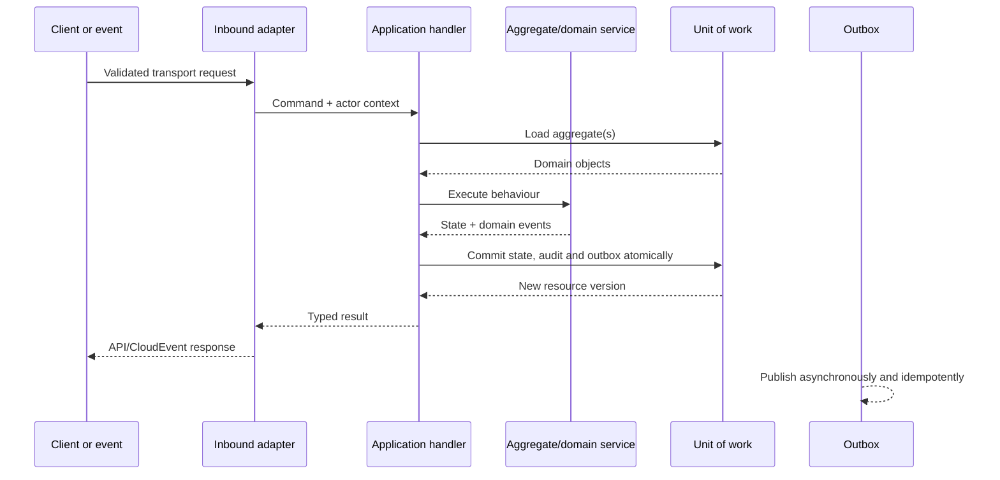

# Domain-Driven Server Design

- **Status:** Draft v0.1
- **Architecture:** Domain-driven modular monolith
- **Last updated:** 19 August 2026

## 1. Purpose

Molo's server must keep tax-work meaning stable while HTTP, Firebase, OCR providers, connectors and regional infrastructure evolve. Domain-driven design is used to protect that meaning, not to create layers for their own sake.

The unit of modularity is a **bounded context**. Each context owns its language, invariants, use cases, persistence ports and events. A context exposes a small public application API; other contexts cannot import its repositories, Firestore documents or internal aggregates.

## 2. Bounded contexts

| Context | Owns | Does not own |
|---|---|---|
| `identity_access` | Session interpretation, memberships, invitations, access grants and capability policy | Credentials or provider tokens managed by Firebase Authentication |
| `practices` | Practice lifecycle, settings, jurisdiction enablement and regional assignment | Members, taxpayers or billing implementation |
| `taxpayers` | Taxpayers, client relationships, taxpayer relationships, trading activities, registrations and portfolios | Work status or document processing |
| `tax_work` | Work items, tasks, assignment and professional-work state transitions | Template definitions or notification delivery |
| `documents` | Requests, upload sessions, logical documents, immutable versions, links and document review | OCR/extraction proposal logic |
| `workflows` | Workflow templates/versions, deadline rules, deadlines and reminder policies | Work-item aggregate state |
| `notifications` | Notification intents, preferences, delivery evidence and inbox state | The business decision that a notification is needed |
| `connectors` | Connector catalogue, connections, consent, sync runs, external records and matching | Core taxpayer/work/document mutation |
| `intelligence` | OCR/classification/extraction runs, proposals, evidence and human review | Professional approval or final tax outcomes |
| `audit` | Immutable audit evidence, privileged queries and controlled exports | Mutable business state |

Context names match the API and planned data-design files. New contexts require a vocabulary decision and architecture review; a new feature does not automatically deserve a context.

## 3. Layers and dependency rule

Every bounded context follows:

```text
domain
  ↑
application
  ↑            ↑
inbound adapters   outbound adapters
  ↑            ↑
composition root / runtime
```

### Domain

Contains aggregates, entities, value objects, domain services, domain events and domain errors.

It may import only:

- the context's own domain code;
- the minimal shared kernel;
- standard language primitives.

It may not import Fastify, Firebase, Google Cloud clients, environment variables, loggers, HTTP status codes, JSON DTOs or generated OpenAPI clients.

### Application

Contains commands, queries, handlers, policies, process managers and ports. It coordinates domain objects and defines transaction boundaries.

It may import the context domain and shared kernel. It defines interfaces such as `WorkItemRepository`, `UnitOfWork`, `DomainEventOutbox`, `Clock`, `IdGenerator` and `AuthorisationPort`; infrastructure implements them.

### Inbound adapters

Translate HTTP requests, CloudEvents, Pub/Sub messages or coordinator jobs into application commands/queries. They perform transport validation and map application outcomes to transport responses. They contain no business invariants.

### Outbound adapters

Implement repositories and gateways for Firestore, Storage, Firebase Auth, Secret Manager, Pub/Sub, email, OCR and external providers. They translate provider failures into stable application errors and never leak provider objects into domain code.

### Composition roots

Read configuration, initialise SDKs, construct adapters/handlers, register routes and start/stop the process. Only composition roots may choose concrete infrastructure.

## 4. Module public surface

Each context exports only:

```text
commands and command results
queries and query results
integration events
explicit application ports needed by an orchestrator
stable context-owned identifiers/value DTOs
```

The following remain private:

```text
aggregate implementation
repository implementation
Firestore paths and document types
Fastify routes
provider SDK types
internal domain events
helper utilities
```

An architecture test must reject imports containing another context's `/domain/`, `/application/` or `/adapters/` path. Cross-context callers import only the target context's public `index.ts`.

## 5. Command flow



Request handlers never write Firestore documents directly. The application handler asks a domain object to perform behaviour, then commits through a context-owned unit of work.

## 6. Aggregates and invariants

Initial aggregate roots include:

| Context | Aggregate roots |
|---|---|
| Practices | `Practice` |
| Identity/access | `PracticeMembership`, `TaxpayerAccessGrant` |
| Taxpayers | `Taxpayer`, `ClientRelationship`, `Portfolio` |
| Tax work | `WorkItem` |
| Documents | `DocumentRequest`, `Document`, `UploadSession` |
| Workflows | `WorkflowTemplate`, `Deadline`, `ReminderPolicy` |
| Notifications | `NotificationIntent`, `NotificationPreferences` |
| Connectors | `ConnectorConnection`, `SyncRun` |
| Intelligence | `IntelligenceRun`, `ExtractionProposal` |

An aggregate:

- is loaded and saved through one repository port;
- owns its state transition and resource version;
- emits domain events but does not publish them;
- protects invariants even when invoked outside HTTP;
- accepts value objects, not raw unvalidated strings for critical concepts.

Cross-aggregate checks belong in application policies and are revalidated inside the same Firestore transaction where required. Avoid aggregates that load an entire practice.

## 7. Commands, queries and results

Commands are imperative and actor-aware:

```ts
type TransitionWorkItem = {
  actor: ActorContext;
  practiceId: PracticeId;
  workItemId: WorkItemId;
  expectedVersion: ResourceVersion;
  transitionCode: TransitionCode;
  reason?: string;
  idempotencyKey: IdempotencyKey;
  correlationId: CorrelationId;
};
```

Queries return read models, never live aggregates. Versioned HTTP GET endpoints are the v1 Flutter read boundary. Any later realtime or direct projection adapter must reuse the same visibility policy and requires an explicit architecture decision.

Expected business failures use a typed result/error hierarchy. Throw only for truly exceptional failures or adapter errors that are translated at the application boundary. Domain code never returns HTTP status codes.

## 8. Transactions, outbox and idempotency

One consequential command commits, in the same regional Firestore transaction where possible:

1. aggregate state and new resource version;
2. idempotency record or command receipt;
3. immutable audit event;
4. domain-event outbox record;
5. directly affected local projection counters where transactionally required.

Publishing happens after commit. Consumers record their processed event ID in the same transaction as their business effect. At-least-once delivery is assumed everywhere.

No transaction spans regional cells or external providers. External side effects use a durable intent/saga state:

```text
requested → dispatched → provider_confirmed
          ↘ retryable_failure
          ↘ permanent_failure
```

Provider success never rolls back local state; compensating domain actions record what happened.

## 9. Cross-context collaboration

Use, in priority order:

1. a public application command/query for synchronous work within the monolith;
2. an integration event for asynchronous reaction;
3. a process manager for a long-running multi-context workflow.

Never:

- import another context's Firestore repository;
- update another context's collection directly;
- use a shared mutable “service” bag;
- make one aggregate depend on another context's aggregate class;
- use an event when the caller requires immediate invariant confirmation.

Example: Documents emits `document.reviewed.v1`; Tax Work may react by re-evaluating a transition gate. Documents does not update `WorkItem.incompleteTaskCount` directly.

## 10. Shared kernel

Keep the shared kernel intentionally small:

- opaque/branded identifiers;
- `Result` and base error primitives;
- `Clock` and timestamp parsing;
- money/currency, locale, timezone and jurisdiction value objects;
- resource version, idempotency and correlation identifiers;
- domain/integration event envelope primitives.

Do not place business entities, repositories, Firebase helpers or generic “utils” in the shared kernel. Duplication is preferable to accidental coupling when concepts merely look similar.

## 11. Testing strategy

| Test | Purpose | Infrastructure |
|---|---|---|
| Domain unit | Aggregate invariants and state machines | None |
| Application unit | Handler coordination, capability and error mapping | In-memory ports/fakes |
| Contract | API request/response/error examples | Fastify injection + generated schemas |
| Repository adapter | Firestore mapping, transactions and concurrency | Firebase Emulator Suite |
| Event adapter | CloudEvent parsing, idempotency and outbox handling | Recorded fixtures + emulator |
| Architecture | Import/dependency rules and public surfaces | Static analysis |
| Regional end-to-end | Auth, App Check, routing, Storage and asynchronous flow | Isolated staging cell |

Use builders with explicit values; do not hide important jurisdiction, region or actor context behind magical fixtures.

## 12. Extraction criteria

A context may become a separate service only when at least one is true:

- it has a materially different scaling profile;
- it needs a stronger security or runtime isolation boundary;
- it has independent availability requirements;
- a dedicated team can own its operations and contract;
- measured deployments are blocked by the monolith;
- regulation or contracts demand separate infrastructure.

Extraction must preserve the public application/integration contract and cannot introduce cross-service distributed transactions.

## 13. Acceptance criteria

1. A domain test runs with no Firebase or Fastify process.
2. Static rules prevent context-internal imports across boundaries.
3. One command commits state, audit and outbox atomically.
4. Replaying an integration event produces one business effect.
5. A provider failure is expressed through a context-owned application error.
6. Moving an inbound adapter from HTTP to Eventarc does not change the aggregate behaviour.
