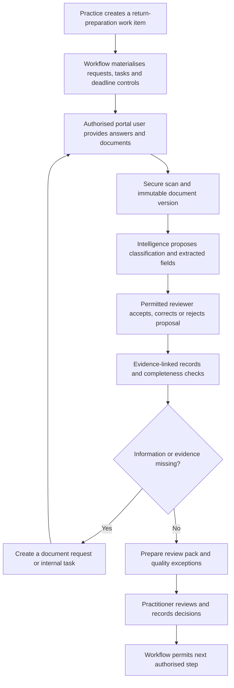

# AI-Assisted Tax Work for South African Practices

- **Status:** Proposed v0.1
- **Owner:** Product and engineering
- **Applies to:** Product strategy, experience design, intelligence, workflows, documents, connectors and tax-work design
- **Launch jurisdiction:** South Africa (`ZA`)
- **Last updated:** 21 August 2026
- **Factual sources checked:** 21 August 2026

**Vocabulary source of truth:** [Product glossary](glossary.md)<br>
**Architecture source of truth:** [System architecture](system_architecture.md)<br>
**Related contracts:** [Intelligence](../api_design/intelligence.md), [Documents](../api_design/documents.md), [Tax work](../api_design/tax_work.md), [Workflows](../api_design/workflows.md), [Audit](../api_design/audit.md) and [Connectors](../api_design/connectors.md)

---

## 1. Purpose

Molo helps a South African **practice** deliver tax work for its **taxpayers**. It is not an autonomous tax practitioner and it does not replace the professional judgement, accountability or authority of the practitioner and taxpayer.

The product objective is to reduce the operational work that surrounds tax compliance:

```text
Collect → organise → extract → reconcile → identify gaps → prepare → review → submit → monitor
```

The professional retains control of tax advice, material tax positions, final review and any authorised submission. Molo turns client conversations, documents and routine follow-up into structured, evidence-linked work for that professional to assess.

This document converts the “day in the life” research into an implementable product direction. It records:

1. facts that constrain a South African launch;
2. the product decisions that follow from those facts;
3. the first workflow to build; and
4. boundaries that prevent Molo from presenting generated output as professional tax advice or a completed submission.

It does not define tax-law rules, filing dates, SARS integration behaviour or calculation formulae. Those must live in reviewed, versioned jurisdiction packs and workflow templates.

---

## 2. South African operating context

### 2.1 Tax-practitioner regulation

SARS states that, subject to statutory exclusions, a natural person who charges to advise another person on applying a tax Act, complete a return for another person, or assist with completing that return must be registered with both SARS and a recognised controlling body. SARS also notes that a person working under the supervision of a registered tax practitioner is an exclusion, with the registered practitioner accountable for that person's actions. [SARS: register as a tax practitioner](https://www.sars.gov.za/tax-practitioners/register-as-a-tax-practitioner/) · [SARS: reporting unprofessional conduct](https://www.sars.gov.za/guide-to-reporting-unprofessional-conduct/)

**Product implication:** Molo may support a practice and its personnel, but must never describe itself as the tax practitioner, imply that an AI model holds a practitioner registration, or obscure the responsible practice member. Professional approval and ownership are recorded against a named practice member, not an AI capability.

### 2.2 Evidence, verification and SARS correspondence

SARS can request documents supporting amounts declared in a return. For an individual-income-tax verification, the current SARS guide describes a 15-working-day opportunity to provide supporting documents or submit a request for correction; the actual correspondence determines what is requested and the applicable action. [SARS individual return guide](https://www.sars.gov.za/guide-to-submit-your-individual-income-tax-return-via-efiling/) · [SARS supporting-document guidance](https://www.sars.gov.za/faq/how-do-i-upload-submit-supporting-documents/)

**Product implication:** A SARS correspondence workflow must preserve the original document, extract a proposed deadline and requested items, and require a person to confirm them against the letter before a statutory deadline is relied upon. The system must not invent a request type, deadline or response requirement from a summary alone.

### 2.3 Provisional tax, VAT and disputes

Provisional tax is a method of paying normal income tax in advance, using estimated taxable income. SARS describes two compulsory payments and an optional third payment; insufficient payment or underestimation can attract penalties and interest. [SARS: provisional tax](https://www.sars.gov.za/types-of-tax/provisional-tax/)

For VAT, input-tax treatment and documentary requirements are fact-specific. SARS's vendor guide sets out tax-invoice requirements and conditions for deducting input tax. [SARS VAT 404 guide](https://www.sars.gov.za/wp-content/uploads/Ops/Guides/Legal-Pub-Guide-VAT-404-VAT-404-Guide-for-Vendors.pdf)

An objection to an assessment or decision must generally be lodged within 80 business days, subject to the applicable rules and circumstances. [SARS: objections](https://www.sars.gov.za/individuals/what-if-i-do-not-agree/objections/)

**Product implication:** Molo may classify, reconcile, calculate from approved inputs and highlight missing evidence. It must present tax treatment, VAT recoverability, a provisional estimate and a dispute route as proposals or reviewed outputs—not automatic conclusions. Every statutory deadline must carry its jurisdiction-rule version or its source correspondence and a confirmation record.

### 2.4 Personal information and AI providers

Tax records contain highly sensitive personal and financial information. POPIA establishes safeguards for the integrity and confidentiality of personal information and addresses processing by operators; its rules also cover cross-border information flows. [POPIA](https://www.gov.za/documents/protection-personal-information-act) · [Information Regulator: security safeguards](https://inforegulator.org.za/knowledge-base/category/popia/chapter-3-conditions-for-lawful-processing/part-a-processing-of-personal-information-in-general/condition-7-security-safeguards/)

**Product implication:** Before enabling an OCR, AI or messaging provider, Molo must document the permitted purpose, roles of the practice and Molo, processor/operator terms, security controls, retention, processing location and any cross-border transfer basis. This is an implementation and contractual requirement, not a claim that a particular provider is automatically suitable.

---

## 3. Product decision

Molo is a **practice operating system with assisted intelligence**, not an AI chatbot and not an autonomous multi-agent tax adviser.

Its stable core is:

| Product plane | Responsibility | AI may assist with | AI must not own |
|---|---|---|---|
| Taxpayer and client relationship | Who is responsible and who may act | Extracting candidate details | Legal classification or authority confirmation |
| Tax work | Work items, tasks, assignments and status | Drafting tasks and identifying gaps | Final work-item state or completion |
| Documents | Secure evidence, versions, requests and review | OCR, classification and extraction | Acceptance of evidence without a permitted reviewer |
| Workflow | Templates, deadlines, transitions and review gates | Suggesting the next action | Bypassing a transition, deadline policy or reviewer gate |
| Intelligence | Evidence-linked proposals and summaries | Extraction, matching, explanations and anomaly flags | Professional approval, tax law or final outcomes |
| Audit | Immutable evidence of actions and approvals | Safe, attributable action context | Rewriting history |
| Connectors | Governed exchange with external providers | Normalising imported records | Directly mutating arbitrary core records |

This is consistent with the system architecture: the domain remains useful when every connector and AI provider is disabled. Intelligence enriches the domain but does not become the domain's source of truth.

### 3.1 The two experiences

**Practice workspace** gives practice members a portfolio, work queues, evidence, review controls and accountable decisions.

**Client workspace** gives an authorised portal user a plain-language way to answer questions, provide information and upload documents for a taxpayer. It does not require the client to understand technical tax terminology, but it does require clear questions, confirmations and disclosure of what the practice needs.

The operating path is therefore:

```text
Authorised portal user → Molo client workspace → practice review → authorised SARS process
```

Molo does not sit between the practice and taxpayer as a substitute for either of them.

### 3.2 Interoperability position: coordinate; do not require replacement

South African practices commonly use more than one accounting, tax, payroll, working-paper, document and communication system. Molo's position is to **connect the work across that existing stack**. A practice must be able to adopt Molo without migrating its ledger, tax software, working papers or eFiling process.

Molo is not a replacement ledger and does not claim to supersede an external source. It owns the practice's Molo records—work items, requests, reviewed evidence, decisions, audit events and the relationship between them. It retains the identity, timestamp, source and review state of every imported or extracted value.

| System category | It remains responsible for | Molo's role |
|---|---|---|
| Accounting system | The underlying books and accounting records | Read authorised facts, compare them with other evidence, and surface preparation/reconciliation work |
| Tax or practice software | Its own tax-compliance and execution process | Prepare context, evidence and exceptions; support a deliberate hand-off where approved |
| Working-paper/reporting software | Its working papers and professional outputs | Improve readiness and link the evidence that supports the work |
| Payroll system | Its payroll records and submissions | Ingest authorised payroll facts as evidence/proposals for relevant work |
| Document and communication systems | Their original files/messages and delivery records | Ingest through governed connectors and retain source attribution and consent context |
| SARS | SARS-issued correspondence, assessments and system outcomes | Preserve the source document/outcome, prepare related work and compare it with other records; never claim that Molo's copy is an official SARS outcome |

SARS maintains an Independent Software Vendor interface programme for specified return submissions. It requires product-specific secure access, user authentication and appropriate eFiling rights; it is not a blanket public API. Any future Molo submission capability therefore needs separate ISV/access, security, authority and contractual design approval. [SARS: Independent Software Vendors](https://www.sars.gov.za/individuals/i-need-help-with-my-tax/your-tax-questions-answered/independent-software-vendors/)

This approach is compatible with the existing connector boundary: a connector normalises and matches external records, then proposes or invokes only approved domain actions. It cannot write uncontrolled provider data directly into a work item.

### 3.3 Canonical work and evidence graph

The product's canonical layer is a **work and evidence graph**, not a copy of every source system's database:

```text
source record or client statement
              ↓
immutable source evidence and provenance
              ↓
reviewed fact, match or discrepancy
              ↓
work-item input, candidate treatment or calculation input
              ↓
professional decision and resulting action
```

This allows Molo to show a practitioner both the value and its provenance: for example, an accounting-system transaction, a bank transaction, an invoice and a client statement may agree or disagree about the same apparent event. Molo can identify the discrepancy, state the evidence available and create the next task. It must not decide that the difference is an error, a taxable amount or a deductible expense without the required facts and professional review.

An **impact analysis** is a proposed map of what a newly accepted fact could affect—for example a work item, a request, a reconciliation or a future calculation input. Molo may automatically flag the potential impact. It may only claim a calculated tax effect once a separately approved deterministic calculation engine has used reviewed inputs and a versioned jurisdiction pack.

---

## 4. Product principles

1. **The practitioner remains accountable.** Generated content is prepared work. It is never represented as advice from Molo or as a professional decision.
2. **The work item is the unit of work.** Do not create a generic “tax case” record. The glossary's `WorkItem` is the trackable unit for one responsible taxpayer; conversations, requests and documents attach to it.
3. **One responsible taxpayer per work item.** A portfolio is only a navigation aid. It cannot merge documents, registrations, deadlines or authority across people, companies and trusts.
4. **Evidence before assertion.** A material proposal identifies its source document, extracted field, transaction, client statement or rule reference. Missing evidence remains visible.
5. **Classification is not tax treatment.** “Looks like software” is a classification. “May be relevant to a business expense claim” is a qualified candidate. Neither is a deduction decision.
6. **Deterministic systems own deterministic outcomes.** Permissions, workflow transitions, deadline calculations, arithmetic, tax-rule versions, totals and audit events are ordinary software functions. Language models do not improvise them.
7. **AI may propose; approved domain commands change state.** No model output writes a registration, a return, an assessment, a statutory deadline or a final tax outcome directly.
8. **Confidence does not equal correctness.** Confidence is metadata used for routing and review. It cannot waive an evidence or approval requirement.
9. **Escalation is a success state.** When facts, authority, evidence or tax treatment are uncertain, the assistant stops and creates a prepared task for a practice member.
10. **Practice policy is not tax law.** A practice may define its own evidence and review thresholds. The UI must label them as internal policy and preserve the underlying legal/jurisdiction source separately.

---

## 5. Assisted-work model

### 5.1 Capability-oriented intelligence, not a giant agent

The original research correctly rejects one unrestricted prompt that is asked to “do tax.” Molo will use bounded capabilities whose inputs, outputs and permitted effects are explicit:

| Capability | Input | Output | Permitted effect |
|---|---|---|---|
| Document understanding | Clean document version | Classification and extraction proposal with page evidence | Create an intelligence run and proposal only |
| Conversation intake | Authorised user message and current workflow context | Structured answers, candidate facts and next question | Save an auditable draft; create a task or request only through workflow policy |
| Record matching | Approved records and document proposals | Possible links or duplicates with confidence | Propose links; never silently merge or delete records |
| Completeness checking | Work item, request items, accepted evidence and template | Missing-information list | Draft a document request or task |
| Correspondence triage | Original correspondence and approved context | Proposed type, dates, requested documents and summary | Create a review task; no external response |
| Research assistance | Reviewed jurisdiction sources and stated facts | Cited explanation or decision-support brief | Draft only; no tax-position approval |
| Quality review | Prepared work and evidence graph | Exceptions, inconsistencies and unanswered questions | Flag for reviewer; never approve a return |
| Communication drafting | Approved workflow context and template | Plain-language client draft | Send only under channel, consent and approval policy |

The server-side coordinator is a workflow **process manager**. It determines what is eligible to happen next from durable state and policy. It does not make a professional tax decision. It invokes public domain commands, receives events, and records causation and correlation IDs.

### 5.2 Structured proposals

Natural-language output alone is not a reliable integration boundary. An intelligence result must contain structured, versioned fields such as:

```text
proposal type: document classification
candidate document kind: IRP5
confidence: 0.98
evidence: page 1, bounding region, text hash
source version: immutable document version
review state: unreviewed
```

The existing Intelligence contract provides this model through `IntelligenceRun` and `ExtractionProposal`. A reviewer may accept, correct or reject a field; the original proposal and the reviewer decision stay traceable. Approval makes reviewed values available to a subsequent domain command—it does not itself alter tax work.

### 5.3 Human decision levels

The exact gates are configured by workflow and practice policy. The following is the launch baseline:

| Level | Example | Requirement |
|---|---|---|
| A — low-risk preparation | OCR, duplicate candidates, document titles, routine question drafts | Automated processing permitted after security and workflow checks; result remains reviewable |
| B — workflow preparation | Missing-document list, transaction category, correspondence summary, client message | Evidence-linked proposal; send or apply only if the relevant policy permits |
| C — professional review | Potential tax treatment, reconciliation exception, provisional-tax preparation, draft SARS response | Named practitioner/reviewer decision recorded with evidence and reason |
| D — consequential professional action | Final calculation, final return, formal SARS response, objection/appeal, material advice | Explicit authorised human approval; submission capability remains out of scope until separately designed |

No level permits an AI model to claim it has submitted to SARS, accepted tax liability, given final personalised advice or made a professional decision in its own name.

---

## 6. First end-to-end workflow: prepare a return for review

The first product increment is not “twenty agents.” It is one evidence-led workflow that prepares a return work item for practitioner review.

### 6.1 Scope

**In scope**

- Create a return-preparation work item for one taxpayer and one tax period.
- Invite authorised portal users to answer guided questions and upload requested documents.
- Securely scan, store, classify and extract documents as proposals.
- Match reviewed data to the work item and show evidence provenance.
- Identify incomplete requests, conflicts and questions for the client or practice.
- Generate an internal review pack: completeness, source evidence, exceptions, unresolved questions and suggested next actions.
- Record human review decisions and update the work item through its workflow.

**Out of scope for the first increment**

- Automated SARS login, submission or document upload.
- Issuing personalised tax advice without a practitioner decision.
- Treating an inferred category as a deduction, input-tax claim or taxable receipt.
- Autonomous calculation of an official liability.
- Automatic dispute initiation, objection, appeal or SARS response.
- Unreviewed bank-feed or accounting-system data becoming declared tax data.

### 6.2 Workflow



### 6.3 Definition of ready for review

“Ready for review” means the work item's configured preparation controls are satisfied, not that it is legally correct or ready to submit. At minimum the review pack shows:

- responsible taxpayer, tax type, period and jurisdiction-pack version;
- document-request status and any outstanding items;
- each extracted amount with document/version/page evidence and review state;
- client statements and confirmations, distinct from independently evidenced facts;
- reconciliations performed, unreconciled items and material differences;
- candidate classifications and tax-treatment questions, clearly labelled;
- calculation inputs if a future calculation engine is enabled, including the exact rule-set version;
- all AI-generated summaries, model/schema versions and confidence metadata; and
- reviewer, decision, timestamp and reason where a review was completed.

---

## 7. Documents, transactions and evidence

### 7.1 Documents are evidence, not merely uploads

Each logical document has immutable versions, a malware-scan status, a review state and explicit links. Original file bytes, OCR text and model payloads are protected artifacts; they do not belong in lists, logs or general chat transcripts.

An accepted document can support a work item, but acceptance does not prove that every value extracted from it is correct or that it supports a tax treatment. The system must distinguish:

```text
uploaded → clean → proposal created → reviewed values available → used as work evidence → professional decision
```

### 7.2 Transactions

Bank, accounting and invoice data are useful for reconciliation and preparation but require context. The system may propose a merchant/category match and identify discrepancies. It must preserve alternatives such as transfers, loans, refunds, personal payments and omitted business income rather than assuming every bank receipt is taxable income.

For mixed-use or capital items, the system asks relevant factual questions and escalates the applicable treatment. It must not state that an item is immediately deductible merely because it is categorised as a business purchase.

### 7.3 The evidence graph

The product should make a reviewer able to navigate:

```text
client statement / connector record / document version
                 ↓
          reviewed fact or match
                 ↓
  work-item check, candidate treatment or calculation input
                 ↓
       practitioner decision and resulting action
```

Every link must identify its source and review state. The graph supports explanation and review; it must not allow a single document owned by one taxpayer to silently satisfy work for another taxpayer.

---

## 8. SARS correspondence and deadlines

SARS correspondence is a high-priority assisted workflow, but it is not a standalone generic “SARS agent.” The workflow must:

1. keep the original correspondence and its document version;
2. propose the correspondence type, tax type, period, case reference, action and deadline with page-level evidence;
3. obtain confirmation of the items requested and due date from an authorised practice member;
4. create work-item tasks and document requests for the responsible taxpayer;
5. prepare a response pack with only relevant reviewed evidence;
6. require the relevant professional gate before any formal response; and
7. record the delivery/submission outcome only when evidence of it exists.

A deadline is either:

- **statutory:** calculated from a reviewed, versioned jurisdiction rule with recorded inputs; or
- **correspondence-sourced:** captured from the original SARS communication and confirmed by a practice member; or
- **internal/client-document:** a practice-created planning date.

The UI must show which kind it is. A generated summary is never the deadline source.

---

## 9. Knowledge, calculation and explanation

### 9.1 Controlled research

For South African tax content, the product knowledge hierarchy is:

1. legislation and regulations;
2. current SARS guidance, notices, forms and published material;
3. reviewed practice knowledge, marked as internal guidance;
4. historical client decisions, marked as prior treatment rather than a rule.

Substantive generated explanations must cite the exact source version or identify that no verified source was found. If a source conflicts with a practice preference, the product shows the distinction; it does not silently prefer internal convention.

### 9.2 Deterministic calculation engine

Molo must not use an LLM for arithmetic or to select a tax-rule version. A future calculation engine must consume validated, approved inputs and a versioned jurisdiction pack, and return reproducible outputs. It must record:

- jurisdiction, taxpayer type, tax type and tax period;
- the exact rule-set version and effective dates;
- input values, units and sources;
- calculation steps and outputs; and
- overrides, reviewer and reason.

Until that engine and its professional workflow are separately approved, Molo may prepare inputs and present calculations as draft analysis only.

### 9.3 Client education

The client workspace may explain general concepts—such as why evidence is requested or what provisional tax means—in plain language. It must label the explanation as general information and offer escalation where the user asks for advice about their circumstances, planning or a material tax position.

---

## 10. Communications and connectors

Messaging, email, accounting systems, document stores and future banking data are connectors. They are not alternative systems of record.

Before a channel can be enabled, the connector design must define:

- the authorised account and consent/authority required;
- the data allowed to enter and leave the product;
- source attribution, idempotency and reconciliation behaviour;
- whether a user-visible message may be sent automatically or needs approval;
- regional processing, retention and deletion behaviour; and
- how a connector record becomes an evidence-linked proposal rather than a silent domain mutation.

WhatsApp may be valuable to South African clients as a familiar communication channel, but it is a future connector opportunity—not a launch assumption. Molo remains the system of record; no sensitive data should be exposed in message previews, and any conversation-derived fact must retain message evidence, consent context and a review state.

### 10.1 Connector sequence

Connector priority is a product-discovery decision, not a claim that every named vendor exposes equivalent access. Start with the sources that resolve the most frequent evidence and follow-up problems for launch practices.

| Sequence | Connector capability | Launch posture |
|---|---|---|
| 1 | Secure document upload, email intake and approved document stores | Evidence ingestion and attribution; no automatic professional conclusions |
| 2 | One accounting-system pilot selected with launch practices | Read-only or least-privilege import, source normalisation, matching and reconciliation exceptions |
| 3 | Additional accounting systems | Reuse the same source, consent, mapping, idempotency and review contracts; avoid vendor-specific domain behaviour |
| 4 | Payroll and working-paper/tax-practice systems | Governed ingestion and prepared hand-off, after the core evidence and work workflow is proven |
| 5 | SARS interaction | Only through a separately approved, authorised mechanism; begin with evidence-pack preparation rather than automated external action |

Sage Accounting's South African developer material documents an Accounting API, an API-key/access process, more than 100 services and rate limits. This confirms a meaningful integration surface, but not a reason to assume it is appropriate for every Molo use case or that the same model applies to other Sage products. Each connector still requires a security, capability, residency, commercial-terms and customer-authority review. [Sage Accounting Developer API](https://www.sage.com/en-za/sage-business-cloud/accounting/developer-api/)

### 10.2 Contextual assistance

“Ask Molo” is a contextual view over a user's authorised practice and taxpayer scope, not a general-purpose chat surface. It should answer questions such as “What is blocking this VAT work item?” by returning the current work state, evidence, outstanding requests and changes since the last review. It must cite the relevant source records, preserve uncertainty and create an escalation task when the answer requires professional judgement.

---

## 11. Trust, security and audit requirements

The trust plane is a product feature, not background infrastructure. Every significant action records safe audit metadata: actor, acting context, action, target, time, reason, correlation/causation and applicable jurisdiction. Audit logs do not store document content, raw OCR, secrets or unmasked tax identifiers.

Launch controls include:

- explicit taxpayer-scoped access grants for portal users;
- server-side authorisation on every consequential action;
- immutable document versions and immutable audit events;
- malware scanning before intelligence processing;
- clear distinction between AI proposal, review decision and final professional action;
- pinned model, schema, workflow and jurisdiction-rule versions;
- no hidden low-confidence aggregation that masks uncertain fields;
- regional processing-location records for intelligence runs;
- protected AI/provider payloads, no prompts or sensitive raw data in application logs; and
- controlled exports and short-lived downloads only for authorised users.

The practice and Molo must agree the actual POPIA responsibilities and contractual safeguards before production processing. Engineering must not infer legal roles from a screen label such as “owner,” “practice,” “client” or “administrator.”

---

## 12. Delivery sequence

| Stage | Outcome | Prerequisites |
|---|---|---|
| 1. Evidence-led preparation | Documents, requests, uploads, scanning, extraction proposals, review and return review pack | Existing documents, intelligence, tax-work and audit foundations |
| 2. Guided completeness | Dynamic client questions, missing-information engine, exception queue and approved communication drafts | Versioned workflow templates and tested portal authorisation |
| 3. Read-only source pilot | Authorised accounting/document import, provenance, matching and reconciliation exceptions | A connector assessment, least-privilege connection and launch-practice validation |
| 4. Correspondence triage | SARS-letter workflow, reviewed source deadlines and evidence packs | Correspondence schemas, deadline policy and professional review gates |
| 5. Reconciliation assistance | Imported records proposed/matched to evidence; variance and impact flags | Governed connectors, matching policy, reconciliation UX and professional-review controls |
| 6. Rule-backed calculation preparation | Reviewed inputs and reproducible draft calculation output | Approved jurisdiction packs, deterministic engine, calculation tests and practitioner policy |
| 7. External action support | Any SARS submission or formal external delivery workflow | Separate security, authority, integration, audit and legal/compliance design approval |

The product should not advance to a later stage because an AI demo is persuasive. Each stage must show that its evidence, authorisation, review, failure and audit paths work in production conditions.

---

## 13. Success measures and safety measures

Measure value without rewarding unsafe automation.

| Area | Measure | Safety counterpart |
|---|---|---|
| Client collection | Time from request to complete reviewed evidence | Re-open/replacement rate and client confusion rate |
| Document intelligence | Field-level acceptance/correction rate | Unsupported auto-acceptance rate must remain zero |
| Preparation | Time to ready-for-review | Review-pack defect and missing-evidence rate |
| Practitioner focus | Percentage of work queue surfaced as actionable exceptions | No automatic closure of items requiring a review gate |
| Communication | Client response rate and time | Opt-out, failed delivery and inappropriate-send incidents |
| Correspondence | Time from received letter to confirmed task plan | Deadline-source confirmation rate; missed statutory deadlines |
| Trust | Audit completeness and evidence-link coverage | Access-control failures, privacy incidents and untraceable actions |

“More automated actions” is not a primary success metric. The intended outcome is less administrative effort with clear accountability and stronger evidence quality.

---

## 14. Open decisions

The following need deliberate design and approval before implementation:

1. The first tax type and return workflow to support, including its jurisdiction-pack owner and review cadence.
2. The professional approval policy for solo practices versus teams with reviewer separation.
3. The consent, authority and disclosure model for client communications and each future connector.
4. The appropriate POPIA roles, operator agreements, provider assessment process, retention schedule and incident response process.
5. The calculation-engine scope, independent verification approach and release/change-control process.
6. The supported SARS interaction model: manual evidence pack only, assisted portal navigation, or a governed integration if one becomes available and approved.
7. The policy for internal practice knowledge, historical decisions, data isolation and model evaluation.
8. The thresholds and procedures for escalation, materiality and human review.

Resolving these decisions must not weaken the glossary, one-taxpayer work-item boundary, regional data-residency rules, API authorisation rules, document immutability or audit requirements.

---

## 15. Source register

The following official sources support the factual South African statements in this document. They are not a substitute for jurisdiction-specific legal review or a current SARS deadline/rules check when a workflow is published.

| Topic | Source | Checked |
|---|---|---|
| Tax-practitioner registration and recognised controlling bodies | [SARS: register as a tax practitioner](https://www.sars.gov.za/tax-practitioners/register-as-a-tax-practitioner/) | 21 August 2026 |
| Practitioner conduct and supervision context | [SARS: guide to reporting unprofessional conduct](https://www.sars.gov.za/guide-to-reporting-unprofessional-conduct/) | 21 August 2026 |
| Individual-return verification and correction path | [SARS individual-return guide](https://www.sars.gov.za/guide-to-submit-your-individual-income-tax-return-via-efiling/) | 21 August 2026 |
| Supporting documents | [SARS supporting-document guidance](https://www.sars.gov.za/faq/how-do-i-upload-submit-supporting-documents/) | 21 August 2026 |
| Provisional tax | [SARS: provisional tax](https://www.sars.gov.za/types-of-tax/provisional-tax/) | 21 August 2026 |
| VAT evidence | [SARS VAT 404 guide](https://www.sars.gov.za/wp-content/uploads/Ops/Guides/Legal-Pub-Guide-VAT-404-VAT-404-Guide-for-Vendors.pdf) | 21 August 2026 |
| Dispute and objection timing | [SARS: objections](https://www.sars.gov.za/individuals/what-if-i-do-not-agree/objections/) | 21 August 2026 |
| SARS software-interface programme | [SARS: Independent Software Vendors](https://www.sars.gov.za/individuals/i-need-help-with-my-tax/your-tax-questions-answered/independent-software-vendors/) | 21 August 2026 |
| Sage Accounting integration surface | [Sage Accounting Developer API](https://www.sage.com/en-za/sage-business-cloud/accounting/developer-api/) | 21 August 2026 |
| Personal-information safeguards | [Protection of Personal Information Act, 2013](https://www.gov.za/documents/protection-personal-information-act) · [Information Regulator: security safeguards](https://inforegulator.org.za/knowledge-base/category/popia/chapter-3-conditions-for-lawful-processing/part-a-processing-of-personal-information-in-general/condition-7-security-safeguards/) | 21 August 2026 |
