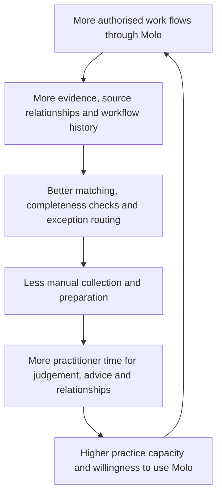

# Molo Product Outcomes and Strategic OKRs

- **Status:** Proposed v0.1
- **Owner:** Product and engineering
- **Applies to:** Company strategy, product roadmap, product analytics and pilot operations
- **Planning horizon:** First 90 days, then quarterly
- **Last updated:** 21 August 2026

**Related product direction:** [AI-assisted tax work](ai_assisted_tax_work.md)<br>
**Vocabulary source of truth:** [Product glossary](glossary.md)<br>
**Architecture source of truth:** [System architecture](system_architecture.md)

---

## 1. Purpose

Molo does not win by shipping a larger catalogue of screens, chat functions or integrations than established accounting and tax platforms. It wins when a practice can manage tax work with less administrative coordination, stronger evidence and the same—or better—professional quality.

This document defines the outcomes Molo is trying to create and the measures used to prove them. It is deliberately independent of a feature roadmap. Features are only valuable when they move a stated outcome without breaching a quality or trust guardrail.

---

## 2. North star and guardrails

### North star: practitioner leverage

> **Enable a practitioner to complete and supervise more comparable client work per professional hour, without reducing quality, timeliness or professional control.**

The primary measure is the **Molo Leverage Ratio**:

```text
weighted active or completed work items
──────────────────────────────────────
practitioner service-delivery hours
```

`Weighted` matters. A simple client count treats a straightforward individual return as equivalent to a complex company, VAT, provisional-tax or verification work item. Initial pilots may use a small set of practice-agreed work categories and weights; those weights must be visible and stable during the measurement period.

The ratio is compared with the same practice's pre-Molo baseline where possible, or with a documented comparable period. It is not a measure of total staff hours, total log-in time or overtime.

### Non-negotiable guardrails

Leverage is not a success if any of the following deteriorates:

| Guardrail | Required condition |
|---|---|
| Professional control | No high-risk external or professional action is completed without the workflow's explicit authorised approval |
| Quality | Material defect, rework and client-correction rates do not worsen against the agreed baseline |
| Timeliness | No increase in missed statutory deadlines caused by Molo workflow or notification failure |
| Evidence | Material recommendations and workflow conclusions retain their required provenance and review state |
| Privacy and access | No unresolved unauthorised-access, prohibited-processing or security incident |
| Client experience | Completion and response rates improve without an unacceptable complaint, opt-out or confusion rate |

If a guardrail fails, the relevant leverage result is not counted as a product success until the failure is understood and remediated.

---

## 3. Measurement rules

Metrics must mean the same thing across a product review and a pilot-practice review. Before an OKR is reported, the team defines its source event, eligible population, observation window, exclusions and owner.

| Term | Definition for initial measurement |
|---|---|
| **Active practice** | A practice with an active subscription or pilot agreement and at least one eligible work item in the observation period |
| **Active practitioner** | A practice member assigned as practitioner or reviewer on at least one eligible work item in the observation period |
| **Active work item** | A non-cancelled work item with a client-facing or internal state change during the period |
| **Client information complete** | All workflow-required client-supplied items are accepted or explicitly waived by an authorised practice member; it does not mean the return is professionally complete |
| **Manual follow-up** | A practice member's individual outreach for missing information, excluding an approved Molo-initiated reminder or a response to a complex client question |
| **Material discrepancy** | A cross-source difference meeting the workflow's explicit monetary, percentage, tax-risk or policy threshold; thresholds vary by workflow and must be recorded |
| **Material conclusion** | A generated/reviewed classification, discrepancy, deadline, recommendation, calculation input or workflow assertion that could affect tax work, client communication or professional action |
| **High-risk action** | A workflow-defined action such as final calculation approval, formal SARS response, return submission, objection/appeal or material personalised tax advice |
| **Preparation time** | Practitioner time on collection, validation, reconciliation and preparation; professional judgement and client relationship time are reported separately, not framed as waste |

### Metric design rules

1. Record baselines before setting a final target. The targets below are planning hypotheses, not claims of current performance.
2. Report numerator, denominator and sample size. A percentage without its population is not decision-ready.
3. Segment results by work type, practice size and connector/source configuration before generalising.
4. Measure both detection **recall** and **precision**. Finding every possible issue is not useful if the practitioner receives excessive false positives.
5. Never count an AI action as “time saved” by assumption. Estimate avoided work from a validated time study or practitioner-confirmed sample, and label it as an estimate.
6. A completed automation is not a completed professional outcome. Keep proposal, review, approval, external delivery and outcome as distinct events.

---

## 4. Strategic objectives

### O1 — Become the intelligence and orchestration layer across the existing practice stack

**Objective:** Molo becomes the place where a practitioner can understand the current state of authorised client work across the practice's connected systems, without requiring a source-system migration.

| Key result | Planning target | Guardrail / interpretation |
|---|---:|---|
| Connected-source coverage | At least 80% of eligible active work items have two or more attributed sources | A source is connected only when Molo can show its origin, sync/ingestion status and authority context |
| Complete client context | At least 90% of eligible active work items show taxpayer, work, deadlines, accepted evidence, outstanding requests and latest significant changes | This is a work context, not a claim that every client record is legally or financially complete |
| Material discrepancy detection | At least 90% recall and at least 80% precision on a reviewed benchmark set | Thresholds and labels must be workflow-specific; a discrepancy is never automatically a tax conclusion |
| Change awareness | At least 90% of benchmark material changes produce a visible, attributable workflow signal within the target service level | Measure from a durable source-ingestion event; exclude unsupported connector downtime transparently |

**What this means in product:** source provenance, reconciliation, change detection, impact flags and an authorised “What changed?” view are more important than an integrations count.

### O2 — Make client information collection substantially self-service

**Objective:** Molo turns authorised portal users into active participants in the workflow, reducing routine chasing while preserving a clear route to a person.

| Key result | Planning target | Guardrail / interpretation |
|---|---:|---|
| Manual follow-ups | Reduce the practice's manual follow-ups per eligible work item by 60% from baseline | Do not count client replies to a practitioner as a failure; classify complex/advice escalation separately |
| Information completeness before review | At least 80% of workflow-required client information is accepted or explicitly waived before preparation review begins | “Complete” does not remove professional review or evidence checks |
| Self-service completion | At least 70% of routine client requests are completed without practitioner intervention | An intervention is not negative when it is the correct escalation |
| Collection cycle time | Reduce median time from request sent to information complete by 50% from baseline | Report the median and the long tail; do not hide stalled cases |

**What this means in product:** guided questions, document requests, reminders, plain-language explanations and an explicit escalation path are part of one collection workflow—not isolated chat features.

### O3 — Prepare work so practitioners can focus on exceptions and judgement

**Objective:** For supported workflows, Molo prepares structured, evidence-linked work for review so the practitioner spends less time collecting and transcribing information and more time making decisions.

| Key result | Planning target | Guardrail / interpretation |
|---|---:|---|
| Ready-for-review preparation | At least 60% of eligible supported work items reach “ready for review” with a Molo-prepared review pack | The state means configured preparation controls are complete; it is not an assertion of legal correctness or readiness to submit |
| Practitioner preparation time | Reduce median practitioner preparation time by 40% for comparable supported work items | Professional advice, judgement and relationship time are not treated as eliminable work |
| Exception-first usage | At least 70% of measured practitioner work actions are reviews, decisions, approvals or exception resolution rather than data transcription | Classify actions from product events, not self-reported labels alone |
| Quality review effectiveness | At least 90% recall and 80% precision for defined benchmark issues | Benchmark categories include missing evidence, source conflict, duplicate candidate, unexplained variance and unanswered question—not unreviewed tax conclusions |

**What this means in product:** documents, facts, records, reconciliation, review packs and workflow gates work together. A general-purpose chat reply is not a substitute for prepared work.

### O4 — Earn trust for professional use

**Objective:** Every material Molo output is explainable, reviewable and safely constrained, so practices can rely on the system for preparation without surrendering professional control.

| Key result | Planning target | Guardrail / interpretation |
|---|---:|---|
| Provenance coverage | 100% of material outputs sampled in production have the required source/evidence, model/schema or rule version, and review state | “Required” is defined per output type; missing provenance is a defect, not an analytics gap |
| Approval enforcement | 100% of successful high-risk actions pass the required explicit approval check | This is measured by workflow enforcement tests and production audit events; failures are severity-one trust incidents |
| Low-risk task quality | At least 95% field-level correctness for defined extraction/classification benchmark tasks | Report by document class and confidence band; do not average away weak categories |
| Appropriate escalation | At least 95% recall for defined high-risk/ambiguous benchmark scenarios requiring escalation | The target rewards safe abstention, not a confident answer to every question |
| Practitioner confidence | At least 90% of pilot-practice respondents agree that Molo shows enough evidence and control to review its prepared work | Report response rate and qualitative failure reasons alongside the score |

**What this means in product:** Molo's advantage is explainable prepared work, not a model that sounds certain. It is acceptable—and often required—for Molo to stop, state the uncertainty and escalate.

### O5 — Become part of the daily practice operating routine

**Objective:** Practices voluntarily use Molo to organise and progress real work because it is the clearest operational view of what needs attention.

| Key result | Planning target | Guardrail / interpretation |
|---|---:|---|
| Weekly practitioner engagement | At least 70% of active practitioners use Molo on four or more working days per week | Use meaningful work events, not passive page views |
| Work coverage | At least 80% of eligible active work items in pilot practices are monitored in Molo | The denominator excludes unsupported work types only when documented before measurement |
| Practice retention | At least 90% monthly retention among post-onboarding paying practices | Early pilots report continuation intent separately from commercial retention |
| Daily planning adoption | At least 60% of active practitioners begin or review their daily work queue in Molo on a working day | This does not require them to abandon source systems; it tests whether Molo is the operational starting point |

**What this means in product:** daily use must come from actionable queues, clear changes, prepared decisions and visible progress—not from forcing users to visit Molo.

---

## 5. The Molo operating flywheel



The flywheel does **not** authorise indiscriminate model training on practice data. Any use of practice data for product improvement is governed by applicable permissions, contracts, privacy controls and product policy. The first product-learning loop is practitioner feedback on proposals, corrections, workflow outcomes and evaluation fixtures.

---

## 6. First-90-day validation plan

The first 90 days are intended to prove specific product hypotheses, not to achieve a mature end-state across every tax type and connector.

| Objective | Validation target | Evidence required before claiming success |
|---|---|---|
| Prove prepared work | 10 pilot practices; at least 100 eligible work items across up to three explicitly supported workflows | Review-pack completeness, time-study comparison, defect/rework analysis and practitioner feedback |
| Prove less client chasing | At least 100 client collection workflows; 60% reduction in manual follow-ups and 80% information completeness | Request/reminder events, practice baseline, completion state and escalation reasons |
| Prove multi-source context | One approved accounting-source pilot plus documents/email; at least 80% successful eligible synchronisation and 90% source attribution correctness | Connector run records, sampled provenance review and failure categorisation |
| Prove trust | 100% tested high-risk approval enforcement; 95% provenance coverage in the initial production sample; at least 90% pilot continuation intent | Automated policy tests, audit sample, incident log and blinded practitioner interviews |

The initial integration goal is **one high-value, read-only source-system pilot**, not simultaneous integrations with every named accounting, tax and payroll product. The pilot determines which connector produces verified reduction in collection or preparation work for launch practices.

---

## 7. Roadmap decision rule

No roadmap item should be approved solely because it sounds useful, demonstrates AI capability or matches a competitor feature.

Every proposed capability must state:

1. the objective and key result it intends to move;
2. the target workflow and responsible taxpayer context;
3. the expected mechanism of change;
4. the evidence/provenance, access and approval requirements;
5. the leading metric and the guardrail metric; and
6. how the team will decide whether to expand, revise or stop it.

Examples:

| Output proposal | Outcome framing |
|---|---|
| “Build AI chat” | Reduce manual follow-ups while preserving successful escalation for complex client questions |
| “Build document upload” | Increase accepted client-information completeness before review and reduce collection cycle time |
| “Build a dashboard” | Increase daily planning adoption and exception-first practitioner actions |
| “Build a Xero integration” | Improve multi-source provenance coverage and discrepancy detection for a defined pilot workflow |

---

## 8. Practice scoreboard

The future Molo dashboard should demonstrate outcomes, not merely system activity. It can show a practice:

```text
This period

• client requests completed and still blocked
• documents processed and accepted after review
• exceptions detected, resolved and awaiting judgement
• follow-ups automated and manual follow-ups avoided (estimated)
• work items ready for review and professionally completed
• time saved estimate, including its measurement basis
• client-information completeness
• professional decisions and approvals required
• unapproved high-risk actions: 0
• Molo Leverage Ratio and its quality/timeliness guardrails
```

The dashboard must not imply that a “time saved” estimate is a verified financial result, that fewer professional decisions are always better, or that zero open issues means zero tax risk.

---

## 9. Review cadence and accountability

| Cadence | Review |
|---|---|
| Weekly during pilot | Instrumentation health, incidents, connector failures, workflow blockers and qualitative practitioner feedback |
| Monthly | Key-result progress by practice/workflow segment, guardrail performance and roadmap experiments |
| Quarterly | Retain, revise or replace targets; approve the next supported workflow/connector only with evidence from prior stages |

Product owns outcome definition and discovery. Engineering owns measurement integrity, resilience and enforcement controls. Practice pilot partners validate workflow relevance and review quality. No single team may declare success without the others' evidence.

---

## 10. Strategic test

Molo has made meaningful progress when a practitioner can accurately say:

> “Molo showed me what needed my attention, collected and organised the supporting information, exposed the exceptions and left me with the professional decisions only I should make.”

The long-term standard is not more features. It is measurable practitioner leverage with preserved professional judgement, evidence and trust.
