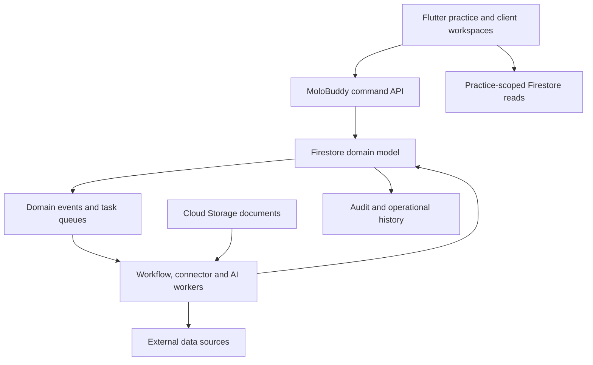
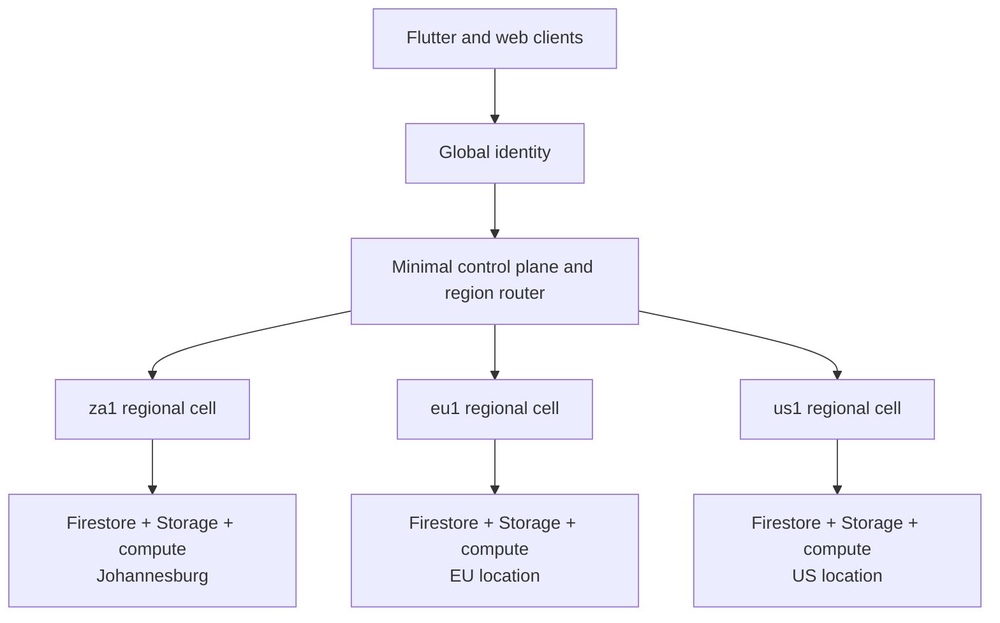
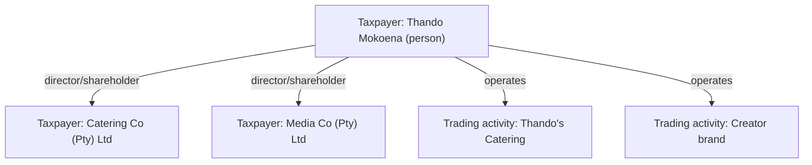
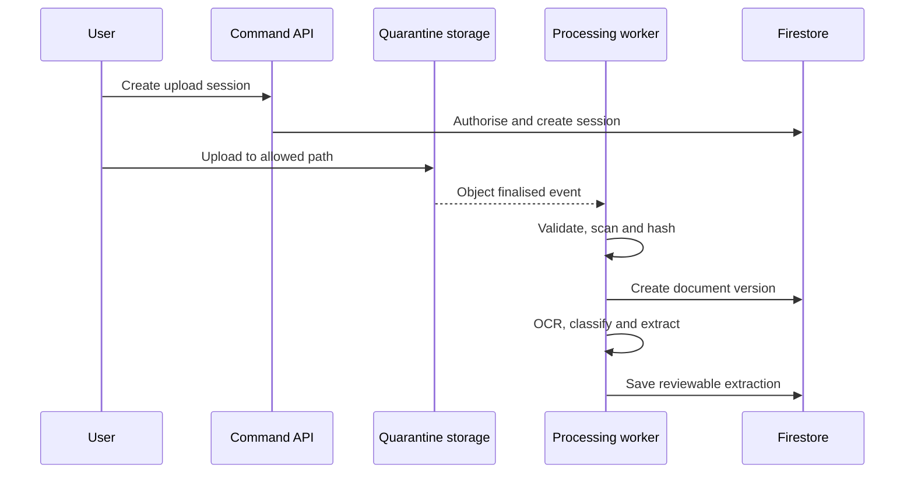

# Molo System Architecture

- **Status:** Proposed architecture
- **Audience:** Product, engineering, security and design
- **Launch market:** South African accounting and tax practices
- **International scope:** Global, multi-region product with jurisdiction-specific tax packs
- **Application stack:** Responsive Flutter Web/Android/iOS client using feature-first MVVM and Riverpod 3; Node.js 24/TypeScript domain-driven server on Cloud Run
- **Platform facts checked:** 2026-08-19; re-check before provisioning production resources

**Vocabulary source of truth:** [Molo Product Glossary](glossary.md)

**API contract source of truth:** [Molo API Design](../api_design/README.md)

**Backend design source of truth:** [Molo Backend Design](../backend_design/README.md)

**Flutter app design source of truth:** [Molo Flutter Application Design](../app_design/README.md)

**Architecture principle:** Firebase is the operational backend. Cloud Firestore is the system of record; no PostgreSQL database is introduced.

---

## 1. Executive decision

MoloBuddy should be built as a **multi-tenant practice operating system** with a **connector and automation harness** around a stable tax-work core.

The core is intentionally small:

1. Practices and people
2. Taxpayers, client relationships, taxpayer relationships, trading activities and tax registrations
3. Work items
4. Tasks and deadlines
5. Document requests and documents
6. Communications and notifications
7. Audit history

Everything external—Google Drive, OneDrive, Xero, Sage, QuickBooks, email, WhatsApp, bank feeds, calendars and future providers—connects through a governed **Connector Platform**. A connector never writes uncontrolled provider data directly into a work item. It ingests, normalises, matches and then proposes or executes an approved domain action.

The most important tenancy decision is:

> Every firm is a `Practice`, including a one-person practice. A solo operator is a practice with one active membership whose role is `owner`.

There is no separate solo data model and no migration when the owner hires a team member. The interface can hide team features until they are needed, while the backend remains identical.

### Recommended deployment shape

- Separate Firebase/Google Cloud projects for `development`, `staging` and `production`.
- One production identity and control plane with region-routed application data.
- The first regional cell, `za1`, uses a named Firestore database, Storage bucket and compute in Johannesburg.
- Add named regional Firestore databases and matching Storage buckets as MoloBuddy enters new data-residency regions.
- Assign every practice to one immutable `homeRegionKey`; do not scatter one practice's operational records across cells.
- Logical tenant isolation through practice-scoped document paths, explicit server authorisation and deny-by-default client Security Rules.
- One global Firebase Authentication identity per human.
- Practice roles and client access held in Firestore membership records, not encoded as a growing list of custom claims.
- Region-matched Cloud Storage buckets for original and derived files.
- Node.js 24 Cloud Run services for the control API, regional API, event receivers, workers and coordinators.
- Eventarc direct Firestore/Storage triggers target IAM-protected regional Cloud Run receivers and filter the named database/bucket explicitly.
- A Firestore job ledger plus Pub/Sub retry/dead-letter delivery for region-resident asynchronous work; use Cloud Tasks only in cells whose locations support it.
- Pub/Sub topics constrained by regional message-storage and in-transit policies; Eventarc trigger locations match their regional sources.
- Region-local Cloud Run workers for OCR, malware scanning, connector jobs or AI work that exceeds normal function constraints.
- Region-scoped Secret Manager resources for OAuth refresh tokens, API credentials and webhook secrets.
- Document AI or a replaceable OCR provider behind the Intelligence Gateway.

Firestore supports multiple named databases in one project, including databases in different locations, and client SDKs can select a database by ID. Cloud Storage for Firebase likewise supports multiple buckets with different locations. Database and bucket locations must therefore be selected deliberately before each regional cell is provisioned. [Firebase: manage Firestore databases](https://firebase.google.com/docs/firestore/manage-databases) · [Firebase: multiple Storage buckets](https://firebase.google.com/docs/storage/web/start)

---

## 2. What “a powerful harness” means

MoloBuddy should not be a collection of tightly coupled screens. It should be a harness with six planes:

| Plane | Responsibility | Examples |
|---|---|---|
| Experience | Interfaces for each audience | Flutter practice and client workspaces, public website, admin workspace |
| Domain | Stable business truth | Practices, taxpayers, client relationships, work items, tasks, requests, documents, deadlines |
| Workflow | Coordinates repeatable work | Templates, status transitions, assignments, reminders, approvals |
| Connector | Exchanges data with external systems | Drive, email, WhatsApp, accounting tools, calendars |
| Intelligence | Reads and assists | OCR, classification, extraction, matching, summaries, anomaly flags |
| Trust | Controls and proves activity | Authentication, authorisation, consent, audit, retention, monitoring |

The domain plane must remain useful even if every connector and AI provider is switched off. Connectors and AI enrich the core; they do not own it.



### Architectural style

Start as a **domain-driven modular monolith** in one monorepo, with a Dart/Flutter client and a Node.js 24/TypeScript server deployed through a small number of Cloud Run entrypoints:

- `identity-access`
- `practice`
- `taxpayers`
- `tax-work`
- `documents`
- `workflow`
- `notifications`
- `connectors`
- `intelligence`
- `audit`

Each context follows domain, application, inbound-adapter and outbound-adapter boundaries defined in the [backend DDD design](../backend_design/domain_driven_design.md). This provides clean domain boundaries without the deployment, tracing and consistency cost of premature microservices. A context may later become a separate service without changing its public application or integration contracts.

---

## 3. Firebase and Google Cloud component map

| Component | Use in MoloBuddy | Source-of-truth status |
|---|---|---|
| Firebase Authentication with Identity Platform | Client-first email/federated sign-in, provider linking, email verification and session identity | Identity only |
| Cloud Firestore | All operational metadata and application state | Primary system of record |
| Cloud Storage for Firebase | Original documents, versions, previews and derived OCR artifacts | Source of truth for file bytes |
| Firebase App Check | Reduce abuse from unauthorised clients | Trust control |
| Firestore job ledger | Durable job state, delayed availability, leases and replay evidence | Job source of truth |
| Cloud Tasks | Optional managed dispatch in regional cells where the service is available | Transport only |
| Pub/Sub + Eventarc | Region-constrained event distribution, retry and loose coupling | Transport only |
| Cloud Run | Node.js 24 control/regional APIs, event receivers, coordinators and workers | Compute only |
| Secret Manager | Connector credentials and signing secrets | Secret source of truth |
| Document AI / OCR adapter | OCR and layout extraction | Replaceable processor |
| Firebase Cloud Messaging | Browser/mobile push notifications | Delivery channel |
| Cloud Logging/Monitoring/Error Reporting | Logs, traces, alerts and service health | Operational telemetry |

Cloud Run supports the selected Node.js 24 runtime. Eventarc routes direct named-database Firestore events to Cloud Run, while Pub/Sub carries application integration events. The domain job contract must not depend on Cloud Tasks because its availability differs by region. [Cloud Run: Node.js runtimes](https://cloud.google.com/run/docs/runtimes/nodejs) · [Eventarc: Firestore events to Cloud Run](https://cloud.google.com/eventarc/standard/docs/run/route-trigger-cloud-firestore) · [Google Cloud: Cloud Tasks locations](https://cloud.google.com/tasks/docs/locations)

### Multi-region strategy

MoloBuddy uses **regional cells**, not one planet-wide operational database.

Keep these concepts separate:

| Concept | Meaning | Example |
|---|---|---|
| Molo region | Product data and operational boundary | `za1`, `eu1`, `us1` |
| Cloud location | Google resource location | `africa-south1`, `eur3`, `nam5` |
| Tax jurisdiction | Legal tax regime | `ZA`, `GB`, `CA` |
| Locale | Language and display formatting | `en-ZA`, `en-GB`, `fr-CA` |
| Time zone | IANA context for dates and deadlines | `Africa/Johannesburg`, `Europe/London` |

A practice can operate in one home region, support several tax jurisdictions and have users in many locales and time zones. No generic `country` field may stand in for these distinct concerns.



Regional-cell rules:

1. The control plane stores only identity linkage, opaque practice ID, a non-sensitive practice display label, region route, deployment metadata and globally safe configuration. It stores no tax registrations, documents, work items, extracted data or practice audit history.
2. Every practice has one `homeRegionKey`, assigned before operational data is created.
3. All practice data, files, secrets, queues, logs and background processing remain in the home cell unless an explicitly approved processor or connector requires a documented transfer.
4. The client resolves `practiceId → regionKey → regional API base URL` after authentication; database and bucket identifiers remain server deployment configuration.
5. Direct Firestore reads target the resolved named database. Consequential writes target the matching regional command API.
6. Domain events stay inside the regional cell. Only aggregated, anonymised operational metrics may cross into a global reporting plane by default.
7. There are no synchronous transactions, joins or status dependencies across regional cells.
8. Moving a practice between regions is a controlled export, validation, import and cutover workflow with an audit record; it is not a field edit.
9. A separate Google Cloud project per region remains an available evolution when regulation, enterprise contracts, quotas or blast-radius requirements justify stronger isolation.
10. The same schemas, rules, migrations and acceptance tests deploy to every cell through infrastructure as code.

Firestore allows multiple databases per project and each database can have its own location. Security Rules must be deployed and tested for every database. Eventarc can filter direct Firestore events by named database and route them to a Cloud Run service; each trigger is configured for its cell and source location. [Firebase: manage databases](https://firebase.google.com/docs/firestore/manage-databases) · [Firebase: Firestore Security Rules](https://firebase.google.com/docs/firestore/security/get-started) · [Eventarc: Firestore events to Cloud Run](https://cloud.google.com/eventarc/standard/docs/run/route-trigger-cloud-firestore)

#### Initial `za1` cell

- Firestore: `africa-south1` (Johannesburg)
- Storage: `africa-south1` (Johannesburg)
- Node.js 24 Cloud Run APIs, event receivers and workers: `africa-south1` (Johannesburg)
- Pub/Sub: `africa-south1` regional endpoint with an `africa-south1` message-storage policy and in-transit enforcement
- Eventarc: source-matched regional triggers for supported Firestore and Storage events
- Secret Manager: regional secrets in `africa-south1`
- Cloud Logging: a user-defined log bucket in `africa-south1` for regional application and audit diagnostics
- Scheduled work: a payload-free schedule signal invokes the coordinator in `africa-south1`; all deadline records, selection and processing remain in the cell
- External AI/OCR: select and document the actual storage and processing regions per provider

The Johannesburg service-location statements were checked on 2026-08-19 against [Cloud Firestore locations](https://firebase.google.com/docs/firestore/locations), [Cloud Run locations](https://cloud.google.com/run/docs/locations) and [Cloud Storage bucket locations](https://cloud.google.com/storage/docs/locations).

Cloud Tasks and Cloud Scheduler do not currently list `africa-south1`. The `za1` design therefore keeps durable jobs and delayed-work timestamps in its regional Firestore database, uses region-constrained Pub/Sub for dispatch/retry/dead-letter delivery and permits an out-of-region scheduler to send only a payload-free wake-up signal to a Johannesburg coordinator. No taxpayer, practice or deadline data is placed in that scheduler request. Regional cells with native Cloud Tasks support may use it behind the same job-dispatch interface. [Google Cloud: Cloud Tasks locations](https://cloud.google.com/tasks/docs/locations) · [Google Cloud: Cloud Scheduler locations](https://cloud.google.com/scheduler/docs/locations) · [Google Cloud: Pub/Sub regional endpoints](https://cloud.google.com/pubsub/docs/reference/service_apis_overview)

Important constraint: Document AI currently lists `us`, `eu` and a limited set of single regions for OCR; Johannesburg is not listed as a Document AI processing location. The South African jurisdiction launch must therefore either:

1. obtain the required contractual/privacy approval for processing in a supported region such as `eu`, with the transfer disclosed and recorded; or
2. run an alternative OCR engine in a Johannesburg Cloud Run worker.

The processor choice and processing location must be configuration, not hard-coded application logic. [Google Cloud: Document AI regions](https://cloud.google.com/document-ai/docs/regions)

---

## 4. Multi-tenancy model

### 4.1 Tenant boundary

The tenant is `practiceId`.

All tenant-owned operational documents live below:

```text
/practices/{practiceId}/...
```

This gives every Security Rule a practice identifier from the path and makes accidental unscoped queries visibly wrong during review.

Do not create one Firebase project per small practice. It multiplies deployments, migrations, observability, connector callback configuration and support work. Dedicated projects or databases may be introduced later only for contracted enterprise isolation.

### 4.2 Global user, contextual access

A human has one global Firebase Auth `uid`. That user can be:

- owner of Practice A;
- invited practitioner in Practice B;
- portal user for their own individual tax record in Practice C;
- portal user for one or more companies represented in Practice C.

Use a global identity because the same person may cross practice and regional boundaries. Firebase Authentication with Identity Platform can create separate identity-provider/user silos, but that is better reserved for enterprise customers needing their own SAML/OIDC configuration or identity policies. It is not the default practice- or region-isolation mechanism. [Firebase Authentication](https://firebase.google.com/docs/auth) · [Identity Platform multi-tenancy](https://cloud.google.com/identity-platform/docs/multi-tenancy)

### 4.3 Membership model

```text
control database:
  /users/{uid}
  /users/{uid}/practiceRefs/{practiceId}  // includes homeRegionKey

resolved regional database:
  /practices/{practiceId}
  /practices/{practiceId}/members/{uid}
  /practices/{practiceId}/taxpayers/{taxpayerId}/accessGrants/{uid}
```

`users/{uid}/practiceRefs` is a minimal control-plane navigation and routing projection. It allows “choose a workspace” after login and identifies the regional cell, but does not grant access. The authoritative grant is the practice `members/{uid}` document or taxpayer `accessGrants/{uid}` document inside the resolved regional database.

Practice and portal actors:

| Role | Typical authority |
|---|---|
| `owner` | Billing, deletion, all settings, members, connectors and work |
| `admin` | Members, clients, templates, connectors and all work except ownership/billing |
| `manager` | Clients, assignment, due dates, review and reporting |
| `practitioner` | Assigned/shared client work, documents and internal comments |
| `reviewer` | Review queues, approvals and quality control |
| `assistant` | Collection, data capture and explicitly granted work |
| `portal_user` | Not a practice member; access comes through `TaxpayerAccessGrant` records |

Permissions should be expressed as capabilities in server code, for example:

```text
taxpayers.read
taxpayers.manage
workItems.create
workItems.transition
documents.review
members.manage
connectors.manage
audit.read
```

Roles map to capabilities. This avoids scattering role-name comparisons throughout the codebase and permits custom enterprise roles later.

### 4.4 Solo practice behaviour

On first signup, a single transaction creates:

1. the user record;
2. a practice;
3. an `owner` membership;
4. default statuses;
5. default tax-work templates;
6. default reminder policy;
7. the user's practice navigation reference.

For a solo practice:

- `assignedToUid` defaults to the owner;
- the Team navigation is hidden or presented as “Invite someone”;
- workload charts collapse to “My work”;
- approval steps may be self-review or disabled by template policy;
- all records retain the same assignment and audit fields used by larger teams.

Adding the first employee is therefore an invitation, not a tenancy conversion.

### 4.5 Taxpayer, business and trading-activity model

MoloBuddy must not use one `Client` record to mean all of the following at once:

- the human who logs in;
- the taxpayer legally responsible for an obligation;
- a registered company owned or represented by that human;
- an unregistered business name or side hustle;
- the practice's commercial relationship;
- a group of related people and businesses.

Those are different concepts and need separate records.

| Concept | Meaning | Example |
|---|---|---|
| `User` | A login identity | The person using the MoloBuddy portal |
| `Taxpayer` | A natural person or independently responsible organisation | Thando Mokoena; Mokoena Media (Pty) Ltd |
| `ClientRelationship` | The practice's service relationship with one taxpayer | Active client, relationship manager, billing reference |
| `TaxpayerRelationship` | A dated relationship between two taxpayers | Director, shareholder, trustee, member, representative |
| `TradingActivity` | An unincorporated trade, side hustle, rental activity or brand operated by a taxpayer | “Thando’s Catering”; creator brand |
| `TaxRegistration` | A tax obligation/registration belonging to a taxpayer | Income tax, VAT, PAYE, provisional-tax status |
| `Portfolio` | An operational portfolio used to view related taxpayers together | “Mokoena Portfolio” |
| `WorkItem` | One trackable unit of professional work for one responsible taxpayer | Company VAT return; individual provisional tax |

The deciding question when work is created is:

> **Who is legally responsible for this tax obligation or work?**

That taxpayer becomes `taxpayerId` on the work item.

#### Example: one person with multiple companies and informal brands



- The person has personal tax registrations and personal tax work items.
- Each registered company is a separate taxpayer with its own client relationship, identifiers, registrations, work items, deadlines, documents and risk status.
- The catering and creator brands are trading activities under the person while they remain unincorporated.
- A personal provisional-tax work item can link to one or both trading activities as context while remaining the person's work item.
- If a trading activity has a VAT or other registration attached to the person, the `TaxRegistration` links to the responsible taxpayer and, optionally, to the trading activity.
- If the catering operation is later incorporated, MoloBuddy creates a new organisation taxpayer and a successor relationship. It does not rewrite the old trading activity into a company or lose its historical documents.

MoloBuddy must not infer whether something is an independent taxpayer from its trading name, logo, bank account or connector. The practice confirms the classification and can record verification evidence.

#### Portfolios are navigation, not legal boundaries

A `Portfolio` lets the practice open one view and see the related person, companies, trust and trading activities together. It may drive a consolidated dashboard or combined communication, but it must not:

- merge tax registrations;
- merge document ownership;
- make one taxpayer's deadline satisfy another's;
- grant portal access to every portfolio member;
- imply legal ownership without a `TaxpayerRelationship` record.

Every board row, deadline and work item must still name its responsible taxpayer. Portfolio totals are derived projections.

#### Portal access is granted per taxpayer

A portal user may be allowed to see:

- their personal taxpayer details;
- Company A, where they are an authorised representative;
- Company B, where they are also authorised;
- neither company's internal practice notes.

Access to one taxpayer never automatically grants access to all taxpayers in the same portfolio. The practice explicitly issues a `TaxpayerAccessGrant` under `accessGrants/{uid}` for each taxpayer, with role, scope, start/end dates and evidence of authority.

#### Practice-side workflow

The practice onboarding flow should support:

1. Add or import the person.
2. Ask whether the person needs only personal tax work, operates under a trading name, or represents an independently responsible organisation.
3. Create one taxpayer for every independently responsible person, company, close corporation, trust or other supported organisation.
4. Create trading activities for unincorporated trades, side hustles and creator/catering brands.
5. Record ownership, directorship, trusteeship, membership and representation as relationships.
6. Add the relevant tax registrations to each responsible taxpayer.
7. Optionally add related taxpayers to one portfolio.
8. Create work items against the responsible taxpayer and registration, with trading-activity context where applicable.

The client directory should therefore offer two complementary views:

- **Taxpayers:** separate operational rows for every independently responsible person or organisation with work and deadlines.
- **Portfolios:** related taxpayers and trading activities grouped for relationship management.

On the work board, the primary label is the responsible taxpayer and the secondary label is the portfolio or trading activity, for example `Mokoena Media (Pty) Ltd · VAT` or `Thando Mokoena · Creator activity · Provisional tax`. The practice can filter by portfolio, but bulk status changes still operate on selected taxpayer-scoped work items.

After login, the client portal shows a taxpayer switcher only for taxpayers covered by active grants. A combined portfolio landing page may summarise outstanding requests across those taxpayers, but every card and upload destination visibly states whether it belongs to the person, Company A or Company B.

---

## 5. Firestore data architecture

### 5.1 Rules for modelling

1. Store binary files and large OCR payloads in Cloud Storage, never Firestore.
2. Store growing lists as subcollections, not arrays on parent documents.
3. Denormalise the small display fields needed by a screen.
4. Make every business record carry `practiceId`, even if the path already contains it; this aids events, exports and validation.
5. Use server timestamps for authoritative times.
6. Store money as integer minor units plus currency, never floating point.
7. Version templates, rules, extracted data and connector schemas.
8. Never depend on deleting a parent document to delete its subcollections.
9. Store authoritative timestamps in UTC and display them through an explicit IANA time zone.
10. Use ISO jurisdiction/country codes, BCP 47 locale tags and ISO 4217 currency codes at system boundaries.
11. Never hard-code South African tax types, labels, authority names, date formats or currency into core domain code.
12. Make applicable records carry `regionKey` and `jurisdictionCode`; neither value may be inferred from locale.

Firestore documents have a 1 MiB maximum, and growing nested lists do not scale as well as subcollections. [Firebase: Firestore limits](https://firebase.google.com/docs/firestore/quotas) · [Firebase: choose a data structure](https://firebase.google.com/docs/firestore/manage-data/structure-data)

### 5.2 Recommended collection tree

```text
control database:
  /users/{uid}
    /practiceRefs/{practiceId}
  /regions/{regionKey}
  /practiceDirectory/{practiceId}       # opaque route + status only
  /connectorDefinitions/{connectorKey}
  /jurisdictionDefinitions/{jurisdictionCode}

each regional database:
  /jurisdictionPacks/{jurisdictionCode}
    /versions/{versionId}
      /taxTypes/{taxTypeCode}
      /deadlineRules/{ruleId}
      /workflowDefinitions/{workflowKey}
      /localeContent/{locale}

  /practices/{practiceId}
    /members/{uid}
    /invitations/{invitationId}
    /consentTemplates/{templateId}
    /workflowTemplates/{templateId}
      /versions/{versionId}
    /taxpayers/{taxpayerId}
      /accessGrants/{uid}
      /contacts/{contactId}
      /identifiers/{identifierId}
    /clientRelationships/{clientRelationshipId}
    /taxpayerRelationships/{relationshipId}
    /tradingActivities/{tradingActivityId}
    /taxRegistrations/{registrationId}
    /portfolios/{portfolioId}
      /members/{taxpayerId}
    /combinedRequests/{combinedRequestId}
    /workItems/{workItemId}
    /tasks/{taskId}
    /deadlines/{deadlineId}
    /documentRequests/{requestId}
      /items/{requestItemId}
    /documents/{documentId}
      /versions/{versionId}
      /extractions/{extractionId}
    /documentLinks/{linkId}
    /uploadSessions/{uploadId}
    /comments/{commentId}
    /notifications/{notificationId}
    /notificationDeliveries/{deliveryId}
    /connectorConnections/{connectionId}
      /syncRuns/{syncRunId}
      /externalRecords/{externalRecordId}
    /imports/{importId}
      /rows/{rowId}
    /domainEvents/{eventId}
    /processedEvents/{consumerEventId}
    /idempotencyKeys/{keyHash}
    /auditEvents/{auditId}
    /dashboardProjections/{projectionId}
```

### 5.3 Core documents

#### Region and jurisdiction configuration

```ts
type RegionDefinition = {
  regionKey: string;                   // za1, eu1, us1
  status: 'planned' | 'active' | 'restricted' | 'retiring';
  firestoreDatabaseId: string;
  firestoreLocation: string;
  storageBucket: string;
  storageLocation: string;
  commandApiBaseUrl: string;
  processingLocations: string[];
  supportedJurisdictionCodes: string[];
  residencyPolicyVersion: string;
  createdAt: Timestamp;
  updatedAt: Timestamp;
};

type PracticeDirectoryEntry = {
  practiceId: string;
  displayLabel: string;               // non-sensitive workspace label only
  homeRegionKey: string;
  status: 'provisioning' | 'active' | 'migrating' | 'suspended' | 'closed';
  routeVersion: number;
  updatedAt: Timestamp;
};

type JurisdictionPackVersion = {
  jurisdictionCode: string;
  versionId: string;
  authorityCodes: string[];
  supportedLocales: string[];
  defaultLocale: string;
  defaultCurrency: string;
  effectiveFrom?: Timestamp;
  effectiveTo?: Timestamp;
  status: 'draft' | 'active' | 'deprecated';
  reviewedByUid: string;
  reviewedAt: Timestamp;
  sourceReferences: string[];
  createdAt: Timestamp;
};
```

`PracticeDirectoryEntry` is deliberately minimal. It is a route, not a global copy of the practice. A jurisdiction pack is published immutably and replicated into every regional cell that supports that jurisdiction.

#### Practice

```ts
type Practice = {
  practiceId: string;
  name: string;
  slug: string;
  status: 'trial' | 'active' | 'suspended' | 'closing' | 'closed';
  homeRegionKey: string;               // immutable outside a controlled migration
  defaultJurisdictionCode: string;     // ISO 3166-1 alpha-2 where applicable
  enabledJurisdictionCodes: string[];
  timezone: string;                    // IANA identifier
  defaultLocale: string;               // BCP 47 tag
  defaultCurrency: string;             // ISO 4217 code
  dataResidencyPolicyVersion: string;
  ownerUid: string;
  branding: { logoPath?: string; primaryColour?: string };
  plan: { code: string; limitsVersion: number };
  featureFlags: Record<string, boolean>;
  createdAt: Timestamp;
  updatedAt: Timestamp;
};
```

#### Member

```ts
type PracticeMember = {
  practiceId: string;
  uid: string;
  role: 'owner' | 'admin' | 'manager' | 'practitioner' | 'reviewer' | 'assistant';
  capabilityOverrides?: Record<string, boolean>;
  status: 'invited' | 'active' | 'suspended' | 'removed';
  displayName: string;
  emailLower: string;
  workloadCapacity?: number;
  joinedAt?: Timestamp;
  updatedAt: Timestamp;
};
```

#### Taxpayer and client structure

```ts
type Taxpayer = {
  practiceId: string;
  taxpayerId: string;
  kind: 'natural_person' | 'registered_organisation' | 'trust' | 'other';
  displayName: string;
  searchName: string;
  legalName?: string;
  tradingNames: string[];
  status: 'active' | 'inactive' | 'archived';
  primaryContactId?: string;
  source: { type: 'manual' | 'csv' | 'connector'; ref?: string };
  verificationStatus: 'unverified' | 'partially_verified' | 'verified';
  createdAt: Timestamp;
  updatedAt: Timestamp;
};

type ClientRelationship = {
  practiceId: string;
  clientRelationshipId: string;
  taxpayerId: string;
  serviceStatus: 'prospect' | 'onboarding' | 'active' | 'paused' | 'terminated' | 'archived';
  relationshipOwnerUid?: string;
  billingReference?: string;
  serviceTags: string[];
  riskFlags: string[];                // practice-internal
  openWorkItemCount: number;
  overdueCount: number;
  nextDueAt?: Timestamp;
  createdAt: Timestamp;
  updatedAt: Timestamp;
};

type TaxpayerRelationship = {
  practiceId: string;
  relationshipId: string;
  fromTaxpayerId: string;
  toTaxpayerId: string;
  role: 'director' | 'shareholder' | 'member' | 'trustee' | 'beneficiary' | 'representative' | 'owner' | 'other';
  ownershipPercentageBps?: number;    // 10000 = 100%; optional, never inferred
  status: 'pending_verification' | 'active' | 'ended';
  validFrom?: Timestamp;
  validTo?: Timestamp;
  evidenceDocumentIds?: string[];
  createdAt: Timestamp;
  updatedAt: Timestamp;
};

type TradingActivity = {
  practiceId: string;
  tradingActivityId: string;
  taxpayerId: string;
  name: string;
  kind: 'sole_trade' | 'freelance' | 'creator' | 'catering' | 'rental' | 'other';
  registrationStatus: 'unincorporated' | 'pending_registration' | 'unknown';
  startedAt?: Timestamp;
  endedAt?: Timestamp;
  successorTaxpayerId?: string;
  status: 'active' | 'inactive' | 'ceased' | 'incorporated';
  createdAt: Timestamp;
  updatedAt: Timestamp;
};

type TaxRegistration = {
  practiceId: string;
  registrationId: string;
  taxpayerId: string;
  tradingActivityId?: string;
  jurisdictionCode: string;
  authorityCode: string;
  taxTypeCode: string;
  jurisdictionPackVersionRef: string;
  maskedReference?: string;
  status: 'unconfirmed' | 'active' | 'inactive' | 'deregistered';
  effectiveFrom?: Timestamp;
  effectiveTo?: Timestamp;
  filingFrequency?: string;
  createdAt: Timestamp;
  updatedAt: Timestamp;
};

type Portfolio = {
  practiceId: string;
  portfolioId: string;
  name: string;
  primaryTaxpayerId?: string;
  status: 'active' | 'inactive' | 'archived';
  memberCount: number;
  openWorkItemCount: number;            // derived projection only
  overdueCount: number;               // derived projection only
  createdAt: Timestamp;
  updatedAt: Timestamp;
};

type TaxpayerAccessGrant = {
  practiceId: string;
  taxpayerId: string;
  uid: string;
  role: 'self' | 'director' | 'trustee' | 'representative' | 'viewer' | 'uploader';
  scopes: Array<'taxpayer.read' | 'workItems.read' | 'documents.read' | 'documents.upload' | 'requests.respond'>;
  status: 'invited' | 'active' | 'suspended' | 'expired' | 'revoked';
  validFrom?: Timestamp;
  validTo?: Timestamp;
  authorityEvidenceDocumentIds?: string[];
  grantedByUid: string;
  createdAt: Timestamp;
  updatedAt: Timestamp;
};
```

Sensitive identifiers should be separate records so normal taxpayer list queries do not fetch tax numbers and registration identifiers. Store a masked display value, a deterministic keyed hash where exact matching is required, and a protected/encrypted value for authorised retrieval.

Every identifier also carries `jurisdictionCode`, `authorityCode` and `identifierTypeCode`. Postal addresses use country-aware structured fields with an optional formatted display value; telephone numbers are normalised to E.164 where possible. Names remain Unicode and must never be forced into Western first-name/last-name assumptions.

#### Work item

```ts
type WorkItem = {
  practiceId: string;
  workItemId: string;
  taxpayerId: string;
  clientRelationshipId: string;
  taxpayerName: string;                // denormalised display field
  portfolioIds?: string[];
  taxRegistrationId?: string;
  tradingActivityIds?: string[];
  jurisdictionCode: string;
  authorityCode?: string;
  jurisdictionPackVersionRef: string;
  workTypeCode: string;
  taxTypeCode: string;
  title: string;
  period: { label: string; startAt?: Timestamp; endAt?: Timestamp };
  internalStatus: string;
  clientStatus: string;
  priority: 'low' | 'normal' | 'high' | 'urgent';
  assignedToUid?: string;
  assignedToName?: string;
  reviewerUid?: string;
  statutoryDueAt?: Timestamp;
  internalDueAt?: Timestamp;
  clientDocumentDueAt?: Timestamp;
  effectiveDueAt?: Timestamp;         // projection for lists
  blockingReason?: string;
  outstandingDocumentCount: number;
  incompleteTaskCount: number;
  workflowTemplateVersionRef?: string;
  createdByUid: string;
  createdAt: Timestamp;
  updatedAt: Timestamp;
  completedAt?: Timestamp;
};
```

Internal and client status must remain separate. The client does not see internal quality problems, staffing notes or risk flags.

#### Document request

```ts
type DocumentRequest = {
  practiceId: string;
  requestId: string;
  combinedRequestId?: string;
  taxpayerId: string;
  clientRelationshipId: string;
  tradingActivityIds?: string[];
  workItemId?: string;
  title: string;
  status: 'draft' | 'sent' | 'opened' | 'partial' | 'submitted' | 'reviewing' | 'more_info' | 'complete' | 'cancelled';
  recipientUserIds: string[];
  dueAt?: Timestamp;
  reminderPolicySnapshot: object;
  totalItems: number;
  acceptedItems: number;
  outstandingItems: number;
  sentAt?: Timestamp;
  completedAt?: Timestamp;
  createdByUid: string;
  createdAt: Timestamp;
  updatedAt: Timestamp;
};
```

Request items are subcollection documents. Each item references zero or more uploaded documents and has its own state.

A practice may send one `CombinedRequest` to a person covering personal work and several represented organisations. The combined request controls one communication/link, but contains separate taxpayer-scoped requests and headings. This reduces message chasing without mixing document ownership or completion states.

#### Document and version

`documents/{documentId}` is the stable logical document. `versions/{versionId}` is immutable evidence for every replacement.

```ts
type Document = {
  practiceId: string;
  documentId: string;
  taxpayerId: string;
  tradingActivityId?: string;
  workItemId?: string;
  requestId?: string;
  requestItemId?: string;
  kind: string;
  displayName: string;
  currentVersionId: string;
  status: 'processing' | 'needs_review' | 'accepted' | 'rejected' | 'superseded';
  uploadedByUid: string;
  createdAt: Timestamp;
  updatedAt: Timestamp;
};

type DocumentVersion = {
  versionId: string;
  storagePath: string;
  sha256: string;
  byteSize: number;
  contentType: string;
  malwareScan: 'pending' | 'clean' | 'blocked' | 'failed';
  ocrStatus: 'not_requested' | 'queued' | 'processing' | 'complete' | 'failed';
  pageCount?: number;
  source: 'portal' | 'staff' | 'connector' | 'email';
  sourceRef?: string;
  uploadedAt: Timestamp;
};

type DocumentLink = {
  practiceId: string;
  linkId: string;
  documentId: string;
  taxpayerId: string;
  targetType: 'work_item' | 'trading_activity' | 'tax_registration' | 'request_item';
  targetId: string;
  createdByUid: string;
  createdAt: Timestamp;
};
```

`DocumentLink` allows one document belonging to a taxpayer—for example a personal bank statement—to support more than one trading activity or work item without copying the file. Cross-taxpayer links require an explicit privileged action and must never be inferred merely because taxpayers share a portfolio.

#### Task and deadline

Tasks represent work; deadlines represent time obligations. A task can be due without being a statutory deadline, and a deadline can create many tasks/reminders.

```ts
type Deadline = {
  practiceId: string;
  deadlineId: string;
  taxpayerId: string;
  clientRelationshipId: string;
  taxRegistrationId?: string;
  tradingActivityId?: string;
  workItemId?: string;
  jurisdictionCode: string;
  taxTypeCode: string;
  kind: 'statutory' | 'internal' | 'client_documents' | 'custom';
  dueAt: Timestamp;
  timezone: string;
  source: 'rule' | 'template' | 'manual' | 'connector';
  ruleVersionRef?: string;
  status: 'scheduled' | 'satisfied' | 'missed' | 'cancelled';
  nextReminderAt?: Timestamp;
  assignedToUid?: string;
  createdAt: Timestamp;
  updatedAt: Timestamp;
};
```

### 5.4 Query projections and indexes

Firestore is not a relational join engine. Each important list screen should query one collection and receive the fields it needs.

Required projections:

- `workItems` carries taxpayer name, assignee name, effective due date and counts.
- `clientRelationships` carries open/overdue counts and next due date.
- `portfolios` contains derived portfolio totals but never replaces taxpayer-level queries.
- `dashboardProjections/{uid}` carries counts for “mine”, “unassigned”, “overdue” and “waiting on client”.
- daily practice snapshots support historical operational reporting.

Initial composite indexes should be designed from screens, not guessed. Likely examples:

```text
workItems: internalStatus + effectiveDueAt
workItems: assignedToUid + internalStatus + effectiveDueAt
workItems: jurisdictionCode + taxTypeCode + internalStatus + effectiveDueAt
workItems: taxpayerId + updatedAt
workItems: taxRegistrationId + effectiveDueAt
tasks: assignedToUid + status + dueAt
deadlines: status + nextReminderAt
deadlines: jurisdictionCode + taxpayerId + status + dueAt
documentRequests: taxpayerId + status + updatedAt
notifications: recipientUid + readAt + createdAt
```

Firestore uses indexes for queries, and compound query combinations generally require manual/composite indexes. Disable automatic indexing for large unqueried maps, OCR text, AI payloads and raw connector metadata. [Firebase: Firestore index overview](https://firebase.google.com/docs/firestore/query-data/index-overview)

For taxpayer and portfolio search in the MVP, maintain normalised prefix/search fields for legal name, trading names, email and masked identifier. Do not place full extracted document text into a search array. If full-text or semantic document search becomes necessary, add a derived search index through the connector/event layer; Firestore remains the source of truth.

---

## 6. Command, read and event model

### 6.1 Client reads

After authentication, the client obtains its minimal practice references through the global session/control API, selects a practice and resolves the matching regional API. It does not initialise or query operational Firestore databases directly.

The versioned HTTP query contracts in [`docs/api_design/`](../api_design/) are the one external shape for bounded reads on Web, Android and iOS. Flutter repositories call generated clients behind the Molo transport; the server applies regional routing, field visibility, membership and capability policy consistently.

V1 has no direct `cloud_firestore` or `firebase_storage` business-data dependency in the Flutter app. Upload/download sessions use server-authorised signed flows. Firebase client SDK use is limited to approved client capabilities such as Authentication and App Check.

Where measured product need later requires realtime updates for a board, upload progress or notifications, add an explicit server-owned subscription design—such as a bounded event stream—or approve a narrowly scoped projection through an architecture decision. That decision must cover authorisation parity, region routing, reconnect/resume, read cost, cache invalidation and Web/mobile lifecycle before adding a client database SDK.

### 6.2 Server commands

All consequential writes go through the versioned HTTPS API. Molo does not add a parallel Firebase callable contract in v1; Web, Android, iOS and future channels share the same semantics:

```text
createPractice
invitePracticeMember
acceptPracticeInvitation
importTaxpayers
createTaxpayer
createClientRelationship
createTaxpayerRelationship
createTradingActivity
createTaxRegistration
createPortfolio
createWorkItem
transitionWorkItem
assignWorkItem
createDocumentRequest
sendDocumentRequest
createUploadSession
submitDocumentRequest
reviewDocument
createTask
completeTask
connectConnector
requestConnectorSync
disconnectConnector
```

Each command handler performs:

1. authentication and App Check verification;
2. trusted `practiceId` to `homeRegionKey` route resolution;
3. rejection of requests sent to the wrong regional command endpoint;
4. practice membership/taxpayer access-grant resolution in the regional database;
5. capability check;
6. input/schema and jurisdiction-pack validation;
7. idempotency check;
8. invariant and state-transition validation;
9. one regional Firestore transaction/batch for state plus a domain event;
10. an audit entry;
11. a response containing authoritative IDs and version.

Firestore transactions and batched writes are atomic. Use transactions when validation depends on current data; use batched writes when it does not. [Firebase: transactions and batched writes](https://firebase.google.com/docs/firestore/manage-data/transactions)

### 6.3 Domain event envelope

```ts
type DomainEvent<T = unknown> = {
  eventId: string;
  eventType: string;                  // document.uploaded.v1
  schemaVersion: 1;
  regionKey: string;
  practiceId: string;
  jurisdictionCode?: string;
  aggregate: { type: string; id: string; version: number };
  actor: { type: 'user' | 'system' | 'connector'; id: string };
  occurredAt: Timestamp;
  correlationId: string;
  causationId?: string;
  data: T;                            // IDs and safe summary, not raw file content
  publishStatus: 'pending' | 'published' | 'failed';
};
```

The transaction that changes a work item also creates the event document. A publisher forwards pending events to the cell's Pub/Sub topic and marks them published. Each topic must restrict message storage to the cell's approved region set and enable in-transit enforcement where strict regional isolation is required. Consumers create a `processedEvents/{consumer}:{eventId}` record in the same regional database transaction as their business effect. [Google Cloud: Pub/Sub message storage policies](https://cloud.google.com/pubsub/docs/resource-location-restriction)

Pub/Sub is at-least-once by default and messages can be redelivered, so every consumer must be idempotent. [Google Cloud: Pub/Sub subscription delivery](https://cloud.google.com/pubsub/docs/subscription-overview)

Suggested events:

```text
practice.created.v1
member.invited.v1
taxpayer.created.v1
client_relationship.created.v1
taxpayer_relationship.created.v1
trading_activity.created.v1
tax_registration.created.v1
work_item.created.v1
work_item.status_changed.v1
request.sent.v1
request.opened.v1
document.uploaded.v1
document.scan_completed.v1
document.ocr_completed.v1
document.reviewed.v1
deadline.approaching.v1
connector.sync_requested.v1
connector.sync_completed.v1
connector.sync_failed.v1
```

This event surface is the spine of the harness. Notifications, connectors, AI and reporting subscribe without being built into the work item command itself.

---

## 7. Document ingestion, OCR and AI

### 7.1 Secure upload pipeline



Detailed flow:

1. A user requests an upload session for one request item, taxpayer and work item.
2. The server checks access and creates an expiring `uploadSessions` document.
3. Storage Rules permit that user to upload only to the assigned quarantine path, with allowed size and MIME constraints.
4. A Storage finalise trigger queues scanning and validation.
5. The worker verifies file signature, size, checksum, page constraints and malware status.
6. A duplicate check compares SHA-256 within the practice and taxpayer scope.
7. Clean bytes are copied to an immutable version path.
8. OCR and extraction jobs are queued.
9. The request item becomes `uploaded`/`processing` and later `needs_review`.
10. Rejected or infected quarantine objects are isolated and removed under a retention policy.

Recommended storage paths:

```text
quarantine/{practiceId}/{taxpayerId}/{uploadId}/original
documents/{practiceId}/{taxpayerId}/{documentId}/{versionId}/original
derived/{practiceId}/{taxpayerId}/{documentId}/{versionId}/preview/page-{n}.webp
derived/{practiceId}/{taxpayerId}/{documentId}/{versionId}/ocr/result.json
derived/{practiceId}/{taxpayerId}/{documentId}/{versionId}/extraction/result.json
connector-raw/{practiceId}/{connectionId}/{recordType}/{externalId}/{version}.json
```

Cloud Storage Rules can check authentication, validate upload size/content type and consult Firestore access documents. Keep the rule lookup to the practice membership and `TaxpayerAccessGrant` for the current path. [Firebase: Storage Rules conditions](https://firebase.google.com/docs/storage/security/rules-conditions)

### 7.2 Intelligence Gateway

All AI/OCR providers implement internal interfaces:

```ts
interface OcrProvider {
  process(input: OcrInput): Promise<OcrResult>;
}

interface DocumentClassifier {
  classify(input: ClassifiedText): Promise<ClassificationResult>;
}

interface Extractor<TSchema> {
  extract(input: ExtractionInput, schema: TSchema): Promise<ExtractionResult>;
}
```

The gateway owns:

- provider selection by environment, home region, jurisdiction and residency policy;
- redaction and minimisation;
- timeout and retry policy;
- prompt/model/schema versions;
- cost and token accounting;
- provider request IDs;
- confidence normalisation;
- traceability back to page and bounding box;
- audit-safe failure reporting.

Document AI OCR can return text/layout and quality information, while specialised extraction should remain a separate step. [Google Cloud: Enterprise Document OCR](https://cloud.google.com/document-ai/docs/enterprise-document-ocr)

### 7.3 AI run and extraction model

Every run is recorded:

```ts
type IntelligenceRun = {
  runId: string;
  regionKey: string;
  practiceId: string;
  jurisdictionCode?: string;
  documentVersionRef: string;
  task: 'ocr' | 'classify' | 'extract' | 'summarise' | 'match' | 'flag';
  provider: string;
  processingLocation: string;
  model: string;
  modelVersion?: string;
  schemaVersion: string;
  promptVersion?: string;
  inputFingerprint: string;
  status: 'queued' | 'running' | 'complete' | 'failed';
  confidence?: number;
  outputStorageRef?: string;
  cost?: { amountMinor: number; currency: string };
  startedAt?: Timestamp;
  completedAt?: Timestamp;
};
```

Extraction fields include:

- field key and typed value;
- confidence;
- page number;
- source text/bounding box;
- extraction method;
- reviewer decision;
- corrected value;
- reviewer UID and timestamp.

AI may create a proposal or flag. It may not autonomously:

- mark a work item submitted;
- approve its own extraction;
- calculate a final tax liability without an explicit product workflow and professional review;
- send sensitive documents to a new connector;
- alter a statutory deadline rule;
- delete evidence.

---

## 8. Connector Platform

### 8.1 Connector concepts

| Concept | Meaning |
|---|---|
| Connector | A reusable MoloBuddy integration, defined by its provider metadata and supported capabilities |
| Connector connection | One practice's authorised connection to a provider account |
| Data source | A provider resource inside a connection, such as one Drive folder or Xero organisation |
| Sync run | A bounded attempt to import/reconcile data |
| External record | A provider-owned record tracked by external ID/version/checksum |
| Mapping | Link between an external record and a MoloBuddy taxpayer, document or work item |
| Action | An outbound operation, such as sending a message or creating a calendar event |

### 8.2 Connector definition and capability manifest

```ts
type ConnectorDefinition = {
  key: string;                         // google-drive
  version: string;
  name: string;
  auth: 'oauth2' | 'api_key' | 'service_account' | 'none';
  capabilities: Array<
    | 'taxpayers.read'
    | 'documents.read'
    | 'documents.write'
    | 'transactions.read'
    | 'messages.send'
    | 'calendar.read'
    | 'calendar.write'
    | 'webhooks.receive'
  >;
  scopes: Array<{ key: string; description: string; required: boolean }>;
  recordTypes: Array<{ key: string; schemaVersion: string }>;
  supportsDeltaSync: boolean;
  supportsWebhooks: boolean;
  rateLimitProfile: string;
  status: 'private' | 'beta' | 'public' | 'deprecated';
};
```

### 8.3 Connection record

```ts
type ConnectorConnection = {
  practiceId: string;
  connectionId: string;
  connectorKey: string;
  connectorVersion: string;
  status: 'authorising' | 'active' | 'attention_required' | 'paused' | 'revoked';
  externalAccountId?: string;
  externalAccountName?: string;
  grantedCapabilities: string[];
  grantedScopes: string[];
  secretRef: string;                   // reference only; no token value
  webhookKeyId?: string;
  syncCursor?: string;
  lastSuccessfulSyncAt?: Timestamp;
  nextScheduledSyncAt?: Timestamp;
  errorSummary?: { code: string; occurredAt: Timestamp };
  connectedByUid: string;
  createdAt: Timestamp;
  updatedAt: Timestamp;
};
```

OAuth access/refresh tokens and API keys belong in Secret Manager, with least-privilege IAM for only the connector runtime. Firestore stores the opaque secret reference and non-secret connection metadata. [Google Cloud: Secret Manager best practices](https://cloud.google.com/secret-manager/docs/best-practices)

### 8.4 Connector runtime contract

```ts
interface ConnectorAdapter {
  getAuthorizationUrl(ctx: ConnectionStartContext): Promise<string>;
  exchangeAuthorizationCode(ctx: CallbackContext): Promise<CredentialResult>;
  testConnection(ctx: ConnectorContext): Promise<ConnectionHealth>;
  listDataSources(ctx: ConnectorContext): Promise<DataSource[]>;
  sync(ctx: SyncContext): AsyncIterable<ExternalRecordEnvelope>;
  handleWebhook(ctx: WebhookContext): Promise<WebhookResult>;
  executeAction?(ctx: ActionContext): Promise<ActionResult>;
  revoke(ctx: ConnectorContext): Promise<void>;
}
```

MoloBuddy-built connectors can live as modules in the connector runtime. Third-party or untrusted connector code must not execute inside the main command API. Later, partner connectors can run in isolated Cloud Run services and communicate through signed, versioned envelopes.

### 8.5 Inbound sync pipeline

```mermaid
flowchart LR
    SOURCE["External source"] --> EDGE["Webhook or sync request"]
    EDGE --> QUEUE["Per-connection queue"]
    QUEUE --> FETCH["Fetch and checkpoint"]
    FETCH --> RAW["Immutable raw record"]
    RAW --> NORMAL["Normalise and validate"]
    NORMAL --> MATCH["Match or request review"]
    MATCH --> COMMAND["MoloBuddy domain command"]
    COMMAND --> AUDIT["Event and audit trail"]
```



Rules:

1. Verify webhook signatures before acknowledging useful work.
2. Acknowledge quickly, then queue processing.
3. Serialise or bound concurrency by connection to protect cursors and provider rate limits.
4. Persist the raw provider payload in Cloud Storage with a checksum and schema/version metadata.
5. Normalise into a connector-neutral envelope.
6. Match using deterministic identifiers first; use AI only as a confidence-scored suggestion.
7. Quarantine ambiguous records for human review.
8. Invoke domain commands; never write directly to arbitrary core documents.
9. Advance the sync cursor only after the corresponding batch is durably recorded.
10. Make every operation idempotent using provider event ID, external record version or a generated idempotency key.

### 8.6 Canonical external record envelope

```ts
type ExternalRecordEnvelope<T = unknown> = {
  schemaVersion: 1;
  regionKey: string;
  practiceId: string;
  jurisdictionCode?: string;
  connectionId: string;
  connectorKey: string;
  recordType: string;
  externalId: string;
  externalVersion?: string;
  occurredAt?: string;
  receivedAt: string;
  operation: 'upsert' | 'delete';
  checksum: string;
  rawRecordRef: string;
  data: T;
};
```

### 8.7 Matching states

Every imported record moves through:

```text
received → normalised → matched → applied
                    ↘ needs_review
                    ↘ ignored
                    ↘ failed
```

Store the reason and confidence for a match. Once a user confirms a match—for example a Drive folder to a taxpayer—save a deterministic mapping rule so future records do not require repeated AI matching.

### 8.8 Connector permissions and consent

Connecting an external provider is a privileged practice action. The connection screen must explain:

- which account is being connected;
- requested scopes;
- data types MoloBuddy will read/write;
- whether historical backfill will occur;
- sync frequency;
- retention behaviour after disconnect;
- who connected it;
- how to revoke access.

Taxpayer-authorised connectors need an additional taxpayer-level grant. A practice owner connecting a firm Drive must not automatically authorise MoloBuddy to connect to a client's private Drive.

---

## 9. Workflow, deadlines and reminders

### 9.1 Versioned workflow templates

A workflow template contains:

- jurisdiction code, jurisdiction-pack version, applicable tax type code and taxpayer kind;
- initial internal/client status;
- required document request template;
- task definitions and dependencies;
- default assignee strategy;
- review gates;
- deadline offsets;
- reminder policy;
- completion criteria.

Publishing creates an immutable template version. Creating a work item materialises tasks, deadlines and request items from that version. Editing the template affects future work items only unless a manager explicitly applies a migration.

### 9.2 Deadline rules

Do not hard-code tax dates in UI or core domain code. Publish versioned rule definitions inside a jurisdiction pack with:

- jurisdiction and authority/source reference;
- applicable tax type code, taxpayer kind and period;
- calculation inputs;
- calculation function version;
- effective date range;
- exception notes;
- reviewed-by and reviewed-at;
- active/deprecated status.

The rule engine calculates a proposed statutory deadline. The practice may set an earlier internal deadline and client-document deadline. The UI displays the source and whether the date was manually overridden.

### 9.3 Scheduling architecture

Do not create a Cloud Scheduler job for every deadline.

Run this pattern independently for every regional cell:

1. one payload-free schedule signal invokes the cell's coordinator every 15–60 minutes;
2. query `deadlines` where `nextReminderAt <= now` and status is active;
3. create idempotent regional job-ledger records and publish their IDs to the cell's constrained Pub/Sub topic;
4. create notification intents idempotently;
5. calculate and store the next reminder time.

The signal carries no tenant data. If a regional cell supports Cloud Scheduler and Cloud Tasks locally, those services may implement the signal and dispatch adapters without changing the coordinator or job contract. `za1` uses the fallback described in the regional-cell section because neither service currently lists Johannesburg. [Firebase: schedule functions](https://firebase.google.com/docs/functions/schedule-functions)

### 9.4 Notification pipeline

```text
domain event / deadline
  → notification policy evaluator
  → notification intent
  → one delivery record per channel
  → provider adapter
  → delivery status/webhook
```

Channels:

- in-app notification;
- email;
- browser/mobile push through FCM;
- WhatsApp connector;
- optional calendar connector.

Notification intents carry `locale`, `timezone` and a versioned template reference. Rendering occurs at delivery time through the relevant locale content pack, with a tested fallback to the practice's default locale. A translated message is never assembled from partial sentence fragments.

Never place tax numbers, balances or document contents in push payloads or lock-screen text. Use a safe message such as “A document needs your review” and deep-link into the authenticated app. FCM is designed for reliable cross-platform notification delivery, but notification data should be treated as a delivery hint rather than the record itself. [Firebase Cloud Messaging](https://firebase.google.com/docs/cloud-messaging)

---

## 10. Security and privacy architecture

### 10.1 Defence layers

1. **Authentication:** client-first Flutter provider flows through Firebase Authentication/Identity Platform; the backend verifies every ID token and applies verified-email/fresh-authentication policy.
2. **App authenticity:** Firebase App Check, with reCAPTCHA Enterprise for web.
3. **Authorisation:** practice membership or `TaxpayerAccessGrant` plus capability checks.
4. **Regional isolation:** operational data is processed only inside the practice's resolved home-region cell.
5. **Tenant isolation:** every tenant record is under a practice path inside that cell.
6. **Command validation:** server-side invariants and state machines.
7. **File isolation:** practice/taxpayer/version storage paths and quarantine.
8. **Secret isolation:** region-scoped Secret Manager resources and least-privilege service accounts.
9. **Auditability:** immutable append-only audit events.
10. **Recovery:** backups, exports, retention and tested restore procedures.
11. **Operational security:** alerts, dependency scanning, incident runbooks and access reviews.

App Check complements Authentication by attesting that requests come from an authorised app/client environment. The Cloud Run APIs verify App Check after a staged monitoring rollout; Firestore and Storage remain closed to direct client business-data access. [Firebase App Check](https://firebase.google.com/docs/app-check)

### 10.2 Firestore and Storage client-access posture

V1 operational Firestore data is server-only. Regional Firestore and Storage Rules deny direct application-client access:

```text
match /{document=**} {
  allow read, write: if false;
}
```

Key policy:

- the control plane may resolve `practiceId → homeRegionKey`, but it must not expose practice operational data;
- a client connects to the global control API and the regional API resolved for that practice, not the regional database or bucket SDK;
- client apps receive only explicitly exposed API projections and can never query internal collections;
- clients cannot directly read or write comments, risk flags, audit records, connector configuration or business records;
- document transfer uses short-lived, server-authorised upload/download sessions with exact object, content and size constraints;
- work items, tasks, assignments, statuses, reviews, connector connections and consents are server commands;
- deny by default.

Server/Admin SDKs bypass Firestore Security Rules, so every regional API operation performs explicit membership, grant and capability authorisation and runs under a least-privilege service account. Rules remain a defence against accidental client access, not the server's authorisation mechanism. Firebase documents this server-client behaviour. [Firebase: structuring Firestore Security Rules](https://firebase.google.com/docs/firestore/security/rules-structure)

Rules are deployed, versioned and tested for every named regional database and Storage bucket. Emulator tests prove denial for unauthenticated and authenticated client identities across representative operational paths; role/capability scenarios are tested at the regional API. [Firebase: test Security Rules](https://firebase.google.com/docs/firestore/security/test-rules-emulator)

### 10.3 Consent evidence

Store immutable consent records:

```ts
type ConsentRecord = {
  consentId: string;
  regionKey: string;
  jurisdictionCode: string;
  practiceId: string;
  taxpayerId: string;
  uid: string;
  purpose: string;
  termsVersion: string;
  privacyNoticeVersion: string;
  documentSharingScope: string[];
  acceptedAt: Timestamp;
  locale: string;
  channel: 'web' | 'mobile' | 'email_link';
  evidence: { userAgentHash?: string; ipEvidenceRef?: string };
  withdrawnAt?: Timestamp;
};
```

Consent is not a boolean field on a client. It is versioned evidence of who accepted which wording, for which purpose, in which jurisdiction and locale, and at which time. Legal wording, data-transfer terms and retention periods require review for every jurisdiction in which Molo operates; South African review is required for the launch jurisdiction.

### 10.4 Audit events

Audit events are append-only and contain:

- region key and Firestore database ID;
- jurisdiction code where the action concerns jurisdiction-specific work;
- practice ID;
- actor and acting context;
- action;
- target type/ID;
- timestamp;
- correlation ID;
- before/after field names or safe diff;
- source IP evidence reference where appropriate;
- connector/provider request reference;
- reason for privileged actions.

Do not duplicate full documents or OCR text into the audit log. Restrict reads to owner/admin/auditor capabilities. Corrections create a new event; they do not mutate the old event.

### 10.5 Retention and deletion

Define retention by class:

- upload sessions and temporary files;
- rejected/quarantined files;
- provider raw payloads;
- OCR and AI intermediates;
- operational documents;
- audit records;
- connector tokens after revocation;
- closed-practice export and deletion window.

Retention schedules are policy data, selected by the practice's home region, the relevant tax jurisdiction and the record class. A jurisdiction pack may express the applicable rule and legal basis, but deletion execution remains a region-local platform responsibility. Any approved cross-region transfer must record its purpose, source, destination, legal basis, approval and expiry.

Firestore TTL is appropriate for ephemeral records such as upload sessions, idempotency keys and temporary webhook receipts. TTL deletion is not immediate and does not delete subcollections, so it must not be the only mechanism for a contractual deletion workflow. [Firebase: Firestore TTL](https://firebase.google.com/docs/firestore/ttl)

---

## 11. Reliability and consistency

### 11.1 Consistency rules

- A practice's authoritative records, outbox events, projections and workers remain in its home-region cell.
- Molo does not depend on cross-cell transactions, joins or synchronous replication.
- A command owns the authoritative state transition.
- A Firestore transaction updates the aggregate and writes its domain event.
- Projections and notifications are eventually consistent.
- Users see `processing` states for asynchronous work.
- External provider success is recorded only after receiving a successful provider response.
- Webhook delivery does not equal business completion.

### 11.2 Idempotency

Every consequential API mutation accepts an `idempotencyKey`. The server stores:

```text
/practices/{practiceId}/idempotencyKeys/{sha256(uid + command + key)}
```

The record includes request hash, result reference, status and expiry. Reusing the same key with a different payload is rejected.

Connector idempotency uses, in order:

1. provider event ID;
2. provider record ID + version;
3. record checksum + connection ID;
4. MoloBuddy-generated action key for outbound calls.

### 11.3 Retries and dead letters

- exponential backoff with jitter;
- connector-specific concurrency/rate limits;
- maximum retry count by error class;
- no retry for validation, permission or revoked-authorisation errors;
- dead-letter state with safe error summary;
- admin retry/replay command requiring capability and audit reason;
- circuit breaker for provider-wide incidents.

### 11.4 Backup and recovery

Enable and test:

- scheduled Firestore backups/PITR for every regional database where available for the selected edition/plan;
- managed exports to protected, policy-approved regional Storage buckets;
- Storage object versioning/retention appropriate to document policy;
- infrastructure/configuration in source control;
- quarterly restore drills into an isolated non-production database in an approved location;
- tenant export tooling for practice closure, controlled home-region migration or a new regional-cell move.

Firestore's managed export/import service can recover from accidental deletion and export selected collection groups. [Firebase: export and import Firestore data](https://firebase.google.com/docs/firestore/manage-data/export-import)

---

## 12. Observability and operations

Every request/job log should include structured fields:

```text
environment
service
operation
regionKey
firestoreDatabaseId
jurisdictionCode
locale
processingLocation
practiceId
actorId (hashed or internal ID)
correlationId
causationId
eventId
jobId
connectorKey
connectionId
durationMs
result
errorCode
```

Never log access tokens, tax numbers, document text, passwords, signed URLs or raw provider payloads.

Dashboards and alerts:

- availability, latency and backlog by regional cell;
- command error rate and p95 latency;
- Firestore read/write volume and denied requests;
- upload processing age;
- malware/validation failures;
- OCR queue age and failure rate;
- AI cost and low-confidence rate;
- connector sync freshness and failure rate;
- deadline coordinator lag;
- notification delivery/bounce rate;
- event publish backlog;
- dead-letter count;
- per-practice quota usage and abnormal spikes.

Operational dashboards may aggregate non-sensitive service metrics globally. Logs, traces, payload references and tenant-level diagnostic data remain in their regional cell unless an approved incident process permits a time-bound transfer. Each cell routes relevant application logs to a user-defined Cloud Logging bucket in an approved regional location with explicit retention; `za1` uses `africa-south1`. [Google Cloud: Logging locations](https://cloud.google.com/logging/docs/region-support)

Use correlation IDs end-to-end so one uploaded document can be traced through storage, scanning, OCR, extraction, review and notification without exposing its contents.

---

## 13. Repository and deployment structure

```text
docs/
  api_design/                 # shared HTTP conventions and one contract per domain
  app_design/                 # Flutter MVVM, Riverpod, responsive and dependency foundation
  backend_design/             # runtime, DDD, authentication and source boundaries
  data_design/                # one persistence/information model per domain
src/
  molobuddy_server/           # Node.js 24 + TypeScript DDD modular monolith
    src/
      entrypoints/            # control API, regional API, events, workers, coordinator
      bootstrap/              # configuration and composition roots
      kernel/                 # minimal shared value and event primitives
      contracts/              # generated wire contracts and CloudEvent types
      contexts/               # one hard module boundary per bounded context
      platform/               # Firebase/Google/Fastify/observability adapters
  molobuddy_app/              # Flutter application
    lib/
      bootstrap/              # environment validation and provider root
      app/                    # typed router, design system, adaptive shell and localisation
      core/                   # auth, networking, contracts, storage and observability adapters
      features/               # feature-first View/ViewModel/Repository/Service modules
contracts/
  openapi/
  json_schema/
  events/
jurisdictions/
  za/                         # versioned tax types, deadline rules and workflows
locales/
  en/                         # international-English fallback content
  en-ZA/                      # South African launch copy and formats
firebase/
  regional/                   # rules and indexes deployed to every named regional database
    firestore.rules
    firestore.indexes.json
    storage.rules
  control/                    # minimal identity routing and product metadata only
    firestore.rules
    firestore.indexes.json
  firebase.json
infra/
  environments/
  regions/                    # repeatable regional-cell definitions and deployment parameters
  monitoring/
```

Recommended engineering rules:

- Dart and Flutter for the client; Node.js 24 with strict TypeScript/ESM for the server.
- Domain-driven design applies to the server only. Flutter uses feature-first MVVM: View → ViewModel → Repository → Service, with optional shared use cases.
- Riverpod 3 is the Flutter application's only state-management and dependency-composition system; use generated modern providers and immutable state.
- Flutter UI is constraint-driven and adaptive across Web, Android and iOS; use central window classes and capabilities rather than device-name or orientation checks.
- Fastify, Firebase and Google Cloud SDKs are adapters; domain/application packages cannot import them.
- Server bounded contexts expose only public application commands, queries and integration events through their `index.ts`.
- The Flutter auth layer owns provider UX and token delivery to the API transport; feature code cannot import Firebase Auth or read raw tokens.
- Runtime schema validation at every boundary, not TypeScript or Dart types alone.
- Language-neutral OpenAPI and JSON Schema definitions are the contract source of truth; generated TypeScript and Dart clients must not drift from them.
- A minimal server kernel owns opaque IDs, timestamps, money and event envelopes; it contains no business entities or infrastructure helpers.
- Flutter consumes generated wire contracts and keeps repository models and immutable view state client-specific.
- No UI imports from server modules.
- No cross-context imports of another context's aggregates, repositories or adapters.
- Connector adapters invoke public application commands; they never update another context's Firestore documents.
- Firestore indexes, rules, jurisdiction packs, locale content and infrastructure are reviewed and deployed from source control.
- The same rules, indexes, worker versions and contract tests are deployed to every regional cell; only approved region configuration differs.
- Every jurisdiction pack and locale has schema validation, fallback checks and regression fixtures.
- UI tests cover long translations, Unicode names, locale-aware formatting and logical layout direction.
- Flutter release tests cover compact through large Web layouts, Android phone/large-screen cases, and iPhone/iPad split-view cases with keyboard and accessibility checks.
- Dependencies default to the latest stable release compatible with the pinned toolchain; deprecated APIs and unreviewed advisories fail CI.
- Emulator Suite tests run in CI for Auth, Firestore and Storage adapters; Eventarc/CloudEvent contract fixtures test event receivers.
- Production deploys require architecture dependency tests, API contract tests, per-database rules tests, migration checks, jurisdiction-pack tests, connector tests and container vulnerability gates.

---

## 14. Recommended API boundary

The canonical public contract is versioned JSON over HTTPS and is specified independently by domain in [`docs/api_design/`](../api_design/):

- [shared API conventions](../api_design/README.md);
- [identity and access](../api_design/identity_access.md);
- [practices](../api_design/practices.md);
- [taxpayers](../api_design/taxpayers.md);
- [tax work](../api_design/tax_work.md);
- [documents](../api_design/documents.md);
- [workflows](../api_design/workflows.md);
- [notifications](../api_design/notifications.md);
- [connectors](../api_design/connectors.md);
- [intelligence](../api_design/intelligence.md);
- [audit](../api_design/audit.md).

The API has a minimal global control plane for session bootstrap and authorised regional route resolution, followed by practice-scoped regional endpoints. Firebase Authentication and App Check protect authenticated endpoints. Consequential POST commands are idempotent; version-sensitive mutations use `If-Match`; failures use the shared Problem Details contract.

OAuth callbacks, inbound email and provider webhooks are public only in the network sense. They authenticate through single-use state, opaque routing keys or provider signatures, derive the regional cell from trusted server records and enqueue a durable receipt inside that cell. They never trust caller-supplied `practiceId`, `regionKey`, `connectionId`, taxpayer mapping or redirect URI.

### Internal task handlers

```text
processUpload
runOcr
classifyDocument
extractDocument
publishDomainEvent
syncConnectorPage
applyExternalRecord
evaluateNotificationPolicy
deliverEmail
deliverPush
deliverWhatsApp
rebuildProjection
```

---

## 15. Scale and cost controls

### Avoid hotspots

- Use random IDs, not sequential IDs, for high-write collections.
- Do not update one “practice counters” document for every event at scale.
- Shard counters or write time-bucketed projections when update frequency grows.
- Exempt large/unqueried fields from indexing.
- Page all list screens with cursors.
- Do not attach listeners to unbounded collections.

### Bound expensive work

- plan-based upload size/page limits;
- OCR before LLM extraction, with document-type routing;
- skip OCR for duplicate file hashes when policy allows reuse;
- cache extraction by input fingerprint + model/schema version;
- queue provider work with per-practice and global concurrency limits;
- daily AI/connector budget alerts;
- manual approval for large connector backfills;
- store raw and derived payloads in Storage rather than Firestore.

### Practice quotas

Track, at minimum:

- active client relationships and taxpayers;
- active members;
- storage bytes;
- pages OCR'd;
- AI runs/tokens/cost;
- connector calls and active connector connections;
- outbound email/WhatsApp volume;
- historical retention tier.

Quota enforcement belongs in server commands and workers, not only in the UI.

---

## 16. Delivery plan

### Foundation: tenancy and trust

- dev, staging and production Firebase environments
- global identity/control plane and repeatable regional-cell infrastructure
- launch cell `za1` in Johannesburg (`africa-south1`), subject to final service-by-service availability review
- South Africa jurisdiction pack, international-English fallback and `en-ZA` locale content
- Node.js 24 Cloud Run entrypoints and domain-driven module dependency gates
- Flutter feature-first MVVM scaffold, Riverpod composition root, typed routing, Molo design system and responsive window-class harness
- Flutter client-first auth layer with provider registry, Firebase Authentication/Identity Platform and verified-email policy
- launch provider configuration: Google plus one approved email method; additional providers enabled through adapters
- Practice, solo onboarding and membership model
- Capability authorisation library
- Firestore/Storage Rules with emulator tests
- App Check rollout
- audit event foundation
- logging and correlation IDs

### Release 1: collection and visibility

- region resolution, locale-aware shell and jurisdiction-pack loading
- taxpayers, client relationships, taxpayer relationships, trading activities and CSV import
- work items
- document request templates
- secure upload pipeline and document versions
- client portal and consent evidence
- basic deadlines
- email and in-app notifications
- firm dashboard projections

### Release 2: practice workspace

- tasks, assignments and Kanban/list views
- workflow templates and versions
- internal versus client status
- reminder policies
- team invitations
- review gates and workload views

### Release 3: intelligence

- OCR gateway
- classification and duplicate detection
- typed extraction with page-level evidence
- confidence/review interface
- AI summaries and flags
- cost and model-version telemetry

### Release 4: connector harness

- connector definition and SDK
- connection and secret lifecycle
- webhook edge and sync workers
- raw/normalised/matched data pipeline
- first connectors: cloud drive and communication
- sync-health dashboard and dead-letter tooling

### Release 5: ecosystem

- deploy and validate a second regional cell from the same infrastructure and contracts
- onboard a second tax-jurisdiction pack without branching the core product
- accounting-package connectors
- calendar integration
- client-owned connector grants
- partner connector isolation/runtime
- connector certification and schema compatibility tests
- workflow actions triggered by connector events

---

## 17. Decisions to lock before implementation

| Decision | Recommendation |
|---|---|
| Tenant unit | Practice |
| Solo operator | Practice with one owner membership |
| Taxpayer unit | Taxpayer: one natural person or independently responsible organisation |
| Informal brand/side hustle | Trading activity under its responsible taxpayer, not a fictional company |
| Related businesses | Explicit taxpayer relationships plus an optional portfolio for navigation |
| Work item ownership | One responsible taxpayer and optional trading-activity/registration context |
| Backend architecture | Domain-driven modular monolith with hard bounded-context import rules |
| Server runtime | Node.js 24 LTS, strict TypeScript/ESM and thin Fastify adapters on Cloud Run |
| Flutter architecture | Feature-first MVVM with Views, ViewModels, Repositories and Services; no client DDD mirror |
| Flutter state/composition | Riverpod 3 generated providers; no second global state or DI system |
| Flutter targets | One responsive/adaptive product for Web, Android and iOS |
| Flutter navigation | Typed `go_router` routes with browser history, refresh and deep-link support |
| Flutter business data | Generated versioned HTTP clients and server-authorised file transfer; no direct Firestore/Storage client in v1 |
| Flutter dependency policy | Latest compatible stable packages, official/verified sources first, no deprecated foundations |
| Auth tenancy | One global Firebase identity per human + regional Firestore memberships/grants |
| Authentication experience | Client-first Flutter auth state machine and provider adapters |
| Authentication authority | Firebase/Identity Platform issues identity; backend verifies tokens, route, membership and capabilities |
| Federation | Configuration-driven provider registry; SAML/OIDC through Identity Platform when justified |
| Database | Cloud Firestore Standard, no PostgreSQL |
| Regional model | One global identity/control plane plus isolated regional product cells |
| Launch regional cell | `za1` in Johannesburg (`africa-south1`), subject to final service-by-service availability review |
| Practice data location | Immutable `homeRegionKey`, changed only by an audited migration |
| Tax configuration | Versioned jurisdiction packs; South Africa is the first pack, not a hard-coded core assumption |
| Language and formatting | International-English fallback plus versioned locale content; `en-ZA` is the launch locale |
| Core write path | Server commands for consequential state changes |
| Integration pattern | Connector adapters + canonical envelopes + domain commands |
| Async backbone | Regional domain-event outbox, Firestore job ledger and region-constrained Pub/Sub; Cloud Tasks only where locally available |
| File model | Immutable Storage versions + Firestore metadata |
| OCR | Replaceable provider behind Intelligence Gateway |
| AI authority | Proposals and extraction only; human approval for professional outcomes |
| Status model | Separate internal and client-facing status |
| Templates | Versioned and materialised per work item |
| Secrets | Secret Manager, never plaintext Firestore tokens |
| Security | Deny-by-default Rules plus explicit server authorisation |
| Search | Firestore prefix search first; derived external index only when needed |

---

## 18. Architecture acceptance criteria

The architecture is ready for implementation when the team can demonstrate:

1. A solo owner can create a practice and complete work without seeing unnecessary team complexity.
2. Adding a staff member requires no data migration.
3. A user belonging to two practices cannot read data across the practice path boundary.
4. One authenticated user can enter practices in different regional cells without those practices sharing operational data.
5. A client portal user can access only explicitly granted taxpayer records; access to one related company does not grant access to another.
6. A direct client call cannot transition a work item or approve an extraction.
7. Every meaningful write produces an audit event and correlation ID.
8. Replaying a webhook or queue message causes no duplicate business effect.
9. Disconnecting a connector revokes credentials and stops sync without deleting core MoloBuddy records.
10. Replacing an OCR/AI provider does not alter the tax-work model.
11. A failed OCR, notification or connector job is visible, retryable and does not leave a false “complete” status.
12. A document version can be traced from upload through scan, OCR, extraction and human review.
13. Deadline reminders are generated by one scalable coordinator per regional cell rather than one scheduler job per deadline.
14. Firestore/Storage rules prove direct-client denial, and server capability checks have automated tests for every actor type in every regional cell.
15. The control plane contains routing and identity metadata only; it exposes no operational tax record, document, connector payload or client communication.
16. Changing locale changes language and formatting but does not change the taxpayer's tax jurisdiction, registrations or deadlines.
17. Every jurisdiction-derived work item or deadline identifies the exact jurisdiction-pack version used.
18. A second regional cell can be deployed from the same infrastructure, schemas, rules and tests without forking the product.
19. Moving a practice between regional cells uses a rehearsed, audited migration with integrity checks and an explicit cutover.
20. A practice can export its taxpayers, client relationships, taxpayer relationships, trading activities, work items, metadata and documents in a coherent package.
21. Recovery from an accidental deletion has been tested from the relevant regional backup/export.
22. One person can have personal tax work, multiple independent companies and multiple trading activities without their registrations, deadlines or documents being merged.
23. Incorporating a trading activity creates a successor organisation taxpayer while preserving the trading activity's historical work items and documents.
24. Domain and application tests run without starting Fastify, Firebase or Google Cloud services.
25. Static architecture tests prevent one bounded context from importing another context's aggregates, repositories or adapters.
26. Flutter features cannot import Firebase Auth or access raw tokens outside the dedicated auth data/service layer.
27. Adding a federated sign-in provider requires no change to backend membership or capability logic.
28. A valid Firebase identity with no active regional membership or taxpayer grant receives no practice data.
29. Flutter architecture checks enforce View → ViewModel → Repository → Service and prevent feature-internal cross-imports.
30. Riverpod is the only application state and dependency-composition mechanism, using modern generated providers rather than legacy state APIs.
31. Every implemented feature builds and passes its proportional journey tests on Web, Android and iOS.
32. Resizing or rotating across supported window classes preserves the appropriate route, selection, form and scroll state.
33. Direct Web links, refresh and browser back/forward restore the correct safe destination without placing sensitive data in URLs.
34. Dependency checks show no undocumented stale foundation, deprecated API, forced override or actionable security advisory.

---

## 19. Final product framing

MoloBuddy's architectural promise should be:

> MoloBuddy is the operational harness around a tax practice: it turns client data, documents, deadlines, external systems and professional review into controlled, traceable work.

The core should be conservative and auditable. The edges should be extensible. The product should remain one globally recognisable Molo experience while regional cells, jurisdiction packs and locale content adapt it responsibly. This balance allows MoloBuddy to serve the South African launch practice today and expand to international practices later without rebuilding, forking or rebranding the foundation.
