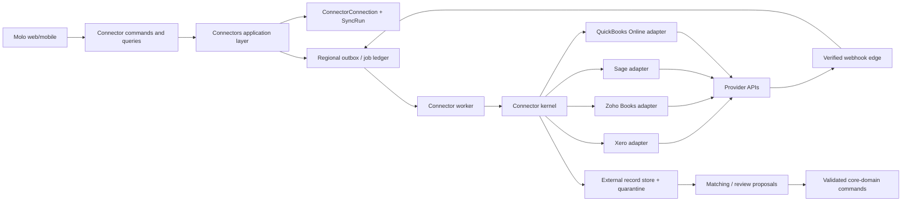

# Accounting Connector Platform Research

- **Status:** Research recommendation — not an accepted architecture decision
- **Scope:** Read-only accounting-data ingestion for Zoho Books, Xero, Sage and QuickBooks Online
- **Researched:** 22 August 2026
- **Decision needed:** Which Sage product family is in scope, and which business outcomes Molo needs in its first release

## 1. Recommendation

Build a **Molo connector kernel** plus one independently deployable-in-code adapter for each provider. The kernel owns the connection lifecycle, consent, credentials, scheduling, durable sync work, idempotency, audit, raw-payload quarantine, normalised envelopes, matching and safe hand-off to domain commands. Provider adapters only own the provider's OAuth details, API calls, pagination/delta strategy, webhook verification and mapping from provider payloads into Molo's canonical ingestion types.

This is deliberately similar to the useful part of LangChain's provider approach: a stable capability-oriented interface with provider-specific implementations. It must *not* copy LangChain's broad "one universal model" idea. Accounting systems differ materially in identifiers, tenant selection, incremental-sync support, rate limits, permissions, reporting semantics and products. A small canonical model plus explicit provider extensions is safer and easier to maintain than pretending that every invoice, tax code or report means the same thing.

The existing Connector bounded context and API contract already provide the correct outer boundary. This proposal fills in its internal ports, records and operating rules; it does not put provider SDKs, HTTP payloads or accounting-provider semantics into Taxpayers, Tax Work or Documents.

## 2. Scope and product boundary

Molo's initial goal should be **read-only, evidence-preserving ingestion**, not accounting-system write-back:

1. A practice authorises Molo to access an accounting organisation/company.
2. Molo discovers eligible external organisations and the practice explicitly selects one or more sources.
3. Molo imports a small, defined set of records, retains provenance and reconciles changes.
4. Molo matches records to Molo taxpayers or work only through reviewable mapping/proposal flows.
5. A connector never changes the provider and never mutates a core Molo record outside a validated command.

Suggested first-release capabilities:

| Capability | Why it belongs in v1 | Initial canonical records |
|---|---|---|
| Organisation discovery and profile | Lets an authorised user choose the right source and establishes currency/timezone/fiscal context | `external_account` |
| Contacts/customers/suppliers | Provides a dependable client-matching substrate | `party` |
| Chart of accounts and tax rates | Explains transaction classification without treating it as Molo tax truth | `account`, `tax_rate` |
| Sales and purchase documents | Gives practices evidence to assess completeness and VAT/tax work | `invoice`, `bill`, `credit_note` |
| Payments and bank/ledger transactions | Adds settlement and cash-flow evidence where the provider/scopes permit it | `payment`, `bank_transaction`, `journal` |
| Sync health, exceptions and evidence | Makes the integration operable and defensible | `sync_run`, `external_record`, receipt/evidence |

Defer provider write-back, journal posting, bill payment initiation, reconciliation, payroll, bank-feed setup and arbitrary report normalisation. They require materially wider permissions and domain decisions. Treat provider report output as a named provider report with parameters and a snapshot, not as a universal `ProfitAndLoss` object.

## 3. Target architecture



### Required ports

The connector application layer should depend on these narrow ports. None are a provider SDK interface.

| Port | Contract responsibility |
|---|---|
| `ConnectorDefinitionRegistry` | Returns a version-pinned definition, supported capabilities, scope bundles, geography and adapter factory. |
| `ProviderAuthorisation` | Creates an authorisation request; exchanges/revokes credentials; reports durable connection targets. |
| `ProviderAccountDiscovery` | Lists external organisations/companies a successful grant can reach. |
| `ProviderSync` | Plans and fetches a bounded page of source data, using an opaque provider cursor/checkpoint. |
| `ProviderWebhook` | Verifies a raw request and converts it to a minimal trigger. It does not apply business data. |
| `CredentialVault` | Reads/writes secret references and performs compare-and-swap credential rotation. |
| `ExternalRecordRepository` | Saves source identity, version/fingerprint, normalised envelope, provenance and retention metadata. |
| `SyncLeaseRepository` | Enforces one cursor-mutating run per source and provides lease/retry state. |
| `ProviderRateLimiter` | Enforces per-provider and per-external-account budgets before requests are issued. |

Use **capability discovery** rather than a giant mandatory interface. For example, an adapter may implement `webhooks`, `incremental_sync`, `attachments` or `journals` only when the provider and granted scopes support it. The definition exposes those capabilities, while code dispatches through focused ports. This avoids stub methods and false portability.

### Adapter package shape

```text
contexts/connectors/
  domain/                         # Connection/sync state and invariants only
  application/
    ports/                        # Above provider-neutral ports
    handlers/                     # StartAuth, CompleteAuth, RunSync, ReceiveWebhook
    process_managers/             # Backfill and token-refresh coordination
  adapters/
    inbound/http/                 # Existing API and OAuth callback routes
    inbound/events/               # Webhook and job inputs
    outbound/providers/
      xero/
      zoho_books/
      sage_accounting/            # or sage_intacct: separate products, separate adapter
      quickbooks_online/
    outbound/persistence/
    outbound/secrets/
    outbound/messaging/
```

Each provider directory has its own client, auth handler, pagination/checkpoint implementation, webhook verifier, provider DTOs, mapper, test fixtures and error mapper. It exports only the registered adapter. Provider DTOs must not leave that directory.

## 4. The data model: preserve source truth, normalise only what Molo uses

Store three layers, not one lossy universal record:

1. **Connection metadata** — non-secret, practice-scoped state such as provider key, adapter version, selected external account, granted scope set, source data-centre, status and latest health.
2. **Source record/evidence** — immutable or versioned provider identity, source version/update timestamp, retrieval time, checksum, external-account ID, selected provider fields and a reference to an encrypted raw payload quarantine object. This preserves auditability and allows a mapper to evolve.
3. **Molo canonical envelope** — a stable, deliberately small shape used by matching and product features: `recordKind`, source key, record ID, natural references, status, dates, money/currency, counterparty reference, tax references, update/version marker, deletion marker and provenance. Keep `providerExtensions` namespaced and typed by the adapter; do not put arbitrary JSON in a cross-provider domain API.

The external identity must be composite:

```text
providerKey + providerAccountId + sourceEntityKind + providerRecordId
```

Never match globally on provider record ID, display name, invoice number or email. An accounting tenant/company/organisation is a Molo **data source**, not the Molo practice itself. One Molo connection can expose multiple data sources (notably Xero and Zoho), and a practice may connect multiple providers.

### State machines

`ConnectorConnection`:

```text
authorising → awaiting_source_selection → active ⇄ paused
active/paused → attention_required → authorising | disconnected
active/paused/attention_required → disconnected
```

`SyncRun`:

```text
queued → acquiring_lease → running → normalising → reconciling → complete
                         ↘ rate_limited/retry_scheduled
                         ↘ failed | cancelled | needs_review
```

`ExternalRecord` is not a core aggregate. It is an append-only/source-versioned integration projection. A confirmed mapping or a proposed domain action references the exact external-record version used, so a later provider correction does not silently rewrite history.

## 5. OAuth, credential and webhook rules

All four initial targets support an OAuth-style server-side connection path, so standardise the *Molo* flow while allowing provider-specific credential fields:

1. A `StartConnection` command validates Molo capabilities and creates a short-lived, single-use authorisation transaction in the regional cell.
2. Generate high-entropy `state`; bind it to connection ID, practice ID, region, connector version, requested scope bundle, PKCE verifier (where used), return-URI allowlist ID and expiry. Store the verifier server-side.
3. The browser visits the provider, then returns only to Molo's registered callback. The callback derives all tenant context from state; it never trusts query/body practice or region data.
4. Exchange the code server-to-server. Put refresh credentials and webhook verification secrets in the regional Secret Manager; Firestore holds an opaque secret reference, expiry metadata and credential-generation counter only.
5. Discover provider accounts and require explicit source selection unless the product has a documented safe default. Store each selected account as its own `ConnectorDataSource` beneath the connection.
6. Queue an initial, bounded backfill. Do not perform it in the callback response.

Token rotation is a concurrency problem: serialise refreshes per credential set; replace the refresh token atomically with a generation check; discard access tokens on disconnect; mark the source `attention_required` only after an authenticated reauthorisation failure. Xero explicitly returns a new refresh token and grants only a 30-minute retry grace period for the old one, so a naïve concurrent worker design will disconnect users. [Xero OAuth flow](https://developer.xero.com/documentation/guides/oauth2/auth-flow/)

The webhook edge should only validate, deduplicate and enqueue. It must respond quickly, fetch authoritative details asynchronously and tolerate duplicated, reordered and missing notifications. Provider notifications are **hints**, not the system of record. A periodic reconciliation sync is mandatory even where webhooks exist.

## 6. Sync design and scaling rules

### Initial and delta sync

- Plan initial backfills by entity type, time window and page; cap history by a visible user-approved policy.
- Persist an opaque per-source/per-entity checkpoint only after records and the page receipt commit successfully.
- Use a source-specific high-water mark plus a small overlap window, then deduplicate using source identity + version/fingerprint. Timestamp-only watermarks miss late writes and tie timestamps.
- Serialize cursor-mutating sync by `connectorDataSourceId`; parallelise only independent entity partitions within the provider's documented quota.
- Treat a webhook as a high-priority targeted refresh where possible; otherwise schedule a short overlapping delta sync.
- Make every request budget-aware. On `429` or a provider retryable failure, respect `Retry-After` when present, use exponential backoff with jitter, persist `notBefore`, and never occupy a Cloud Run request waiting to retry.
- Separate global provider, external-account and connection budgets. A noisy practice must not starve other practices.

### Reliability semantics

Exactly-once delivery from providers is unavailable. The intended result is **at-least-once transport, idempotent Molo effects**:

- receipt idempotency: provider event ID/checksum + connection;
- fetch idempotency: source identity + source version/fingerprint;
- command idempotency: source record/version + intended Molo action;
- side-effect idempotency: Molo command receipt in the same regional transaction as the state/audit/outbox update.

The established Firestore job ledger, transactional outbox and regional worker design is the right execution engine. No connector task may sleep/retry in-process or use an external provider call inside a Firestore transaction.

## 7. Provider matrix

| Provider / product | Correct connection unit | Access / tenant facts | Freshness approach | Material implementation notes |
|---|---|---|---|---|
| **Xero Accounting** | Xero tenant/organisation, selected after OAuth | OAuth 2.0. API calls use `xero-tenant-id`; access token lasts 30 minutes, refresh token 60 days and rotates. New apps use granular scopes; scope reduction requires revoke/reconnect. | Webhooks where entitled + recurring delta reconciliation. | Model one Molo data source per Xero tenant. Request only specific granular read scopes. Start planning certification/partner status: un-certified apps are limited to 25 tenants, and higher API tiers improve limits/features. [Auth](https://developer.xero.com/documentation/guides/oauth2/auth-flow/) · [Scopes](https://developer.xero.com/documentation/guides/oauth2/scopes/) · [Limits/pricing](https://developer.xero.com/pricing) |
| **Zoho Books** | Zoho Books organisation | OAuth 2.0. Use the `api_domain` returned with credentials; each API request identifies `organization_id`. Zoho has eight data-centre domains, so the source's provider residency must be stored. Access tokens last one hour; refresh tokens persist until revoked. | Configurable provider webhooks + periodic delta/list reconciliation. | Protect the per-organisation budget: 100/minute; 1,000–10,000/day by plan; 5 free/10 paid concurrent calls. Treat webhook setup as a privileged connector capability, because Molo may create/manage webhook configuration in the customer organisation. [OAuth](https://www.zoho.com/books/api/v3/oauth/) · [Organisation/DCs and limits](https://www.zoho.com/books/api/v3/introduction/) · [Webhooks](https://www.zoho.com/books/api/v3/webhooks/) |
| **Sage Business Cloud Accounting** | Sage Accounting business/company | OAuth 2.0 against v3.1. One base API URL across countries. Access tokens last 5 minutes and refresh tokens expire after 31 days if not used, making proactive, serial refresh essential. | Confirm event/webhook support and permitted objects during provider onboarding; design v1 around polling/delta capability unless contractually verified. | The name “Sage” is not a single API product. This adapter is only for **Sage Business Cloud Accounting**. Use v3.1, not deprecated v1/v2. [v3.1 migration/auth facts](https://developer.sage.com/accounting/docs/v1.0.0/guides/learning/migrating/migrating-from-v3-to-v31) |
| **Sage Intacct** (separate decision) | Intacct company/entity | OAuth 2.0 REST is available, but requires a Web Services developer licence/sender ID/password, application registry and company authorisation. | Design independently after licence, object and webhook/event availability are validated. | Do **not** hide this behind `sage_accounting` or reuse the Business Cloud Accounting client. Its commercial prerequisites and APIs are a distinct product integration. [Sage Intacct OAuth prerequisites](https://developer.sage.com/intacct/docs/1/sage-intacct-rest-api/tutorials/your-first-api-requests/php-oauth2-example) |
| **QuickBooks Online** | QBO company (`realmId`) | OAuth 2.0 with `com.intuit.quickbooks.accounting`. The company/realm is required on calls. Access tokens last 60 minutes and refresh returns a replacement token. | Webhooks, migrating toward CloudEvents, plus CDC/query-based reconciliation. | Target **QuickBooks Online**, not Desktop. Use Intuit sandbox companies in CI/staging. Intuit's Node SDK is community-supported, so prefer a small native HTTP client behind the adapter unless its current maintenance review approves it. [Scopes](https://developer.intuit.com/app/developer/qbpayments/docs/learn/scopes) · [OAuth/token lifecycle](https://developer.intuit.com/app/developer/qbo/docs/develop/sdks-and-samples-collections/java/authorization) · [Node SDK status](https://developer.intuit.com/app/developer/qbo/docs/develop/sdks-and-samples-collections/nodejs) |

### What is deliberately not universal

| Keep provider-specific | Reason |
|---|---|
| OAuth endpoints, headers, token fields, rotation and revocation | Security and expiry semantics vary. |
| Account/tenant discovery and selection | Xero tenant, Zoho organisation, QBO realm and Sage company are not interchangeable. |
| Pagination, modified-since/CDC/delta strategies and deletion detection | A fake universal cursor causes data loss or costly scans. |
| Scope names and feature availability | Normalise to Molo capabilities for the UI, retain provider scopes for evidence/requests. |
| Webhook signature and event formats | Verify raw bytes with the provider's documented algorithm before normalisation. |
| Provider models, custom fields, tax semantics and reports | Preserve under namespaced extensions/evidence; map only approved product fields. |

## 8. Security, privacy and regional placement

- OAuth client secrets are deployment-level secrets; user grants, refresh tokens and webhook secrets are regional-cell secrets. Never send them to Flutter, logs, Pub/Sub payloads or Firestore documents.
- Keep `providerDataCenter`/API base host on the data source. In particular, a Zoho `.eu` source may imply an external processing location materially different from the practice's Molo regional cell; surface this in availability/consent and document transfer approval.
- Encrypt raw source payloads at rest, restrict access to connector diagnostics, redact logs and define a short raw-payload retention period. Store a canonical evidence subset for the longer audit retention requirement.
- Keep token fingerprints/last four characters only for restricted operational diagnosis; never raw tokens. Correlation IDs must be Molo generated and no provider response body should be emitted in normal logs.
- Treat a `401`/`403` response as a connection-health signal, not proof that a Molo user no longer has access. Require a safe reauthorisation path and preserve prior evidence according to retention policy.
- Use least privilege and staged consent. Xero and Intuit both recommend incrementally requesting scopes; request broader read capabilities only when the user enables the matching Molo feature. [Xero scopes](https://developer.xero.com/documentation/guides/oauth2/scopes/) · [Intuit scopes](https://developer.intuit.com/app/developer/qbpayments/docs/learn/scopes)

## 9. Delivery plan

### Foundation — before the first provider

1. Promote `docs/data_design/connectors.md` from planned to accepted design with records, retention, indexes and state transitions described above.
2. Define generated schemas/events for connection, data source, sync run, external record, receipt, mapping proposal and connector health.
3. Implement the provider-neutral ports, Secret Manager credential vault, Firestore lease/job ledger, raw-payload quarantine and standard error taxonomy.
4. Build a reusable OAuth callback state service and a generic sync-run dashboard/read model.
5. Add architecture tests preventing imports from provider adapters into other contexts; add contract and fixture tests for all kernel behaviours.

### Provider order

1. **Xero first.** It exercises OAuth, multi-tenant source selection, granular consent, token rotation, webhooks and rate limiting. It is the best reference implementation for the kernel.
2. **QuickBooks Online second.** Reuse lifecycle/kernel only; prove QBO `realmId`, sandbox, webhook/CDC and different token model in an adapter that shares no Xero DTOs.
3. **Zoho Books third.** Add multi-data-centre routing, organisation-specific quotas and connector-managed webhooks.
4. **Sage fourth, after product resolution.** Build either Sage Business Cloud Accounting *or* Sage Intacct as the fourth adapter. Do not ship a generic “Sage” button until the product and commercial/API entitlement are known.

For each provider, deliver in slices: (a) connection + account discovery, (b) manually initiated bounded read-only backfill, (c) scheduled delta and health, (d) webhook-triggered refresh, (e) matching/proposals, (f) only then additional objects. A connection is not "done" when OAuth works; it is done when disconnect, revoked consent, rate limits, duplicate events, changed records, deletes and reauthorisation are observable and recoverable.

## 10. Acceptance and operational criteria

Before public launch for any provider, prove:

- OAuth state is single-use, expires and cannot select another practice/region/return URI.
- Refresh-token rotation is safe under two simultaneous sync attempts.
- One data source has one cursor-mutating lease; a crashed worker resumes from the last committed checkpoint.
- Replaying an inbound webhook or a sync page produces no duplicate external-record version, mapping or domain action.
- Late/out-of-order changes and a deletion/tombstone do not overwrite accepted Molo audit history.
- Provider 429/5xx responses back off durably and do not block unrelated sources.
- Every displayed derived value has source record/version/retrieval provenance.
- Disconnect stops jobs/webhooks, revokes credentials where supported, removes secret access and preserves approved Molo records/evidence under policy.
- The provider sandbox/fixture suite covers malformed payloads, partial pages, token expiry, consent revocation, scope denial and provider schema additions.
- Telemetry shows sync lag, success/failure by provider/object, rate-limit headroom, token-refresh failures, queue age, webhook verification failures and stale connection count—without personal or financial data in labels.

## 11. Decisions needed before implementation

1. **Which Sage product?** For South African practices, is the target Sage Business Cloud Accounting, Sage Intacct, Sage Pastel/other Sage product, or more than one? These are separate commercial and technical integrations.
2. **Initial data promise.** Select the v1 object set and permitted history window. "Pull accounting data" is not a sufficient contract for scope, cost or consent.
3. **Source topology.** May one Molo practice connect multiple external companies/organisations? Recommendation: yes, but require explicit selection and an explicit taxpayer/mapping policy.
4. **Data residency/retention.** Approve external-data-centre transfer handling (especially Zoho) and retention periods for raw payloads versus normalised evidence.
5. **Commercial/onboarding readiness.** Start the Xero app/certification path, Intuit production approval/webhook onboarding, Zoho connected-app setup and Sage developer/commercial entitlement checks early; these can be launch-critical.
6. **Write policy.** Recommendation: prohibit writes in the connector platform until a separate, provider-specific ADR and user-confirmed command model exist.

## 12. Sources and research limits

All factual provider details above were checked against official vendor documentation on 22 August 2026. Vendor capability, pricing, terms, certifications, scopes and rate limits change; repeat the dependency-style admission review immediately before provider registration and production rollout.

This research deliberately does not select third-party unified accounting aggregators. They can reduce initial adapter work, but add an external data processor, subscription dependency, abstraction limits and a new migration/availability boundary. Evaluate one only against this native-adapter baseline after the required Sage product and launch object set are decided.
